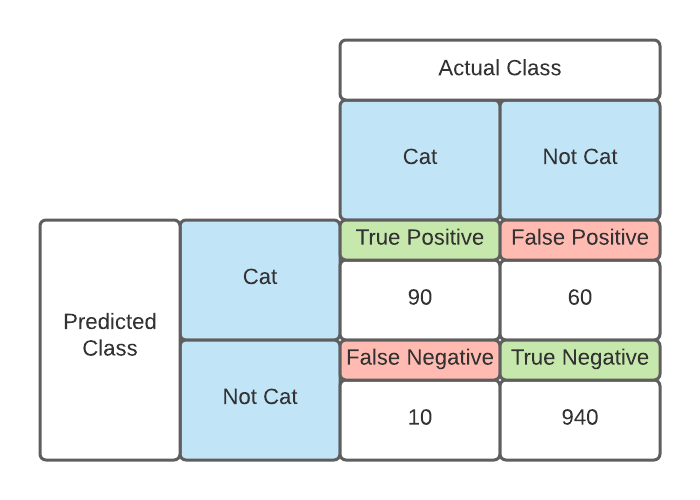

# ML Model Evaluation Tools & Metrics

## Classification Metrics

### Confusion Matrix

Confusion matrix is a tabular visualization of the model predictions versus ground truth labels.
It's often useful to look at a confusion matrix for a quick idea of the recall and precision rate.

For example, we have 1000 non-cat images and 100 cat images. We feed it into a classification model
and receive the following result.

We will use this example and its confusion matrix to derive the evaluation metrics.

### Accuracy

Accuracy is the number of correct predictions divided by the total number of predictions.

$$
\text{Accuracy} = \frac{TP + TN}{TP + FP + TN + FN} = \frac{90 + 940}{1100} = 0.936
$$

### Precision

If your class distribution is imbalanced (i.e. one class is more frequently appearing than others),
accuracy is not a reliable metric. If the model consistently predicts all samples as the most
frequent class, the model has high accuracy but it is deceiving. We need to use precision to
understand the model's performance.

$$
\text{Precision}_\text{positive} = \frac{TP}{TP + FP} = \frac{90}{90+60} = 0.60
$$

$$
\text{Precision}_\text{negative} = \frac{TN}{TN + FN} = \frac{940}{940+10} = 0.989
$$

We can see that the model is not performing well on detecting cat. As we optimize for precision, our
model might become more "conservative" in what it considers to be a "cat". This will cause our
recall score to drop (see next section).

### Recall

Recall is the fraction of samples from a class which are correctly predicted by the model. For a cat
image, how often does the model predict correctly? For a non-cat image, how often does the model
predict correctly?

$$
\text{Recall}_\text{positive} = \frac{TP}{TP + FN} = \frac{90}{90+10} = 0.90
$$

$$
\text{Recall}_\text{negative} = \frac{TN}{TN + FP} = \frac{940}{940+60} = 0.94
$$

High recall generally means that we try to minimize false negative by predicting more positive even
if they are false positive. This will cause our precision to drop.

> If the cost for a FP is low, e.g. detecting cancer for a patient, then we should optimize
  for recall. This is because the cost for FN is high in this scenario.

### F1 Score

Depending on the application, it may need a higher priority for recall or precision. But there are
many applications in which both recall and precision are important. Therefore, it is natural to
think of a way to combine them into one single score.

**F1** is the harmonic mean of precision and recall.

$$
\text{F1} = \frac{2 * \text{Precision} * \text{Recall}}{\text{Precision} + \text{Recall}}
$$

There is always a trade-off between precision and recall of a model. If you want to make the
precision high, you should expect to see a drop in recall, vice versa.

### Sensitivity and Specificity

Sensitivity and specificity are just recalls for true positive and true negative.

$$
\text{Sensitivity} = \text{True Positive Rate} = \frac{TP}{TP + FN}
$$

$$
\text{Specificity} = \text{True Negative Rate} = \frac{TN}{TN + FP}
$$

### ROC Curve

The **receiver operating characteristic** curve is a plot which shows the performance of a binary
classifier as function of its cut-off threshold. It shows the true positive rate against the false
positive rate for various threshold values.

Classification models produce probabilities for samples as predictions. The models compare the output
probability with some cut-off threshold to decide whether the output is positive or negative. For
example, a model may predict `[0.45, 0.60, 0.70, 0.30]` for 4 sample images.

- If `cut-off=0.5` then predicted labels are `[0, 1, 1, 0]`
- If `cut-off=0.2` then predicted labels are `[1, 1, 1, 1]`
- If `cut-off=0.8` then predicted labels are `[0, 0, 0, 0]`

The cut-off rate will directly affect the precision and recall rates. The graph will look like the following.

ROC curve is a useful tool for picking the best cut-off threshold for the model.

### AUC

The **area under of the curve** is an aggregated measure of performance of a binary classifier on
all possible threshold values (and therefore it is threshold invariant). AUC is an integral over all
threshold values over the ROC curve. One way to interpreting AUC is _the probability that the model ranks a random positive example more highly than a random negative example_. A model whose predictions are 100% wrong has an AUC of 0.0, one whose
predictions are 100% correct has an AUC of 1.0.

## Regression Metrics

### MSE

Mean squared error finds the average squared error between predicted and actual values.

$$
\text{MSE} = \frac{1}{N} \Sigma^N_{i=1} (y_i - \hat{y}_i)^2
$$

Some would call this variance. If the error term is square rooted, then it's called **RMSE** which
shows what is the average deviation in the model's predictions from the target values.

### MAE

Mean absolute error finds the average absolute distance between predicted and target values.

$$
\text{MAE} = \frac{1}{N}\Sigma^N_{i=1} \left | y_i - \hat{y}_i \right |
$$

MAE is known to be more robust to the outliers than MSE. The main reason being that in MSE, by
squaring the errors, the outliers get more attention and dominance in the final error, which will
impact the model parameter updates.

If we assume a linear dependence between features and targets, then MSE and MAE correspond to the
maximum likelihood estimation on the model parameters by assuming Gaussian and Laplace priors on the
model errors respectively. Proof can be found [here](https://www.jessicayung.com/mse-as-maximum-likelihood/)

## Ranking Metrics

In learning to rank, the model tries predict the rank (or relative order) of a list of items for a
given task. The algorithms for ranking can be grouped into

- _Point-wise models_ which try to predict a matching score for each query-document pair in the dataset and use
  it for ranking the items.
- _Pair-wise models_ which try to learn a binary classifier that can tell which document is more relevant to a
  query, given pair of documents.
- _List-wise models_ which try to directly optimize the value of one of the above evaluation measures, averaged
  over all queries in the training data.

During evaluation, given the ground-truth order of the list of items for several queries, we want to know how good
the predicted order of those list of items is.

### MRR

The **mean reciprocal rank** is the average of the reciprocal ranks of the first relevant item for
a set of queries Q, and is defined below.

$$
\text{MRR} = \frac{1}{\left | Q \right |} \Sigma^{Q}_{i=1} \frac{1}{\text{rank}_i}
$$

For example,

| Query  | Proposed Ranking          | Correct Response | Rank | Reciprocal Rank |
|--------|---------------------------|------------------|------|-----------------|
| Child  | Childs, Children, Childes | Children         | 2    | 1 / 2           |
| Medium | Medium, Mediums, Media    | Media            | 3    | 1 / 3           |
| Virus  | Viruses, Viri, Virii      | Viruses          | 1    | 1               |

The perfect ranking score is 1 because it's normalized by number of queries. However, one of the
limitations of MRR is that, it only takes the rank of one of the items (the most relevant one) into
account, and ignores other items. This may not be a good metric for cases that we want to browse a
list of related items.

### Precision@K

Precision at K is defined as the number of relevant documents among the top K documents. This is
similar to the regular precision except that we only care about K items instead of the whole test
sets. It's essentially calculating the number of true positive over all positives.

$$
\text{Precision@K} = \frac
{\text{# of recommended items @K that are relevant}}
{\text{# of recommended items @K}}
$$

For example, if we search for "hand sanitizer" on Google and the query returns 10 links, but only 8
links are relevant to the search query, then P@10 is `0.8`.

Disadvantage wise, Precision@K fails to take into account the position of the relevant documents
among the top K items.

### DCG and NDCG

**Normalized Discounted Cumulative Gain**(NDCG) is perhaps the most popular metric for evaluating
learning to rank systems. In contrast to the previous metrics, NDCG takes the order and relative
importance of the documents into account, and values putting highly relevant documents high up the
recommended lists.

**Cumulative Gain**(CG) of a set of retrieved documents is the sum of their relevance scores to the
query. Each score can be arbitrarily defined. For example, I can say `0` is not relevant, `1` is
somewhat relevant, and `2` is relevant. The score is the training label.

$$
\text{CG}_{\text{N top documents}} = \Sigma^{N}_{i=1} \text{score}_i
$$

**Discounted Cumulative Gain** (DCG) is the weighted version of CG, in which a logarithmic reduction
factor is used to discount the relevance scores proportional to the position of the results. We want
to give higher priority to the first few items (than the later ones) to be relevant. Usually people
only look at the top few search results.

$$
\text{DCG}_{\text{N top documents}} = \Sigma^{N}_{i=1} \frac{\text{score}_i}{log_2(i + 1)}
$$

One may ask why reduction by log? Someone back in 2013 had provided a theoretical analysis on how
log provides consistent result on benchmarking different ranking algorithm [A Theoretical Analysis of NDCG Type Ranking Measures](https://arxiv.org/pdf/1304.6480.pdf).

Here's another version

$$
\text{DCG}_{\text{N top documents}} = \Sigma^{N}_{i=1} \frac{2^{\text{score}_i} - 1}{log_2(i+1)}
$$

**Normalized Discounted Cumulative Gain** (NDCG) tries to further enhance DCG to better suit real
world applications. Since the retrieve set of items may vary in size among different queries or
systems, NDCG trie to compare the performance using the normalized version of DCG. It sorts
documents of a result list by relevance, finds the highest DCG (achieved by an ideal system) at
position `p`.

$$
\text{NDCG}_{\text{N top documents}} = \frac{\text{DCG}_N}{\text{IDCG}_N}
$$

and

$$
\text{IDCG}_{\text{N top documents}} = \Sigma^{REL_N}_{i=1} \frac{2^{\text{score}_i} - 1}{log_2(i+1)}
$$

$$REL_N$$ represents the list of relevant documents (ordered by their relevance) in the corpus up to position `N`.

## Statistical Metrics

These are more general statistical metrics used by many predictive tasks.

### Pearson Correlation Coefficient

Correlation coefficient of two random variables (or any two vector/matrix) shows their statistical
dependence. Low correlation means they are independent.

$$
\text{correlation}(X,Y) = \frac{cov(X, Y)}{\sigma_X \sigma_Y} = \frac{\text{E}[(X - \mu_X)(Y - \mu_y)]}{\sigma_X \sigma_Y}
$$

The $\sigma$ and $\mu$ denote the mean and standard deviation of each variable, respectively. In
most cases, the underlying statistical distribution of variables is not known, and all we have are N
samples of that random variable. In those cases, we need to use **sample correlation coefficient** of
the two vectors X and Y.

$$
\text{correlation}(X, Y) = \frac{\Sigma^N_{i=1} (x_i - \bar{x})(y_i - \bar{y})}{\sqrt{\Sigma^N_{i=1}(x_i - \bar{x})^2\Sigma^N_{i=1}(y_i - \bar{y})^2}}
$$

The correlation coefficient of the two variables is always in the range `[-1, 1]`. The two variables
are known to be independent if and only if their correlation is 0, not -1, not +1.

### Coefficient of Determination

Coefficient of determination or $R^2$ is formally defined as the proportion of the variance in the
dependent variable that is predictable from the independent variable(s). Suppose we have `N` samples
and `N` labels, our model produces `N` predictions. Let's use $$y_i$$ to denote `labels[i]` and $$\hat{y}_i$$ to
denote `predicted[i]`.

The mean of the observed data is:

$$
\bar{y} = \frac{1}{N} \Sigma^{N}_{i=1} y_i
$$

The **sum** of **squares** is:

$$
SS = \Sigma^{N}_{i=1} (y_i - \bar{y})^2
$$

The residual sum of squares is:

$$
SS_{\text{residual}} = \Sigma^{N}_{i=1} (y_i - \hat{y}_i)^2
$$

Then the coefficient of determination is:

$$
R^2 = 1 - \frac{SS_{\text{residual}}}{SS}
$$

If the model's predictions match the observed values, then the coefficient is 1. If a model always
predicts the mean value of the observed data, then the coefficient is 0.

## References

[20 Popular ML Metrics Part 1](https://towardsdatascience.com/20-popular-machine-learning-metrics-part-1-classification-regression-evaluation-metrics-1ca3e282a2ce)

[20 Popular ML Metrics Part 2](https://towardsdatascience.com/20-popular-machine-learning-metrics-part-2-ranking-statistical-metrics-22c3e5a937b6)
