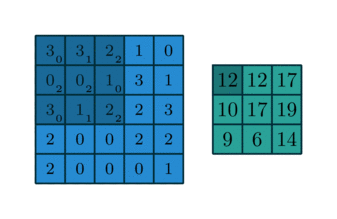
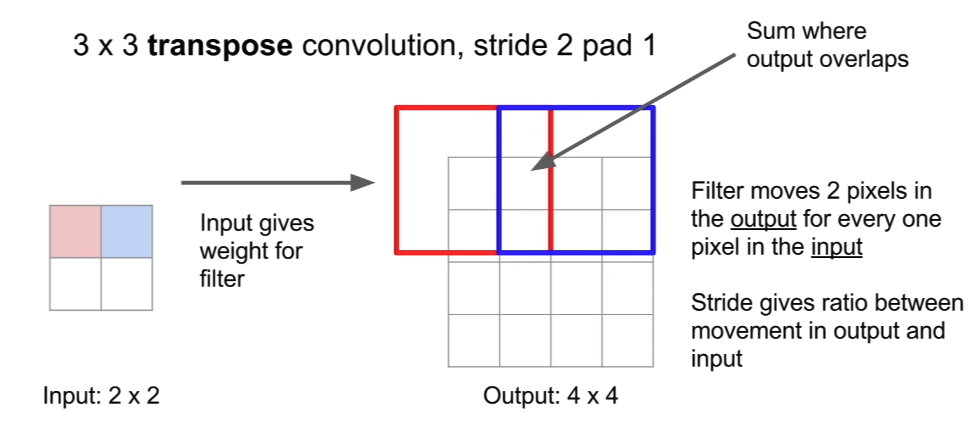

# Convolution Operation

_Using 3x3 filter applied on a single channel 4x4 image_  


## The Basics & Forward Pass

### Filter

Given an 32x32 image with RGB channels, we can represent it as a tensor of shape `(32, 32, 3)` which is \(height, width, channels\). When we perform convolution, we need a filter that has the same channel depth as the image. For example, we can use a 5x5 filter which is of shape `(5, 5, 3)` and slide it across the image left to right, top to bottom with a stride of 1 to perform convolution.

### Padding

Question is, since we are starting from the top left corner, what if the filter goes index out of bound? We can use zero padding in this case. Thus, now we have four hyperparameters:

#### No padding

Filter size of 3x3, stride is 1 and with no padding  


#### With padding and stride of 2

Filter size of 3x3, stride is 2 and with padding  


* `F`: number of filters
* `Hf` or `Wf`: spatial extend of the filters, which is 5 in this case
* `S`: stride size
* `P`: amount of padding

Ignore the example in the picture and use the original example, let's assume `padding=2` and `stride=1`:

```python
import numpy as np

"""
- Input tensor is x, of shape (N, C, H, W) which is channel first. Give it N = 10, that is 10 pictures.
- Filter tensor is denoted as weight, of shape (F, C, Hf, Wf). Give it F = 1, that is 1 filter.
- Bias tensor is a one-dimensional vector of shape (F,) essentially one constant per filter.
- Output tensor is y, of shape (N, F, H_out, W_out)
"""

pad = 2
stride = 1
x = np.random.randn(10, 3, 32, 32)
weight = np.random.randn(1, 3, 5, 5)
b = np.random.randn(1,)

x_pad = np.pad(x, pad_width=((0, 0), (0, 0,), (pad, pad), (pad, pad)), mode='constant', constant_values=0)
print 'Padded input for a given image on a given color channel\n'
print x_pad[0][0]

N, _, H, W = x.shape
F, _, Hf, Wf = weight.shape

H_out = int(1 + (H + 2 * pad - Hf) / stride)
W_out = int(1 + (W + 2 * pad - Wf) / stride)

y = np.zeros((N, F, H_out, W_out))

print '\nExpected output tensor to have shape %s' % str(y.shape)
```

```
Padded input for a given image on a given color channel

[[ 0.          0.          0.         ...  0.          0.
   0.        ]
 [ 0.          0.          0.         ...  0.          0.
   0.        ]
 [ 0.          0.         -0.73378007 ...  0.01677977  0.
   0.        ]
 ...
 [ 0.          0.         -0.10338012 ...  0.69636079  0.
   0.        ]
 [ 0.          0.          0.         ...  0.          0.
   0.        ]
 [ 0.          0.          0.         ...  0.          0.
   0.        ]]

Expected output tensor to have shape (10, 1, 32, 32)
```

### Output Dimension

From the calculation, we can see that given a tensor of shape `(W, H, C)`, convolution produces a tensor of shape `(W_out, H_out, F)`. The depth of the output tensor is dependent on number of filters being applied to the input.


$$
W_{output} = 1 + \frac{W - F_{width} + 2P}{S}
$$


$$
H_{output} = 1 + \frac{H - F_{height} + 2P}{S}
$$


```python
# I don't recommend doing this in Python, the performance is terribly bad. This is for educational purpose.
for n in range(N):
    for f in range(F):
        for h in range(H_out):
            for w in range(W_out):
                i, j = h * stride, w * stride
                conv_sum = np.sum(x_pad[n][:, i:i+Hf, j:j+Wf] * weight[f])
                y[n, f, h, w] = conv_sum + b[f]
```

## Convolution Backpropagation

The backward pass of a convolution operation \(for both the input and weight\) is also a convolution, but with spatially flipped filters. It is easy to derive using 1 dimensional example.

Let's say we have x of shape `(3, 2, 2)` that is a 2x2 image with 3 channels, and a filter of shape `(3, 1, 1)` which is a one-pixel filter; just imagine the filter as `[weight[0], weight[1], weight[2]]`. When we perform convolution using `stride=1`. We can see that:


$$
y_{i, j} = \Sigma_{f} x_{i, j, f} * w_{f}
$$


```
y[0][0] = x[0][0][0] * weight[0] + x[0][0][1] * weight[1] + x[0][0][1] * weight[2]
y[0][1] = x[0][1][0] * weight[0] + x[0][1][1] * weight[1] + x[0][1][2] * weight[2]
y[1][0] = x[1][0][0] * weight[0] + x[1][0][1] * weight[1] + x[1][0][2] * weight[2]
y[1][1] = x[1][1][0] * weight[0] + x[1][1][1] * weight[1] + x[1][1][2] * weight[2]
```

When we calculate derivative of loss with respect to each weight:


$$
\frac{\partial L}{\partial y}\frac{\partial y}{\partial w_{f}} = \Sigma_{i, j} x_{i, j, f} \frac{\partial L}{\partial y}_{i, j}
$$


```
grad_weight[0] = x[0][0][0] * grad_y[0][0][0] + x[0][1][0] * grad_y[0][1][0] + x[1][0][0] * grad_y[1][0][0] + x[1][1][0] * grad_y[1][1][0]

grad_weight[1] = ...

grad_weight[2] = ...
```

Notice how this is flipped? For forward propoagation, we iterate through the number of filters for each pair of `{i, j}`. For back propagation, we iterate through each pair of `{i, j}` for every filter.

```python
grad_weight = np.zeros(weight.shape)
grad_x = np.zeros(x.shape)
grad_b = np.zeros(b.shape)
grad_x_pad = np.zeros(x_pad.shape)
grad_y = np.ones(y.shape)

for n in range(N):
    for f in range(F):
        for h in range(H_out):
            for w in range(W_out):
                i, j = h * stride, w * stride
                grad_weight[f] += x_pad[n][:, i:i+Hf, j:j+Wf] * grad_y[n, f, h, w]
                grad_x_pad[n][:, i:i+Hf, j:j+Wf] += weight[f] * grad_y[n, f, h, w]

# Get rid of padding
grad_x = grad_x_pad[:, :, pad:pad+H, pad:pad+W]

# Compute gradient of bias
for f in range(F):
    grad_b[f] = np.sum(grad_y[:, f, :, :])
```

## Transpose Convolution / Upsampling

So far the convolution we have seen actually downsample the image, i.e. creating an output that is smaller in spatial dimension than the input. When I say spatial dimension, I am referring to the width and height of the tensor input. However, there are times we need to upsample and there is an operation called **transpose convolution** that does exactly this.

Given a 4x4 input, using a 3x3 filter with `stride=1` and `pad=1`, we should expect an output of 4x4. Similarly, if we increase the stride size to 2. We should expect an output of 2x2. Now, a transpose convolution does the opposite. Given an input of 2x2, we produce an output of 4x4 using 3x3 transpose filter with `stride=2` and `pad=1`. What it does is that it takes one element of the input and multiplies it to the filter matrix as a scalar multiplcation on the filter. This is also called **fractionally strided convolution**.


```
y[0][0] = weight[0][0] * x[0][0]
y[0][1] = weight[0][1] * x[0][0]
y[0][2] = weight[0][2] * x[0][0]
y[1][0] = weight[1][0] * x[0][0]
and so on...
```

### Overlaps?

We simply sum the overlapping regions.



### One-dimensional Example

Given an input array of `[a, b]` and a filter array of `[x, y, z]`, using `stride=2`. We can see that the output should be `y = [ax, ay, az + bx, by, bz]`


$$
W_{output} = (W - 1)S + F - 2P
$$


$$
H_{output} = (H - 1)S + F - 2P
$$


Let's extend the example to a bit more complicated. Given an input array of `[a, b, c, d]` and a filter of `[x, y, z]`. We can express a _convolution_ using matrix multiplication. Using `pad=1` and `stride=1`, notice that we are sliding `[x, y, z]` by one step to the right per row in the matrix on the left hand side.


$$
\begin{vmatrix}
x & y & z & 0 & 0 & 0 \\
0 & x & y & z & 0 & 0 \\
0 & 0 & x & y & z & 0 \\
0 & 0 & 0 & x & y & z \\
\end{vmatrix}
\cdot
\begin{vmatrix}
0 \\ a \\ b \\ c \\ d \\ 0
\end{vmatrix}
=
\begin{vmatrix}
ax + bz \\
ax + by + cz \\
bx + cy + dz \\
cx + dy
\end{vmatrix}
=
\begin{vmatrix}
a^{'} \\ b^{'} \\ c^{'} \\ d^{'}
\end{vmatrix}
$$


Now let's perform a _transpose convolution_, with `stride=1`. Padding rule in transpose convolution is different. We cannot arbitrarily insert padding. It must correspond to the previous padded input prior to convolution transformation.


$$
\begin{vmatrix}
x & 0 & 0 & 0 \\
y & x & 0 & 0 \\
z & y & x & 0 \\
0 & z & y & x \\
0 & 0 & z & y \\
0 & 0 & 0 & z
\end{vmatrix}
\cdot
\begin{vmatrix}
a^{'} \\ b^{'} \\ c^{'} \\ d^{'}
\end{vmatrix}
=
\begin{vmatrix}
a^{'}x \\
a^{'}y + b^{'}x \\
a^{'}z + b^{'}y + c^{'}x \\
b^{'}z + c^{'}y + d^{'}x \\
d^{'}z + d^{'}y \\
d^{'}y
\end{vmatrix}
$$


The primary takeaway for transpose convolution is that it **RESTORES** the dimension of an input that was previously downsampled.
