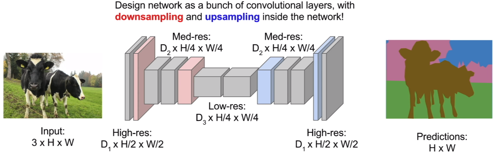
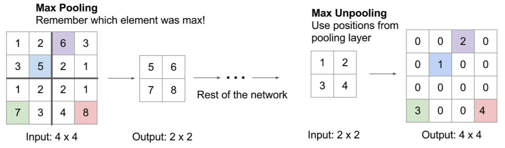
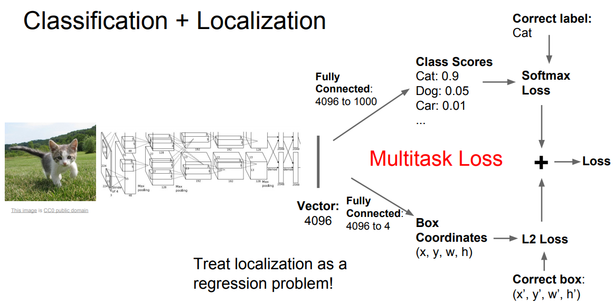
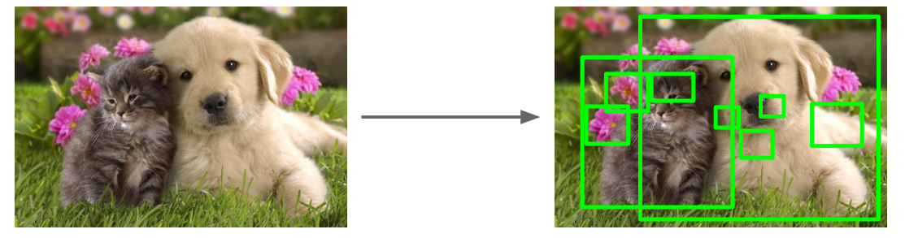

# Detection & Segmentation

Using just convolutional neural networks we can perform more computer vision tasks such as

* Semantic Segmentation - classifying individual pixels of the whole image
* Classification & Localization - find and classify an object and draw a bounding box around it
* Object Detect - Find multiple objects in an image
* Instance Segmentation - Seperate the detected objects into different instance, like dog no.1 and
  dog no.2

## Semantic Segmentation

Label each pixel in the image with a category label. The common approach is to feed the image
through a bunch of convolutional layers with downsampling and upsampling inside the network. Imagine
if we were to keep the spatial dimension of the image throughout the forward pass, it'd be extremely
inefficient and slow.

Thus, instead of making the network very *wide*, we make it deep and narrow. Let the learning takes
place in the low resolution region of the network.

### In-Network Upsampling: Max Unpooling

The idea is quite simple, we simply remember which element was max and then use the same position to
project back to the original dimension.

### Learnable Upsampling: Transpose Convolution

The notes of transpose convolution in my convolution operation notebook.

## Classification & Localization

We can simply treat localization as a regression problem. The expected output of the network is a
set of coordinates like `(x, y, w, h)`. The position of the top-left corner of the bounding box and
the height/width of the bounding box for a detected object in the image.

We will have two optimization objects, also known as *multi-task loss*. Suppose the final fully
connected layer is flatten to a vector of length 4096 (32x32x4), we can either project this vector
to 1000 which represents the class scores or project this vector to 4 which represents the bounding
box `(x, y, w, h)`.

Since we have two losses, what people in practice is that assign the loss with some weight
hyperparameters and take a weighted sum of the two losses to give the final scalar loss. However,
setting this hyperparameter is difficult because it impacts the value of the loss DIRECTLY. Thus,
merely by looking at loss, one cannot judge whether the quality of the hyperparameter.

## Object Detection

### Region Proposals

Using sliding window approach is not computationally feasible because there are infinitely many
possible window sizes and aspect ratios, thus in practice people use region proposals as a
pre-processing algorithm in object detection, such as **selective search**.

### Architectures

* R-CNN
  * Ad hoc training objectives
  * Training is slow
  * Inference detection is slow, 47s per image with VGG16
* Fast R-CNN
* Faster R-CNN
  * Make CNN do proposals
  * Insert region proposal network to predict proposals from features
  * Jointly train with 4 losses (RPN classify object / not object, RPN regress box coordinates,
    final classification scores, and final box coordinates.)
* YOLO - You Only Look Once
* SSD - Single-Shot MultiBox Detector
