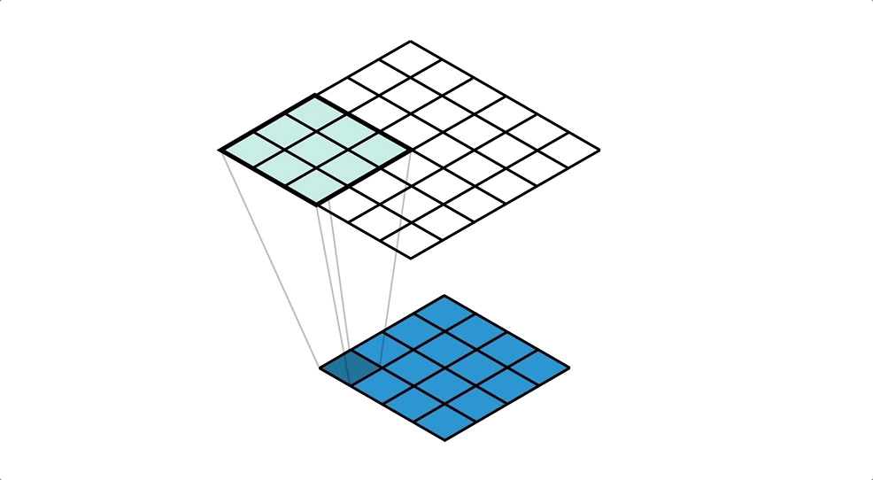

# Transpose Convolution

This is equivalent to the reverse of convolution, hence the term transpose. I've already briefly
talked about transpose convolution operation in the _Convolution Operation_ section of my GitBook. I
want to dive deeper into various techniques of **upsampling** where transpose convolution is just
one of the many techniques.

## Downsample via Convolution

Downsampling is what convolution normally does. Given an input tensor and a filter/kernel tensor,
e.g. `input=(5, 5, 3)` and `kernel=(3, 3, 3)`, using `stride=1`, the output is a `(3, 3, 1)` tensor.
Every filter matches with input in channel size or depth. The result is always a tensor with
`depth=1`. We can compute the height and width of each output tensor by a simple formula.

$$
W\text{: width}\;
H\text{: height}\;
P\text{: padding}\;
S\text{: stride}
$$

$$
W_{\text{output}} = 1 + \frac{W_{\text{input}} - W_{\text{kernel}} + 2P}{S}
$$

$$
H_{\text{output}} = 1 + \frac{H_{\text{input}} - H_{\text{kernel}} + 2P}{S}
$$

Therefore, if we use our example and subsitute in the values.

$$
W_{\text{output}} = H_{\text{output}} = 1 + \frac{5 - 3 + 2*0}{1} = 3
$$

## Upsample Techniques

### K-Nearest Neighbors

We take every element of an input tensor and duplicate it by a factor of `K`. For example, `K=4`:

$$
\text{input} = \begin{bmatrix}
 1 & 2\\
 3 & 4
\end{bmatrix}
\mapsto
\text{output} = \begin{bmatrix}
 1 & 1 & 2 & 2 \\
 1 & 1 & 2 & 2 \\
 3 & 3 & 4 & 4 \\
 3 & 3 & 4 & 4
\end{bmatrix}
$$

### Bi-Linear Interpolation

We take every element of an input tensor and set them to be the corners of the output. Then we
interpolate every missing elements by weighted average.

$$
\text{input} = \begin{bmatrix}
 10 & 20\\
 30 & 40
\end{bmatrix}
\mapsto
\text{output} = \begin{bmatrix}
 10 & 12 & 17 & 20 \\
 15 & 17 & 22 & 25 \\
 25 & 27 & 32 & 35 \\
 30 & 32 & 37 & 40
\end{bmatrix}
$$

### Bed of Nails

We copy every element of an input tensor to the output tensor and set everything else to zero. Each
input tensor value is set to the top left corner of the _expanded_ cell.

$$
\text{input} = \begin{bmatrix}
 1 & 2\\
 3 & 4
\end{bmatrix}
\mapsto
\text{output} = \begin{bmatrix}
 1 & 0 & 2 & 0 \\
 0 & 0 & 0 & 0 \\
 3 & 0 & 4 & 0 \\
 0 & 0 & 0 & 0
\end{bmatrix}
$$

### Max-Unpooling

Max pooling takes the maximum among all values in a kernel. Max unpooling performs the opposite but
it requires information from the previous max pooling layer to know what was the original index
localization of each max element.

First, max pooling performs the following.

$$
\begin{bmatrix}
 1 & 2 & 4 & 1 \\
 3 & 4 & 2 & 3 \\
 1 & 4 & 1 & 2 \\
 2 & 3 & 4 & 3
\end{bmatrix}
\mapsto_{max}
\begin{bmatrix}
 & & 4 & \\
 & 4 & & \\
 & 4 & & \\
 & & 4 &
\end{bmatrix}
\mapsto_{pool}
\begin{bmatrix}
 4 & 4\\
 4 & 4
\end{bmatrix}
$$

We keep track of the original position of the max elements. After some layers later, we perform
unpooling using those positional information. We fill the rest using zeros.

$$
\begin{bmatrix}
 1 & 2\\
 3 & 4
\end{bmatrix}
\mapsto_{max-unpool}
\begin{bmatrix}
 0 & 0 & 2 & 0 \\
 0 & 1 & 0 & 0 \\
 0 & 3 & 0 & 0 \\
 0 & 0 & 4 & 0
\end{bmatrix}
$$

## Upsample via Transpose Convolution

Suppose we have an input

$$
\text{input} = \begin{bmatrix}
 1 & 2\\
 3 & 4
\end{bmatrix}
$$

We have a kernel that is trainable. Backpropagation computes derivatives of kernel respect to loss.
For now, let's assume the kernel is initialized to some integers `=5` for the ease of demonstration.

$$
\text{kernel} = \begin{bmatrix}
 5 & 5\\
 5 & 5
\end{bmatrix}
$$

Assuming 0 padding and unit stride size, we have $$W = H = 2$$ for both inputs and kernels,
$$P = 0$$, and $$S = 1$$.

$$
W_{output} = H_{output} = (W_{input} - 1) * S - 2P + W_{kernel} = (2 - 1) * 1 - 2*0 + 2 = 3
$$

The expected output has `(3, 3)` shape.

$$
\text{output} = \begin{bmatrix}
 ? & ? & ?\\
 ? & ? & ?\\
 ? & ? & ?
\end{bmatrix}
$$

Now we take an element of the input and multiply it to every element of kernel to produce a
partially filled output. We do this to every element of the input.

$$
\begin{bmatrix}
 1 & \\
 &
\end{bmatrix}
\begin{bmatrix}
 5 & 5\\
 5 & 5
\end{bmatrix} =
\begin{bmatrix}
 5 & 5 & \\
 5 & 5 & \\
 & &
\end{bmatrix}
$$

$$
\begin{bmatrix}
 & 2 \\
 &
\end{bmatrix}
\begin{bmatrix}
 5 & 5\\
 5 & 5
\end{bmatrix} =
\begin{bmatrix}
 & 10 & 10\\
 & 10 & 10\\
 & &
\end{bmatrix}
$$

$$
\begin{bmatrix}
 & \\
 3 &
\end{bmatrix}
\begin{bmatrix}
 5 & 5\\
 5 & 5
\end{bmatrix} =
\begin{bmatrix}
 & & \\
 15 & 15 &\\
 15 & 15 &
\end{bmatrix}
$$

$$
\begin{bmatrix}
 & \\
 & 4
\end{bmatrix}
\begin{bmatrix}
 5 & 5\\
 5 & 5
\end{bmatrix} =
\begin{bmatrix}
 & & \\
 & 20 & 20\\
 & 20 & 20
\end{bmatrix}
$$

Then we sum all of them to produce the final output of a transpose convolution operation.

$$
\begin{bmatrix}
 5 & 5 & \\
 5 & 5 & \\
 & &
\end{bmatrix} +
\begin{bmatrix}
 & 10 & 10\\
 & 10 & 10\\
 & &
\end{bmatrix} +
\begin{bmatrix}
 & & \\
 15 & 15 &\\
 15 & 15 &
\end{bmatrix} +
\begin{bmatrix}
 & & \\
 & 20 & 20\\
 & 20 & 20
\end{bmatrix} =
\begin{bmatrix}
 5 & 15 & 10\\
 20 & 50 & 30\\
 15 & 35 & 20
\end{bmatrix}
$$
