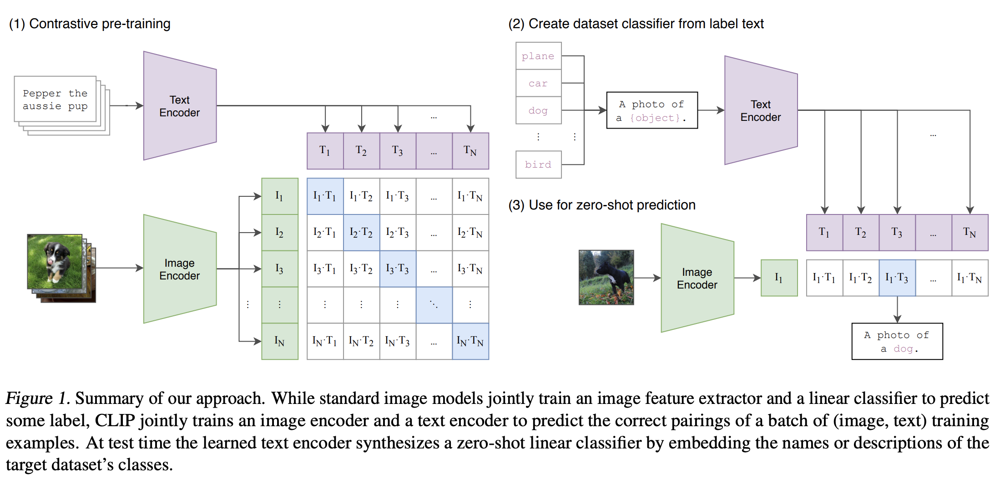

# Diffusion

## What is Diffusion?

This idea came from diffusion in physics, the mixing of substances caused by particle motions. Substances diffuse in another until a homogenouous mixture is achieved. For example, hot water mixes with cool water, temperature gradient will drive particle motion until temperature is identical everywhere in the mixture.


We take the same idea and apply to machine learning models. Instead of diffusing particles, we diffuse structure of data. The equilibrium state is achieved when structure of data is completely destroyed, i.e. turning a piece of data into random noise. Obviously destroying data isn't particular useful, but the opposite is very useful, i.e. generating data.

## Physical Intuition of Diffusion Models

This idea first appeared in [Deep Unsupervised Learning using Nonequilibrium Thermodynamics](https://arxiv.org/pdf/1503.03585.pdf).

### Observation 1: Diffusion Destroys Structure

Imagine that we have a dye diffusing in a bottle of water. A drop of dye will follow Brownian motion and diffuse itself in the water. Let the dye density represent probability density. The goal of a diffusion model is to learn the structure of probability density.

It's impossible to learn the actual process of diffusion but we can approximate it. We know the boundary conditions, i.e. data distribution (dye) will eventually reach uniform distribution (dye uniformly coloring the water).

### Observation 2: Microscopic Diffusion is Time Reversible

If we zoom into the microscopic process of diffusion, the time moving forward and backward is identical, just like Quantum Mechanical processes. We cannot distinguish the before and after state of such operation. Positional update of each dye molecule is sampled from small Gaussian in either time flow direction.


### Conjecture

We can learn the reversal of diffusion process by estimating the function for mean and covariance of each step in the reverse diffusion process (transition rates for discrete state spaces.) The reverse diffusion process is going to form the model of our data.

If I have a `(200, 200, 3)` image, I have a positional vector in `200*200*3`  dimensional space. It is diffusing through this `200*200*3` space and makes an incremental update in position every time step.

## Forward Diffusion

We will use a Markov process with Gaussian transition to describe the forward diffusion process. Markov means that current stand is only dependent on previous state. Gaussian transition means that we move from one state to next state by sampling from a Gaussian distribution.

Let's denote q  as the forward diffusion process.

$$
q\,(x^t \mid x^{t-1}) = \mathbb{N}\left[x^t\,;x^{t-1}\sqrt{1 - \beta_t}\,,I_{\text{identity}}\beta_t\right]
$$

This is saying that we will produce a distribution of `x[t]` using `x[t-1]`. The beta term is the diffusion strength. The matrix `I` is an identity matrix. It represents the covariance matrix with beta as the covariance in `x` space.

Consider we have an image of shape `(64, 64, 3)`, my `x` is a vector of 12288 values. This is assuming that I treat each color channel as a dimension. My diffusion process is applying Gaussian on this vector using the mean `x * sqrt(1 - beta)` and variance `beta`.

```py
import numpy as np

x_0 = np.random.randn(64, 64, 3)
x_0 = img.reshape(-1)
beta = np.random.uniform(0, 1, 64*64*3)
mean = x_0 * np.sqrt(1 - beta)

# Diffusion
x_1 = np.random.normal(mean, beta)
```

## Backward Diffusion

We can describe same process in reverse using the same functional form with different parameters, i.e. the mean and variance. This is the key idea of why diffusion works in the first place.

$$
p\,(x^{t-1} \mid x^t) = \mathbb{N}\left[x^{t-1}\,; f_{\mu}(x^t, t)\,,f_{\sigma}(x^t, t)\right]
$$

This is saying, given some noisy data or image in this case, we can reverse the noise process using the same Gaussian functional form but with different mean and variance at each time step for each dimension or color in this case.

Our model needs to learn the mean and the covariance of the Gaussian from time step to time step. We are turning the problem of building a density model into the problem of learning functions for the mean and the covariance of a sequence of Gaussians. This is basically a supervised regression problem.

## Diffusion Training Objective

The math is nearly identical to that of **variational autoencoder**. We start from the premise of maixmizing the log likelihood of `p` such that it will approximate the true distribution of data. Due to the lack of closed form solution for the posterior, we have to do a couple math tricks like Jensen's inequality to arrive at an **evidence lower bound** for the loss function. I will skip the derivation steps here. 

$$
\text{argmin}_{f_\mu, f_\sigma} = \mathbb{E}\left[D_{KL}\left(q\,(x^{t-1}\mid x^t, x^0) || p\,(x^{t-1} \mid x^t) \right)\right]
$$

In summary, we want to learn the mean and covariance functions of the diffusion process such that we can minimize the expected value of KL divergence of the two distributions. 

# Stable Diffusion

Suppose I have a handwritten digit classifier, I feed handwritten digit images to it. The classifier will predict a probability for the given image. For a noisy image, I will get a very low probability. For a clear digit image, I will get a very high probability.

Now I ask, what is the gradient of probability with respect to each pixel? What if I update each pixel of my noisy image such that it yields the greatest probability to be classified as a digit?

> This idea is very similar to generative adversarial network but diffusion can be seen as a more guided approach 
> to the same idea.

I actually re-frame the problem such that I don't even need a classifier. I train a model that accepts a noisy image as input and produces noises as output. I subtract the noise from the noisy input and I now get the original image I expected. This is the core idea of stable diffusion.

## U-Net

We need a U-Net to detect noises from noisy images. This is practically the same ideas the medical imaging use case. It's an image segmentation task at hand.


However, U-Net limits the resolution we can obtain. We either need an extensive amount of resources to pull it off with a pure U-Net or we need to find a way to compress the image into a smaller latent vector. Let's go with the latter; we project an input from image space to latent space using a VAE. Then feed this latent vector input U-Net to perform de-noising, or reverse diffusion.

## Variational AutoEncoder VAE

The VAE is effectively a deep learning compression algorithm. Variational AutoEncoder is an enhanced version of AutoEncoder that allows latent space to be regularized.

> [What is the difference between autoencoder and variational autoencoder?](https://towardsdatascience.com/difference-between-autoencoder-ae-and-variational-autoencoder-vae-ed7be1c038f2)

### AutoEncoder


The learning object only aims to minimize the squared difference between input and reconstructed input. This will result in a latent space that is not regularized.


When latent space is not regularized, any latent vector that lands on the "white" spot of the space will return a non-sense reconstructed input. The model expects to see a familiar input and produces a latent vector that exists in the latent space. If it does not see one, it will produce a latent vector that does not exist in the latent space. When this occurs, the output, aka reconstructed input, will be gibberish.

We can solve this by changing the learning objective to use KL divergence and add a Gaussian sampling layer in the middle of the network. Instead of just minimizing the difference between input and output. We also minimize the probability distribution of input and output. This forces latent space to be Gaussian.

### Variational AutoEncoder


The resultant latent space is then regularized.


The encoder in the AE outputs latent vectors. Instead of outputting the vectors in the latent space, the encoder of VAE outputs parameters of a pre-defined distribution in the latent space for every input. The VAE then imposes a constraint on this latent distribution forcing it to be a normal distribution. This constraint makes sure that the latent space is regularized.

## CLIP Encoder

We need to teach the model to generate images based on a prompt. We can accomplish this by tokenizing the text prompt and feed it into the U-Net along with the latent vector produced by our VAE. 

In order for the text embedding to resembles an image and vice versa, we need to train two encoders, text encoder and image encoder. These two encoders need to produce latent vectors that are similar in latent space for a given image and text pair. At the same time it needs to perform "contrastive" loss to push negative samples away in latent space. For example, "I am dining", "I am eating dinner", "I am having dinner", should be far away from, "I am working". 



This is known as **Contrastive Language–Image Pre-training** encoder. The end result is that given a text, it can query similar images in the latent space, and vice versa.

## Put Everything Together


1. We use variational autoencoder to project image into latent space.
2. We perform diffusion process to add noise to the vector.
3. We embed the image caption with CLIP encoder. 
4. The text embedding (known as conditionals) and noisy image latent vectors will go into the U-Net.
5. U-Net will output a de-noised latent vector.
6. We take the de-noised latent vector and decode it with variational autodecoder.
7. Viola, we have a de-noised image that is guided by the image caption.

Howver, there are additional details to

- How much de-noising each time step?
- How many time-steps?
- How to perform classifier or classifier-free guidance?
- How to encode attention mechanism?

Some of these answers will be in Stable Diffusion Deep Dive section. The others will take me some time to learn.
