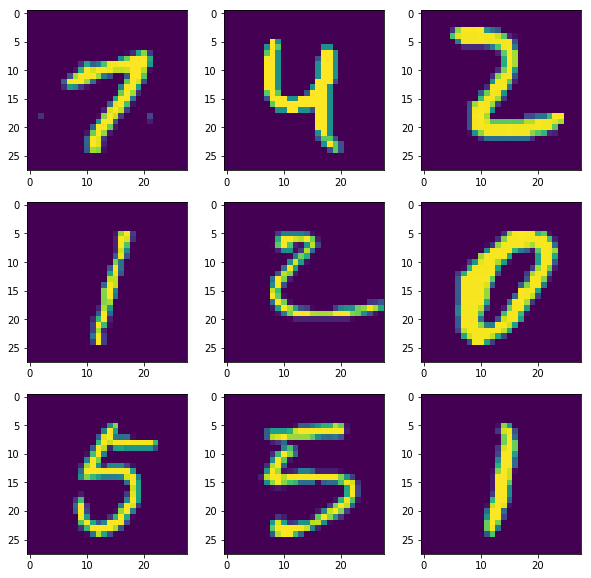

# MNIST Tutorial
In this tutorial, we will first use `tensorflow` and `keras` to build a simple fully connected neural 
network to perform hand written digit classification on MNIST dataset. Then we will dive into the
details of how to write a neural network from scratch. Basically, we will re-implement the 
functionality of `keras` from scratch, without the help of tensorflow or any machine learning frameworks.

## Keras
Step one, let's build a simple sequential model using `keras` and we will see how powerful `keras` is. 
It should only take us less than 10 lines of code to build a 3-layer fully connected network.


```python
import warnings
warnings.filterwarnings('ignore')

from keras.datasets import mnist
from keras.models import Sequential
from keras.layers import Dense, Activation
from keras.utils import to_categorical
from keras.optimizers import SGD
from keras.regularizers import l2

from matplotlib import pyplot as plt

import numpy as np


# Build the neural network!
model = Sequential()
model.add(Dense(300, input_dim=28*28, kernel_regularizer=l2(0.01)))
model.add(Activation('relu'))
model.add(Dense(50, input_dim=300, kernel_regularizer=l2(0.01)))
model.add(Activation('relu'))
model.add(Dense(10, input_dim=100))
model.add(Activation('softmax'))
```

    Using TensorFlow backend.


Now we will grab MNIST hand-written digit data through `keras`.


```python
(x_train, y_train), (x_test, y_test) = mnist.load_data()
```

Let's visualize them and see how do the data look like.


```python
from utils import visualize_img_data

visualize_img_data(x_train)
```





Now here comes the magic of `keras`. We can train the network using as few as 3 lines of code!


```python
from utils import plot_histo_chart


# Massage the data first
N, H, W = x_train.shape
x = x_train.reshape((N,H*W)).astype('float') / 255
y = to_categorical(y_train, num_classes=10)

# Define optimizer
sgd = SGD(lr=0.01, decay=1e-4, momentum=0.9)

# Compile the model
model.compile(optimizer=sgd, loss='categorical_crossentropy', metrics=['accuracy'])

# Train it
plot_histo_chart(model.fit(x, y, validation_split=0.20, epochs=10, batch_size=50))
```

    Train on 48000 samples, validate on 12000 samples
    Epoch 1/10
    48000/48000 [==============================] - 3s 63us/step - loss: 1.9959 - acc: 0.8826 - val_loss: 0.6230 - val_acc: 0.9272
    Epoch 2/10
    48000/48000 [==============================] - 3s 62us/step - loss: 0.5144 - acc: 0.9275 - val_loss: 0.4369 - val_acc: 0.9403
    Epoch 3/10
    48000/48000 [==============================] - 3s 61us/step - loss: 0.4345 - acc: 0.9378 - val_loss: 0.3999 - val_acc: 0.9466
    Epoch 4/10
    48000/48000 [==============================] - 3s 62us/step - loss: 0.4030 - acc: 0.9434 - val_loss: 0.3807 - val_acc: 0.9517
    Epoch 5/10
    48000/48000 [==============================] - 3s 60us/step - loss: 0.3846 - acc: 0.9460 - val_loss: 0.3658 - val_acc: 0.9517
    Epoch 6/10
    48000/48000 [==============================] - 3s 62us/step - loss: 0.3698 - acc: 0.9496 - val_loss: 0.3505 - val_acc: 0.9572
    Epoch 7/10
    48000/48000 [==============================] - 3s 62us/step - loss: 0.3587 - acc: 0.9519 - val_loss: 0.3455 - val_acc: 0.9562
    Epoch 8/10
    48000/48000 [==============================] - 3s 63us/step - loss: 0.3480 - acc: 0.9532 - val_loss: 0.3342 - val_acc: 0.9590
    Epoch 9/10
    48000/48000 [==============================] - 3s 63us/step - loss: 0.3395 - acc: 0.9553 - val_loss: 0.3320 - val_acc: 0.9579
    Epoch 10/10
    48000/48000 [==============================] - 3s 62us/step - loss: 0.3337 - acc: 0.9565 - val_loss: 0.3225 - val_acc: 0.9609


Now training is done, we are ready to evaluate the model.


```python
N, H, W = x_test.shape
x = x_test.reshape(N, H*W).astype('float') / 255
y = to_categorical(y_test, num_classes=10)

test_loss, test_acc = model.evaluate(x, y, batch_size=50)
print 'Accuracy on test data %f' % test_acc
```

    10000/10000 [==============================] - 0s 23us/step
    Accuracy on test data 0.958100


That is a 95.8% accuracy on test data! This isn't bad but it isn't the best. We can achieve 99.8% if
we use convolutional neural network. This is a topic for another tutorial.

## Implement From Scratch
Now it is time to implement everything from scratch. The source code can be found on [GitHub][1]. We 
are going to deep dive into every detail of the implementation to get a full understanding of what's 
going on. It is important to understsand how to perform gradient calculation using the idea of a 
[computational graph][2] before we proceed onto writing code. In every layer, we will focus on 
calculating the local gradients and use chain rule to compute the gradient with respect to loss.

[1]:https://github.com/calvinfeng/machine-learning-notebook/tree/master/mnist_tutorial
[2]:http://colah.github.io/posts/2015-08-Backprop/

## Dense
The first layer we will implement is the `Dense` layer. We need logic for both forward propagation and backpropagation in this layer. 

### Forward Propagation
Let's begin with forward propagation:

$$
y = \vec{x}W + b
$$

$$W$$ is our weight matrix and $$b$$ is the bias vector. We take an input, which is $\vec{x}$, and perform 
an [affine][3] transformation on it. The input to our forward propagation function can be any shape, 
e.g. `(N, 28, 28, 3)`, this represents N 28x28 images with 3 channels (RGB). However, the weight matrix 
must be of shape `(28*28*3, H)` where H is the hidden unit dimension. Thus, the input needs to be 
reshaped before we carry out the matrix multiplication.
```python
    def forward_prop(self, x, w, b):
        self.input = x
        self.weight = w
        self.bias = b

        D = np.prod(x.shape[1:])
        x_reshaped = x.reshape(x.shape[0], D)

        return np.dot(x_reshaped, w) + b
```

[3]:https://en.wikipedia.org/wiki/Affine_transformation

### Backpropagation
It should be the layer's responsibility to compute local gradients and apply chain rule to them to 
obtain gradient of loss. What are local gradients? They are the gradient of $$y$$ with respect to 
$$x$$, $$W$$, and $$b$$, as opposed to the gradient of loss (which is global gradient in our context.)

$$
\frac{\partial y}{\partial W} = x^{T}
$$

$$
\frac{\partial y}{\partial x} = W^{T}
$$

$$
\frac{\partial y}{\partial b} = 1
$$

#### Tensor Calculus
Notice that we are doing tensor calculus, the actual derivation of differentiation isn't very clean.
It involves constructing a Jacobian matrix because we are basically taking derivative of a vector i.e.
$$y$$ with respect to a matrix, i.e. $$W$$. For more information, please look at 
[Prof. Erik Learned-Miller's note][4]. 

For now, let's look at a simple example to prove the equations above:

$$
\vec{x} = [x_{1}, x_{2}, x_{3}] \\
\vec{b} = [b_{1}, b_{2}]
$$

And

$$
W = \begin{bmatrix}
w_{1,1} & w_{1,2} \\ 
w_{2,1} & w_{2,2} \\
w_{3,1} & w_{3,2}
\end{bmatrix}
$$

Thus, $$y$$ is

$$
y = \begin{bmatrix}
w_{1,1}x_{1} + w_{2,1}x_{2} + w_{3,1}x_{3} & w_{1,2}x_{1} + w_{2,2}x_{2} + w_{3,2}x_{3}
\end{bmatrix}
$$

Now if we want to take derivative of $$y$$ with respect to $$\vec{x}$$, we need to construct a Jacobian.

$$
\frac{\partial y}{\partial \vec{x}} = \begin{bmatrix}
\frac{\partial y_{1}}{\partial x_{1}} & \frac{\partial y_{1}}{\partial x_{2}} & \frac{\partial y_{1}}{\partial x_{3}} \\
\frac{\partial y_{2}}{\partial x_{1}} & \frac{\partial y_{2}}{\partial x_{2}} & \frac{\partial y_{2}}{\partial x_{3}}
\end{bmatrix}
$$

That is equivalent to the transpose of weight matrix!

$$
\frac{\partial y}{\partial \vec{x}} = \begin{bmatrix}
w_{1,1} & w_{2,1} & w_{3,1} \\
w_{1,2} & w_{2,2} & w_{3,2} 
\end{bmatrix} = W^{T}
$$

#### Dimension Analysis
Anyways, my typical lazy approach to the problem is dimension analysis. We know that upstream gradient, 
the gradient of loss with respect to $$y$$ has the shape `(N, H)`. We know that $$x$$ has the shape `(N, D)`. 
We are expecting to get the gradient of $$y$$ with respect to $$W$$, which should have the shape of `(D, H)`. 
This is translating to the following in code:
```python
# Applying vector chain rule, as a result, grad_w is the gradient of loss with respect to weight
grad_w = np.dot(x.T, grad_y)  # (D, N) x (N, H) => (D, H)
```

Similarly, we can do the same for gradient of $$x$$:
```python
# Applying vector chain rule, as a result, grad_x is the gradient of loss with respect to input
grad_x = np.dot(grad_y, w.T)
```

Since the local gradient of bias is 1, the gradient of loss with respect to $$y$$ is going to be the 
gradient we use for updating biases. But the problem is that `grad_y` has shape `(N, H)` while bias 
vector has shape `(H,)`. this just means that we need to sum up the contributions from N examples.
```
grad_b = np.sum(grad_y.T, axis=1)
```

Now put everything together.
```python
    # grad_output is grad_y, I use the two terms interchangeably
    def backprop(self, grad_output):
        if self.input is not None and self.weight is not None:
            D = np.prod(self.input.shape[1:])
            input_reshaped = self.input.reshape(self.input.shape[0], D)

            grad_w = np.dot(input_reshaped.T, grad_output)
            grad_x = np.dot(grad_output, self.weight.T).reshape(self.input.shape)
            grad_b = np.sum(grad_output.T, axis=1)

            return grad_x, grad_w, grad_b  
```

[4]:https://compsci697l.github.io/docs/vecDerivs.pdf

## ReLU Activation
ReLU stands for rectified linear unit. It squashes all negative inputs to zero and keeps the value of
all positive inputs. 
```python
relu(1)  # => 1
relu(52342)  # => 52342
relu(-1)  # => 0
relu(-4232)  # => 0
```

### Forward Propagation
$$
f(x) = \begin{cases}
\text{if } x > 0 \quad \text{ return } x \\  
\text{if } x <= 0 \quad \text{ return } 0 
\end{cases}
$$

The implementation is extremely simple.
```python
def forward_prop(self, x):
    return np.maximum(0, x)
```

### Back Propagation
ReLU acts as a switch. If any input is negative, it won't pass the input forward to next layer. If
any input is positive, it will pass the input forward to next layer without any additional 
modifications. What does that imply? Whenever the input is positive, we have a slope of 1 because 
the change is linearly proportional to the input. This is like: 

$$
\text{ Given } f(x) = x \rightarrow \frac{\partial f}{\partial x} = 1
$$

Whenever the input is negative, we have a slope of zero because there isn't any change! This is like:

$$
\text{ Given } f(x) = 0 \rightarrow \frac{\partial f}{\partial x} = 0
$$

We can expect that our local gradient is filled with ones and zeros in a matrix of shape `(N, H)`.
We will multiply the local gradient by the upstream gradient. With that mind, we can take a short cut
and write:
```python
def backprop(self, grad_output):
    grad_input = grad_output
    grad_input[self.input <= 0] = 0  # Set all entries, where inputs were negative, to zero.
    
    return grad_input
```

## Softmax Activation
What is softmax? It is a generalization of the logistic function that allows us to handle multiple
classes. To put it in layman term, it is a function that we can use to squash a set of random values
with range `{-Inf, Inf}` to a range of `{0, 1}`. You may ask, why squashing? It is because squashing
allows us to extract probabilities and likelihood from a set of values. 

For example, let's ask the question, given Dog, Cat, Hippo, and Parrot, which one is your favorite
pet? You can arbitrarily assign some score to each of them, like
```
{
    "dog": 100,
    "cat": 100,
    "hippo": 70,
    "parrot": -100
}
```

For whatever reason you don't like parrot, because they are too talkative, you give it a negative
score. 

### Quantifying Score
The problem with score is that it is completely arbitrary and it is meaningless to tell someone that
"Dog and cat score 100 points". It is more meaningful to ask which one of them is most likely to be 
your favorite pet. 

Let's define score as an array


```python
import numpy as np


pet_types = ['dog', 'cat', 'hippo', 'parrot']
pet_scores = [100, 100, 70, -100]
```

I will denote `s` as score for convenience. Softmax probability for a given `i` item is defined as 
follows

$$
P(i) = \frac{e^{s_{i}}}{\Sigma_{j}^{N} e^{s_{j}}}
$$


```python
def probability(scores, i):
    exp_sum = 0
    for score in scores:
        exp_sum += np.exp(score)
    
    return np.exp(scores[i]) / exp_sum
```

Now we are ready to calculate probability using scores


```python
for i in range(len(pet_types)):
    print "Probability of %s being your favorite pet is %f" % (pet_types[i], probability(pet_scores, i))
```

    Probability of dog being your favorite pet is 0.500000
    Probability of cat being your favorite pet is 0.500000
    Probability of hippo being your favorite pet is 0.000000
    Probability of parrot being your favorite pet is 0.000000


### Numerically Instability
The math expression above is fairly easy to understand, but it suffers from one problem: 
*numerical instability*. The probability function will blow up when the score value is too high.

Let me demonstrate with an example:


```python
car_brands = ['mazda', 'porsche', 'hyundai']
car_scores = [100, 1000, 100]

probability(car_scores, 1)
```

    /home/carmento/Desktop/calvinfeng/machine-learning-notebook/environment/lib/python2.7/site-packages/ipykernel_launcher.py:4: RuntimeWarning: overflow encountered in exp
      after removing the cwd from sys.path.
    /home/carmento/Desktop/calvinfeng/machine-learning-notebook/environment/lib/python2.7/site-packages/ipykernel_launcher.py:6: RuntimeWarning: overflow encountered in exp
      
    /home/carmento/Desktop/calvinfeng/machine-learning-notebook/environment/lib/python2.7/site-packages/ipykernel_launcher.py:6: RuntimeWarning: invalid value encountered in double_scalars
      


    nan


We get a `NaN` as answer! You know why? Because `np.exp(1000)` is tooooooo big to fit in memory. The
computer cannot handle such big number. We need a way to get around this problem and allow our
probability function to take in any score values otherwise it is garbage.

Stablize numerical instability by multiplying by 1. (This is a common trick that is used in many
engineering fields and physics.)

$$
P(i) = \frac{C \cdot e^{s_{i}}}{C \cdot \Sigma_{j}^{N} e^{s_{j}}}
$$

Note that

$$
\frac{C}{C} = 1
$$

`C` is any arbitrary constant, be it `C = 1`, `C = 1000` or `C = 9999999`. Now we can rewrite the
expression by doing a little algebra here. 

$$
P(i) = \frac{e^{s_{i} + log(C)}}{C \cdot \Sigma_{j}^{N} e^{s_{j} + log(C)}}
$$

A common choice for `log(C)` is `-1 * np.max(scores)`. Basically, we are subtracting all scores by
the max score in the score array. It's a very simple trick.
```python
def stable_probability(scores, i):
    max_score = np.max(scores)
    exp_sum = 0
    for score in scores:
        exp_sum += np.exp(score - max_score)
    
    return np.exp(scores[i] - max_score) / exp_sum


for i in range(len(car_brands)):
    print "Probability of %s being the best is %f" % (car_brands[i], stable_probability(car_scores, i))
```

    Probability of mazda being the best is 0.000000
    Probability of porsche being the best is 1.000000
    Probability of hyundai being the best is 0.000000


### Forward Propagation

