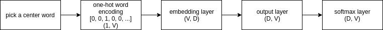

# Word2Vec - The Skip-Gram Model

The idea of word2vec is actually quite simple. We want to train a 2-layer neural network to perform
a fake task. The weights in the hidden layer will become our embedding vectors for our vocabulary in
the corpus.

## Fake Task

Given a specific word in the middle of a sentence, find the probability for every word in our
vocabulary of being the nearby *word*.

For example, I have a sentence.

> Live as if you were to die tomorrow and learn as if you were to live forever.

I pick *tomorrow* to be my center word. Now the neural network is supposed to tell me what is the
probability of *die* being the nearby word of *tomorrow*. If it is properly trained, it should be
close to one. Similarly if I ask the neural network, what is the probability of *live* being the
nearby word of *tomorrow*, it should be close to zero.

## Architecture



### Input

The input is a word that gets translated into one-hot encoding. The encoding vector should have length
of `V` where `V` represents the total vocabulary length. For example, if I have 10 unique words in my
vocabulary, one of the words will be encoded as the following.

    [0, 0, 1, 0, 0, 0, 0, 0, 0, 0]

### Output

Each output is a vector of same length `V`; it contains the probability for all the words that they
are the nearby word of the input center word. The output vector will contain float ranging from 0 to 1.

    [0.1, 0.23, 0.64, 0.45, 0, 0.523, 0.4, 0.9, 0.34, 0.85]

### Lookup Table

Our neural network has two layers and two sets of weights. Suppose we have 1000 words in our vocabulary
and 300 is our feature dimension. The first set of weights from the hidden layer will be our word vector
lookup table after we finish training.


### Implementation

Now we are ready to actually create the model for performing such task. Let's define our word vector
feature length to be `D=100`.

```python
import numpy as np


corpus = """
The Porsche Boxster is a mid-engined two-seater roadster. It was Porsche's first road vehicle to be
originally designed as a roadster since the 550 Spyder. The first-generation Boxster was introduced in
late 1996; it was powered by a 2.5-litre flat six-cylinder engine. The design was heavily influenced by the 1992
Boxster Concept. In 2000, the base model was upgraded to a 2.7-litre engine and the new Boxster S variant was
introduced with a 3.2-litre engine. In 2003, styling and engine output was upgraded on both variants.
"""


def softmax(x):
    if len(x.shape) > 1:
        x = x - np.max(x, axis=1, keepdims=True)
        denom = np.sum(np.exp(x), axis=1, keepdims=True)
        x = np.exp(x) / denom
    else:
        x = x - np.max(x)
        denom = np.sum(np.exp(x))
        x = np.exp(x) / denom

    return x


class Model(object):
    def __init__(self, corpus, feature_dim):
        self.add_corpus(corpus)
        self.V = len(self.lookup_table)
        self.D = feature_dim
        self.w1 = np.random.randn(self.V, self.D)
        self.w2 = np.random.randn(self.D, self.V)

    def add_corpus(self, corpus):
        self.lookup_table = dict()
        idx = 0
        for word in set(corpus.split()):
            self.lookup_table[word] = idx
            idx+=1

    def forward(self, word):
        if self.lookup_table.get(word) is None:
            return

        idx = self.lookup_table.get(word)
        wordvec = np.array([0]*self.V).reshape(1, self.V)
        wordvec[0][idx] = 1

        embeddings = np.dot(wordvec, self.w1)
        scores = np.dot(embeddings, self.w2)
        probs = softmax(scores)

        return probs


model = Model(corpus, 100)
model.forward('Porsche').sum()
```

    0.99999999999999989

## Training

In the context of CS224n, they called `w1` the $$V$$ matrix, or center word matrix, while they called
`w2` the $$U$$ matrix, or context word matrix. The $$U$$ matrix will be tossed away after training.
Sometimes they even called the $$V$$ matrix the predicted and `U` matrix the outputs. The lectures and
assignments have conflicting naming scheme. I would just stick with `w1` as the hidden layer and `w2`
as the output layer.

### Standard Training

The architecture is pretty straightforward, this is just a standard softmax gradient backpropgation.
Suppose we are given the center word and a correct target context word, e.g. `(Porsche, Boxster)`.

```python
def softmax_cost_and_gradient(self, center_word, target_ctx_word):
    if self.lookup_table.get(word) is None:
        return

    # Create the one-hot encoding for center word
    idx = self.lookup_table.get(word)
    wordvec = np.array([0]*self.V).reshape(1, self.V)
    wordvec[0][idx] = 1

    # Forward propgate it
    embeddings = np.dot(wordvec, self.w1) # (1, D)
    scores = np.dot(embeddings, self.w2) #(1, V)
    probs = softmax(scores) # (1, V)

    # Cross-entropy loss
    target_idx = self.lookup_table_get(target_ctx_word)
    cost = -np.log(probs[target_idx])

    grad_score = probs.copy() # (1, V)
    grad_score[0][target_idx] -= 1

    grad_w2 = np.dot(embeddings.T, grad_score) # (D, V)
    grad_embeddings = np.dot(grad_score, self.w2.T) # (1, D)
    grad_w1 = np.dot(grad_embeddings.T, wordvec)
```

Once we have `grad_w1` and `grad_w2`, we can perform updates on these two matrices. Eventually
`grad_w1` will be our list of embedding vectors for all words.

### Problem

However, if we have a giant corpus with one million unique vocabulary words, and our feature dimension
is defined to be 100. We will have a matrix that has 100 million entries. This is not going to fit
in memory. We will also have serious trouble with computing the matrix multiplication. We need a better
technique than this.

### Negative Sampling

In the original paper *Distributed Representations of Words and Phrases and their Compositionality*,
the authors modified the optimization objective with a technique they called **negative sampling**,
which causes each training sample to update only a small percentage of the model's weights instead of
the whole weights.

Essentially we will select 1 positive example, e.g. `(Porsche, Boxster)` and 5 random negative
examples, e.g. `(Porsche, since)`, `(Porsche, styling)`, `(Porsche, concept)`, `(Porsche, engine)`
and `(Porsche, model)`, assuming that the window size is 2.

#### Objective Function

The new objective function is written as follows.

$$
J(\theta) = log\;\sigma\left(u_{o}^{T}v_{c}\right) + \Sigma_{k=1}^{K} log\; \sigma\left(-u_{k}^{T}v_{c}\right)
$$

Using the same context described by CS224n course. The term $$v_{c}$$ is the embedding vector for
our center word in `w1` or $$V$$ matrix. The term $$u_{o}$$ is the positive context word vector in
the `w2` or $$U$$ matrix. The $$u_{k}$$ term is the negative context word vector in the `w2` or $$U$$
matrix.

Here's an example

```python
def neg_sampling_cost_and_gradient(embedding, ctx_word_idx, w2, K=10):
    indices = [ctx_word_idx]
    indices.extend(getNegativeSamples(ctx_word_idx, K))

    # indices has one positive sample, and K negative samples.

    w2 = w2.T # Flip it (V. D)
    grad_w2 = np.zeros(w2.shape) # (V, D)
    grad_embedding = np.zeros(embedding.shape) # (1, D)

    # Changing from softmax to sigmoid (new objective func)
    score = sigmoid(np.dot(w2[ctx_word_idx], embedding[0])) 
    cost = -np.log(score)

    grad_w2[ctx_word_idx] += embedding * (score - 1.0)
    grad_embedding[0] += w2[ctx_word_idx] * (score - 1.0)

    for k in xrange(K):
        samp = indices[k+1]
        score = sigmoid(np.dot(w2[samp], embedding[0]))
        cost += -np.log(1.0 - score)
        grad[samp] += embedding * score
        grad_embedding[0] += w2[ctx_word_idx] * score

    return cost, grad_embedding, grad_w2.T
```

And update the weight matrix `w1` and `w2` with the gradients returned from above calculations. This
way we only need to modify 6 rows at a time.

### Selecting Negative Samples

We will use unigram distribution to select more frequent words to be our negative samples. The
probability of selecting a word to be a negative sample can be summarized by the following equation.

$$
P(w_{i}) = \frac{f(w_{i})}{\Sigma_{j}^{N} f(w_{j})}
$$

The function $$f(w_{i})$$ is the frequency count of a given word. `N` is the total number of words.
The original authors of the paper also raised the power of frequency function to $$\frac{3}{4}$$
power and it allowed less frequent words to be sampled more often.

$$
P(w_{i}) = \frac{f(w_{i})^{3/4}}{\Sigma_{j}^{N} f(w_{j})^{3/4}}
$$