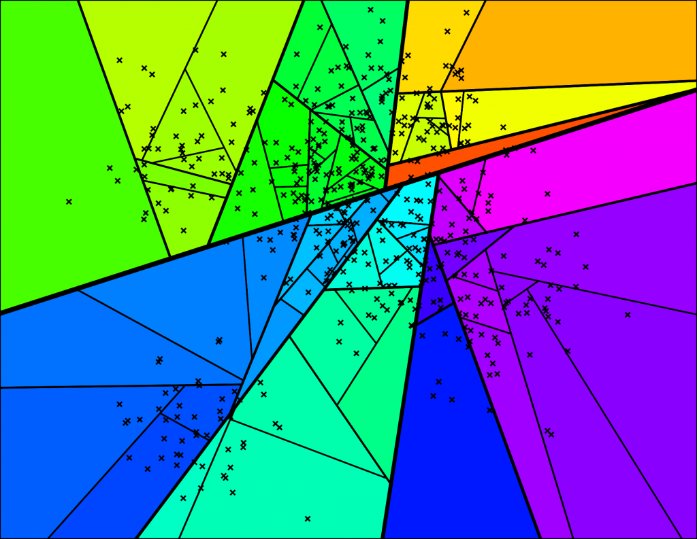
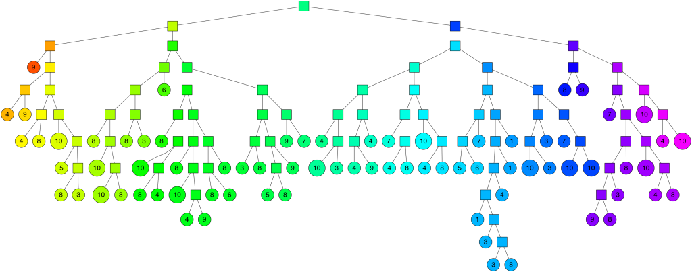
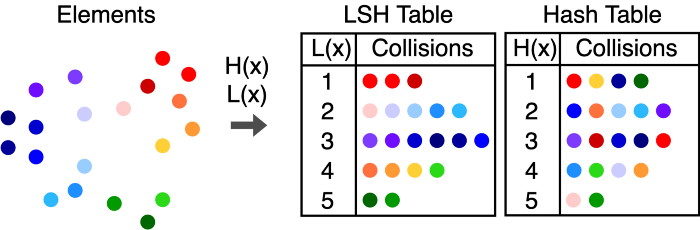
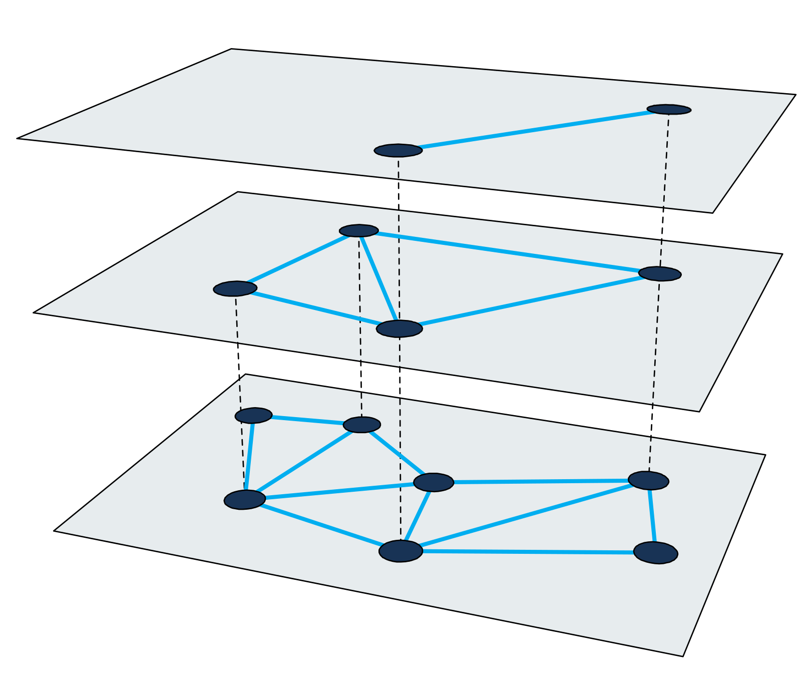

# Nearest Neighbor Search

## Define Nearest Neighbor Search

Given a set of points $${x_1, ..., x_n} \in \mathbb{R}^d$$, preprocess them into a data structure $$X$$ of size
`polynomial(n, d)` in time `polynomial(n, d)` such that nearest neighbor queries can be performed in logarithmic time.
In other words, given a search query point `q`, radius `r`, and $$X$$, one can return all $$x_i$$ such that

$$
\left \|
{q - x_i} \leq r
\right \|
$$

## Find Nearest Neighbor in 2D

Let's assume that we have a random set of points `N = 100`. If we represent these points in a 2D feature space with 
$$x_1 \in [-1, 1]$$ and $$x_2 \in [-1, 1]$$. We want to find all the nearest neighbor within a circle of `radius=1`.
For the purpose of demsontration, I will perform a linear search to find all the exact matches.

```python
import numpy as np
np.random.seed(42)
N = 100

def search_nn_by_dimension(num_points, dim):
    points = np.random.randn(num_points, dim)
    radius = 1
    nearest = []
    for p in points:
        if np.sqrt(p.dot(p)) <= 1:
            nearest.append(p)
    return len(nearest)

print(f"""
number of nearest neighbor within Euclidean distance 1.0: {search_nn_by_dimension(N, 2)}""")
```

    number of nearest neighbor within Euclidean distance 1.0: 41

What if I increase the dimension?

```python
for d in range(3, 10):
    print(f"D={d} number of nearest neighbor within " +
          f"Euclidean distance 1.0: {search_nn_by_dimension(N, d)}"
    )
```

    D=3 number of nearest neighbor within Euclidean distance 1.0: 21
    D=4 number of nearest neighbor within Euclidean distance 1.0: 12
    D=5 number of nearest neighbor within Euclidean distance 1.0: 5
    D=6 number of nearest neighbor within Euclidean distance 1.0: 2
    D=7 number of nearest neighbor within Euclidean distance 1.0: 0
    D=8 number of nearest neighbor within Euclidean distance 1.0: 0
    D=9 number of nearest neighbor within Euclidean distance 1.0: 0

As we increase the dimensionality of feature space, the data points are getting further apart. Nearest neighbor search
within a radius `r` will start to reduce its effectiveness. In order to more accurately find nearest neighbor, the
search radius must increase but it will also result in higher time complexity for the exact search.

> The curse of dimensionality complicates nearest neighbor search in high dimensional space. It is not possible to
> quickly reject candidates by using the difference in one coordinate as a lower bound for a distance based on all the
> dimensions.

## But Why?

Consider feature space as a hyper-cube, the volume of a hyper-cube is simply

$$
V_{\text{hypercube}} = s^d
$$

where $$d$$ is dimension and $$l$$ is the length of the side. What about a hypercube? It involves a gamma function
$$\Gamma$$.

$$
V_{\text{hypersphere}} = \frac{\pi^{d/2} r^d}{\Gamma(\frac{d}{2} + 1)}
$$

Using the previous example, let's assume we want to search within the radius of $$\frac{s}{2}$$. The points are randomly
scattered in the feature space, so the probability of finding a point inside the search radius is the ratio of
hypersphere volume to hypercube volume.

$$
\frac{V_{\text{hypersphere}}}{V_{\text{hypercube}}} = \frac{\pi^{d/2}}{2^d\Gamma(\frac{d}{2} + 1)}
$$

What does this mean? The probability of finding points inside the search radius decreases as the dimension increases!
The rate decreases exponentially too.

> There are no known exact methods for finding nearest neighbors efficiently. As both the number of points increases and
> the number of dimensions increase, we fall victim to the curse of dimensionality. In high dimensions, all points are
> almost equally distant from each other. A good enough solution for many applications is to trade accuracy for
> efficiency. In approximately nearest neighbors (ANN), we build index structures that narrow down the search space.
> The implicit neighborhoods in such indexes also help reduce the problem of high dimensions.

## Approximate Nearest Neighbor

Resources

- [ANNOY ANN Part 1](https://erikbern.com/2015/09/24/nearest-neighbor-methods-vector-models-part-1.html)
- [ANNOY ANN Part 2](https://erikbern.com/2015/10/01/nearest-neighbors-and-vector-models-part-2-how-to-search-in-high-dimensional-spaces.html)

If we care more about search speed, we need to give up accuracy for it. We can preprocess the vectors into efficient
indices by doing the following steps.

1. Transform The Vector: Since the curse is on dimensionality, we can try to reduce the dimension with PCA.
2. Encode The Vector: We can encode the vector into a data structure (e.g. tree, hash, quantization) for fast retrieval.
3. Non-Exhaustive Search: We can avoid excessive searches with inverted files and neighborhood graphs.

Let's look at a couple of approximate nearest neighbor search. Let's assume we have a set of trained embeddings for
movies based on the MovieLens dataset.

```python
import pickle

with open('movies.pickle', 'rb') as f:
    embeddings = pickle.load(f)

print(embeddings['name'].shape)
print(embeddings['vector'].shape)
```

    (1682,)
    (1682, 64)

## Linear Search

We can build a linear search with `faiss`.

```python
import faiss

class BruteForceIndex():
    def __init__(self, embeddings, labels):
        self.dimension = embeddings.shape[1]
        self.embeddings = embeddings.astype('float32')
        self.labels = labels

    def build(self):
        self.index = faiss.IndexFlatL2(self.dimension)
        self.index.add(self.embeddings)

    def query(self, q, k=10):
        q = q.reshape(1, self.dimension)
        distances, indices = self.index.search(q, k)
        candidates = []
        for i in range(len(distances[0])):
            dist = distances[0][i]
            idx = indices[0][i]
            candidates.append({
                "title": self.labels[idx],
                "distance": dist
            })
        return candidates


index = BruteForceIndex(embeddings['vector'], embeddings['name'])
index.build()
```

```python
i = 0
print(f"Query: {embeddings['name'][i]} as query\n")
for candidate in index.query(embeddings['vector'][i]):
    print(f"{candidate['title']} with distance {candidate['distance']}")
```

    Query: Toy Story (1995) as query

    Toy Story (1995) with distance 0.0
    Rock, The (1996) with distance 1.4708294868469238
    Return of the Jedi (1983) with distance 1.6384427547454834
    Willy Wonka and the Chocolate Factory (1971) with distance 1.7211445569992065
    Phenomenon (1996) with distance 1.7770946025848389
    Star Trek: First Contact (1996) with distance 1.8738785982131958
    Star Wars (1977) with distance 1.8834713697433472
    Hunchback of Notre Dame, The (1996) with distance 1.883762001991272
    Birdcage, The (1996) with distance 1.9082722663879395
    Mars Attacks! (1996) with distance 1.9544236660003662

## ANNOY

This is vector encoding using trees. Annoy uses forests to construct an index. Each tree is constructed by picking two
points at random, split the space into two by their hyperplane. The tree keeps spliting into subspaces recursively until
the points associated with a node is small enough.





```python
import annoy


class AnnoyIndex():
    def __init__(self, embeddings, labels):
        self.dimension = embeddings.shape[1]
        self.embeddings = embeddings.astype('float32')
        self.labels = labels

    def build(self, num_trees=5):
        self.index = annoy.AnnoyIndex(self.dimension, metric='angular')
        for i, vec in enumerate(self.embeddings):
            self.index.add_item(i, vec.tolist())
        self.index.build(num_trees)

    def query(self, q, k=10):
        indices = self.index.get_nns_by_vector(q.tolist(), k)
        candidates = []
        for i in indices:
            candidates.append({
                "title": self.labels[i]
            })
        return candidates


index = AnnoyIndex(embeddings['vector'], embeddings['name'])
index.build()
```

```python
i = 0
print(f"Query: {embeddings['name'][i]} as query\n")
for candidate in index.query(embeddings['vector'][i]):
    print(f"{candidate['title']}")
```

    Query: Toy Story (1995) as query

    Toy Story (1995)
    Rock, The (1996)
    Return of the Jedi (1983)
    Star Wars (1977)
    Willy Wonka and the Chocolate Factory (1971)
    Star Trek: First Contact (1996)
    Fargo (1996)
    Twelve Monkeys (1995)
    Phenomenon (1996)
    Men in Black (1997)

### Pros

- Index can be saved as files and passed around.
- Parameters can be tuned to change accuracy/speed trade off.

### Cons

- No support for GPU processing.
- No support for batch processing, every query has to be fed one by one.

## LSH

Another approach is to use locality sensitive hashing. The hash function maps points that are nearby into the same
bucket.



```python
import faiss

class LSHIndex():
    def __init__(self, embeddings, labels):
        self.dimension = embeddings.shape[1]
        self.embeddings = embeddings.astype('float32')
        self.labels = labels

    def build(self, num_bits=128):
        self.index = faiss.IndexLSH(self.dimension, num_bits)
        self.index.add(self.embeddings)

    def query(self, q, k=10):
        q = q.reshape(1, self.dimension)
        distances, indices = self.index.search(q, k)
        candidates = []
        for i in range(len(distances[0])):
            dist = distances[0][i]
            idx = indices[0][i]
            candidates.append({
                "title": self.labels[idx],
                "distance": dist
            })
        return candidates


index = LSHIndex(embeddings['vector'], embeddings['name'])
index.build()
```

```python
i = 0
print(f"Query: {embeddings['name'][i]} as query\n")
for candidate in index.query(embeddings['vector'][i]):
    print(f"{candidate['title']} with distance {candidate['distance']}")
```

    Query: Toy Story (1995) as query

    Toy Story (1995) with distance 0.0
    Rock, The (1996) with distance 26.0
    Star Wars (1977) with distance 27.0
    Return of the Jedi (1983) with distance 27.0
    Willy Wonka and the Chocolate Factory (1971) with distance 30.0
    Men in Black (1997) with distance 31.0
    Hunchback of Notre Dame, The (1996) with distance 33.0
    Fifth Element, The (1997) with distance 33.0
    Liar Liar (1997) with distance 33.0
    James and the Giant Peach (1996) with distance 34.0

### Pros

- Accuracy of approximate search can be tuned without rebuilding the data structure.
- Data distribution does not need to be sparse.

### Cons

- No support for GPU processing.
- Requires a lot of RAM.
- Algorithm might run slower than a linear scan.

## Hierarchical Navigable Small World Graphs

Networks with logrithmic or polylogarithmic scaling of the greedy graph routing are known as the navigable small world
networks. In layman, a random graph have points equally distributed across a feature space while a small world graph
tends to have points clustered.

> A small world network is a type of mathematical graph in which most nodes are not neighbors of one another, but the
> neighbors of any given node are likely to be neighbors of each other and most nodes can be reached from every other
> node by a small number of hops of steps.

This strongly resembles a social network. Friends are typically clustered together in one social group, but social
groups are far apart from each other. This is what led to the famous 6-degree separation statement.

A hierarchical small world graph is a multi-layered structure where each layer is a proximity graph. The search begins
at entry point node in the highest layer and recursively perfrms a greedy graph traversal in each layer until it reaches
a local minimum in the bottom most layer.



```python
import hnswlib

class HNSWIndex():
    def __init__(self, embeddings, labels):
        self.dimension = embeddings.shape[1]
        self.embeddings = embeddings.astype('float32')
        self.labels = labels

    def build(self, m=100, ef_construction=10, ef=10):
        self.index = hnswlib.Index(space='l2',
                                    dim=self.dimension)
        self.index.init_index(max_elements=len(self.embeddings),
                              ef_construction=ef_construction,
                              M=m)
        self.index.set_ef(ef)
        self.index.set_num_threads(4)
        self.index.add_items(self.embeddings)

    def query(self, q, k=10):
        q = q.reshape(1, self.dimension)
        indices, distances = self.index.knn_query(q, k)
        candidates = []
        for i in range(len(distances[0])):
            dist = distances[0][i]
            idx = indices[0][i]
            candidates.append({
                "title": self.labels[idx],
                "distance": dist
            })
        return candidates

index = HNSWIndex(embeddings['vector'], embeddings['name'])
index.build()
```

```python
i = 0
print(f"Query: {embeddings['name'][i]} as query\n")
for candidate in index.query(embeddings['vector'][i]):
    print(f"{candidate['title']} with distance {candidate['distance']}")
```

    Query: Toy Story (1995) as query

    Toy Story (1995) with distance 0.0
    Rock, The (1996) with distance 1.470829725265503
    Return of the Jedi (1983) with distance 1.6384427547454834
    Willy Wonka and the Chocolate Factory (1971) with distance 1.721144437789917
    Phenomenon (1996) with distance 1.777094841003418
    Star Trek: First Contact (1996) with distance 1.8738782405853271
    Star Wars (1977) with distance 1.8834716081619263
    Hunchback of Notre Dame, The (1996) with distance 1.8837616443634033
    Birdcage, The (1996) with distance 1.90827214717865
    Mars Attacks! (1996) with distance 1.9544237852096558

The recall is 100% !!!

### Pros

- Parameters can be tuned to change accuracy/speed tradeoff.
- Support batch queries.
- It outperforms many rival algorithms on real-world datasets, look at the recall!

### Cons

- It requires a lot of RAM.
- It is difficult to incrementally add more points due to the max size limit during initialization.
