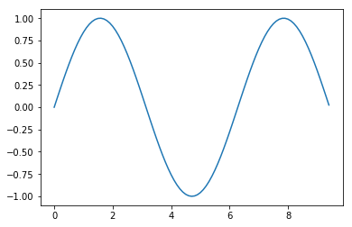
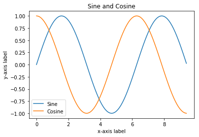
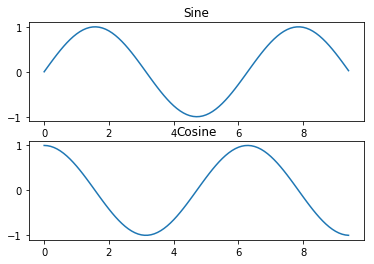
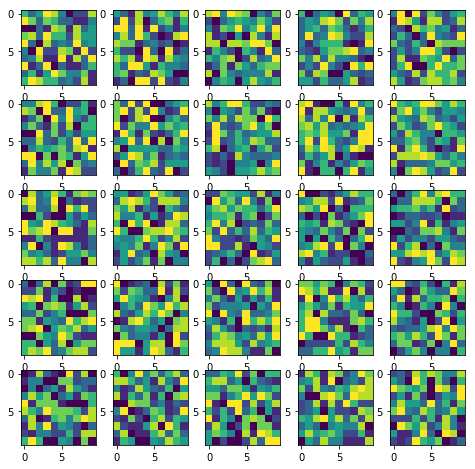

# Numpy Basics

## Array Declaration

Create a rank-1 vector

```python
x = np.array([1, 2, 3])
```

Check its shape

```python
x.shape
```

Declare a zero vector/matrix, which all elements are 0.

```python
x = np.zeros((2, 2))
# [0, 0]
# [0, 0]
```

Declare a one vector/matrix, which all elements are 1.

```python
x = np.ones((2, 2))
# [1, 1]
# [1, 1]
```

Create an identity matrix

```python
I = np.eyes(3)
# [1 0 0]
# [0 1 0]
# [0 0 1]
```

Create a random matrix, values are ranging from 0 to 1

```python
r = np.random.rand(3, 3)
```

Create a random matrix that is normally distributed

```python
r = np.random.randn(3, 3)
```

## Array Indexing

Declare an array and then slice the first two rows and columns 1 and 2

```python
x = np.array([[1, 2, 3, 4],
              [5, 6, 7, 8],
              [1, 2, 3, 4],
              [5, 6, 7, 8]])
x_slice = x[:2, 1:3]
```

Slice of an array is a view into the same underlying data structure, thus modifying it will also
modify the original.

```python
x[0, 1] # => 2
x_slice[0, 0] = 10
x[0, 1] # => 10
```

You can also mix integer indexing with slice indexing. However, doing so will yield an array of
lower rank than the original array.

```python
x = np.array([[1, 2, 3, 4],
              [5, 6, 7, 8],
              [1, 2, 3, 4],
              [5, 6, 7, 8]])

# Rank 1 view of the second row of x
row_rank_1 = x[1, :]

# Rank 2 view of the second row of x
row_rank_2 = x[1:2, :]
```

Every numpy array is a grid of elements of the same type. Numpy provides a large set of numeric data
types that you can use to construct arrays.

```python
x = np.array([1, 2])
x.dtype # => dtype('int64')

x = np.array([1.0, 2.0])
x.dtype # => dtype('float64')

# We can force a particular datatype
x = np.array([1.2, 2.3], dtype=np.int64)
x.dtype # => dtype('int64')
```

## Array Math

Declaring your numpy array, as float64

```python
x = np.array([[1, 2], [3, 4]], dtype=np.float64)
y = np.array([[5, 6], [7, 8]], dtype=np.float64)
```

Element-wise sum

```python
x + y
```

Element-wise difference

```python
x - y
```

Element-wise product

```python
x * y
```

Element-wise division

```python
x / y
```

Element-wise square root

```python
np.sqrt(x)
```

Inner dot product of two vectors

```python
v = np.array([9, 10])
w = np.array([11, 12])
np.dot(v, w)
```

Matrix product of two 2D vectors, which are basically matrices

```python
v = np.array([[1, 2], [3, 4]])
w = np.array([[1, 0], [0, 1]])
np.dot(v, w)
```

Sum an array/vector along all axis

```python
np.sum(w)
```

Sum an array/vector along an axis

```python
np.sum(w, axis=0)
np.sum(w, axis=1)
```

Perform transpose of a matrix

```python
w.T
```

## Array Broadcasting

Suppose that we want to add a constant vector to each row of a matrix

```python
# We begin by doing it with the inefficient way...

x = np.array([[1, 1, 1], [1, 1, 1], [1, 1, 1]])
v = np.array([1, 1, 1])

# Create an empty matrix that has x.shape, and then iterate throgh every row and perform addition
out = np.empty_like(x)
for i in range(3):
    y[i, :] = x[i, :] + v

# We can also consider stacking v together and perform matrix element-wise addition
vv = np.tile(v, (3, 1))
y = x + vv
```

However, there is an even better way in numpy! We can perform the stacking method without actually
creating multiple copies of `v`.

```text
y = x + v
```

```python
import numpy as np

x = np.array([[1, 1, 1], [1, 1, 1], [1, 1, 1]])
v = np.array([1, 1, 1])

# This is known as array broadcasting, which is essentially what we did with stacking.
print x + v
```

```text
[[2 2 2]
 [2 2 2]
 [2 2 2]]
```

## Image Operations

We need to shift gear a little bit and introduce `scipy`. Scientifc Python library provides some
basic functions to work with images. For example, it has functions to read images from disk into
numpy arrays, to write numpy arrays to disk as images, and to resize images.

```python
from scipy.misc import imread, imsave, imresize

img = imread('assets/cat.jpg')
img_tinted = img * [1.0, 0.5, 0.9] # Through array broadcasting
img_tinted = imresize(img_tinted, (300, 300))
imsave('assets/cat_tinted.jpg', img_tinted)
```

## Plots

Plots are essential in machine learning, it helps us with understanding our data and monitoring the
training progress of a model. Thus, `matplotlib` comes in handy! The most important function in
`matplotlib` is `plot` which allows you to plot 2D data, but of course there are other types of plot
functions.

```python
import numpy as np
import matplotlib.pyplot as plt
from scipy.misc import imread, imresize
%matplotlib inline  

x = np.arange(0, 3 * np.pi, 0.1)
y = np.sin(x)

plt.plot(x, y)
plt.show()
```



With just a little bit of extra work, we can easily plot multiple lines at once. We can also add
title, legend, and axis labels.

```python
x = np.arange(0, 3 * np.pi, 0.1)
y_sin = np.sin(x)
y_cos = np.cos(x)

plt.plot(x, y_sin)
plt.plot(x, y_cos)
plt.xlabel('x-axis label')
plt.ylabel('y-axis label')
plt.title('Sine and Cosine')
plt.legend(['Sine', 'Cosine'])
plt.show()
```



You can plot different things in the same figure using the `subplot` function.

```python
x = np.arange(0, 3 * np.pi, 0.1)
y_sin = np.sin(x)
y_cos = np.cos(x)

# Set up a subplot grid which has 2 rows and 1 column. Set the first subplot as active.
plt.subplot(2, 1, 1)
plt.plot(x, y_sin)
plt.title('Sine')

# Set the second subplot as active.
plt.subplot(2, 1, 2)
plt.plot(x, y_cos)
plt.title('Cosine')

plt.show()
```



We can also display images in `numpy`. A slight gotcha with imshow is that it might give starnge
results if it is presented with data that is not uint8. To work around this, we explicitly cast the
image to uint8 before displaying it.

```python
img = imread('assets/cat.jpg')
img_tinted = img * [1, 0.9, 0.9]

plt.subplot(1, 2, 1)
plt.imshow(img)

plt.subplot(1, 2, 2)
plt.imshow(np.uint8(img_tinted))

plt.show()
```


We can display MANY MANY MANY images.

```python
fig = plt.figure(figsize=(8, 8))

# 25 images, display them on a 5 by 5 grid
for i in range(1, 26):
    img = np.random.randint(10, size=(10,10))
    fig.add_subplot(5, 5, i)
    plt.imshow(img)

plt.show()
```


