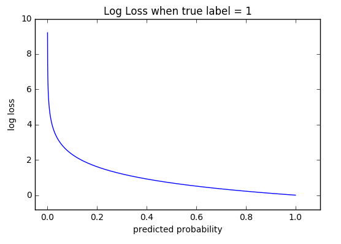

# Loss Function Overview

For supervised learning, there are two main categories of learning objectives.

- Classification (discrete prediction)
- Regression (continuous prediction)

I will use the following notations and assume indexing starts at 1 for ease of writing.

- $$N$$ is the number of training inputs
- $$i$$ is an index of a training input
- $$P$$ is the number of parameters or weights in the model
- $$j$$ is an index of a parameter
- $$w$$ is a parameter/weight of the model
- $$y_i$$ is the ground truth label for ith input
- $$\hat{y}$$ is the predicted label for ith input

## Regression Losses

### L2 Loss

This is also called Mean Square Error (MSE) loss. It measures the average squared difference between
predictions and actual observations.

$$
L = \frac{1}{N} \Sigma^{N}_{i=1} (y_i - \hat{y}_i)^2
$$

Now add a L2 regularization term.

$$
L = \frac{1}{N} \Sigma^{N}_{i=1} (y_i - \hat{y}_i)^2 + \lambda \Sigma^{P}_{j=1} w_j^2
$$

Lambda is the hyperparameter for tuning L2 regularization strength. A regression model that uses L2
regularization technique is called **Ridge Regression**.

**Regularization Behavior**

This regularization penalizes the squared of weights, which acting as a force to remove % of weight.
At any given rate, L2 regularization does not drive weights to zero.

Intuitively speaking, since a L2-norm squares the error (increasing by a lot if error > 1), the
model will see a much larger error ( e vs e^2 ) than the L1-norm, so the model is much more
sensitive to this sample, and adjusts the model to minimize this error. If this sample is an
outlier, the model will be adjusted to minimize this single outlier case, at the expense of many
other common examples, since the errors of these common examples are small compared to that single
outlier case. Therefore, outlier can have significant impact on the model.

### L1 Loss

This is also called Mean Absolute Error (MAE) loss. It measures the average of sum of absolute
differences between predictions and actual observations.

$$
L = \frac{1}{N}\Sigma^{N}_{i=1} \left | y_i - \hat{y}_i \right |
$$

Now add L1 regularization term.

$$
L = \frac{1}{N}\Sigma^{N}_{i=1} \left | y_i - \hat{y}_i \right | + \lambda\Sigma^{P}_{i=1} \left | w_i \right |
$$

Lambda is the hyperparameter for tuning L1 regularization strength. A regression model that uses L1
regularization technique is called **Lasso Regression**.

**Regularization Behavior**

This regularization penalizes the absolute value of weights, which acting as a force that subtracts
some constant from the weight every time. This regularization can drive weights to zero which can be
useful for a sparsed inputs to minimize computational effort.

In a high dimensional sparse vector, it would be nice to encourage weights to drop to exactly 0
where possible. A weight of exactly 0 essentially removes the corresponding feature from the model.

### L2 vs L1 Comparison

In general, L2 loss is preferred in most cases. But when there are outliers in the dataset, L2 loss
will not perform well, because the error rate is magnified. One should consider using L1 or simply
remove the outliers from the dataset before training.

### Huber Loss / Smooth Mean Absolute Error

Huber loss function is defined as the combination of MSE and MAE loss function, using a
hyperparameter called $$\delta$$ to control the switch point.

$$
L_{i} = \left\{\begin{matrix}
\text{if} \; \left | y_i - \hat{y}_i \right | \leq \delta \; \text{then} \; \frac{1}{2} (y_i - \hat{y}_i)^2 \\
\text{else} \; \delta \left | y_i - \hat{y}_i \right | - \frac{1}{2}\delta^2
\end{matrix}\right.
$$

If the error is small and below threshold $$\delta$$, the error is squared. Otherwise, the error is
absolute valued. The choice of delta value is critical because it determines what you are willing to
cosnider as an outlier. Hence the Huber loss could be less sensitive to outliers compared to a
standard L2 loss.

We can choose whichever regularization term we want from above. I am not going to write it out here.

### Log Cosh Loss

The log cosh loss function is defined as the log of hyperbolic cosine of the prediction error. It is
much smoother than MSE loss. It has all the advantages of Huber loss and it's twice differentiable
everywhere, meaning that we can easily take a second derivative of the loss.

$$
L = \Sigma^N_{i=1} log(cosh(\hat{y}_i - y_i))
$$

## Classification Losses

### Binary Cross Entropy Loss

This is the most common loss function for classification problems. In general entropy represents the
amount of information there is in a random event using the probability of the event. For example, if
a random event has a probability of 1, it is guaranteed to happen, therefore we need very little
information to represent it. If a random event has low probability, it has low likelihood of
happening, we need more information to represent it. Entropy loss works on the same principle except
it is cross referencing two different distributions.

- The ground truth distribution of labels
- The predicted distribution of labels

When the number of classes is 2, binary classification

$$
L = \frac{-1}{N} \Sigma^N_i y_i \cdot log(\hat{y}_i) + (1 - y_i) \cdot log(1 - \hat{y}_i)
$$

When the number of classes is more than 2, multi-class classification

$$
L = \frac{-1}{N} \Sigma^N_i y_i \cdot log(\hat{y}_i)
$$

### Hinge Loss

The second most common loss function for classification problems and an alternative to cross entropy
loss is hinge loss. It's primarily developed for SVM model evaluation. SVM is falling out of favor
because for unstructure data, it's been outperformed by neural networks. For structured data, it's
been outperformed by gradient boosted trees.

$$
L = \frac{-1}{N} \Sigma^N_i max(0, 1 - y_i \cdot \hat{y}_i)
$$

Hinge loss not only penalizes the wrong predictions but also the right predictions that are not
confident. It has to be used on SVM classifiers with class labels `-1` and `1`.

