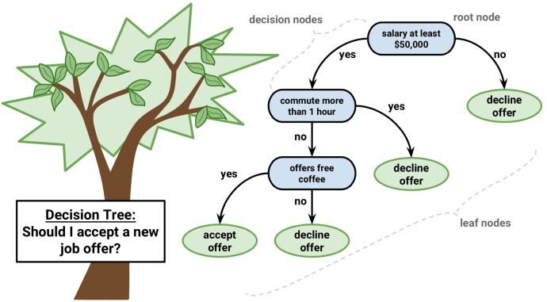

# Random Forest
Random forest is a popular ensemble machine learning technique. Essentially it uses a batch of decision tree and bootstrap aggregation (*bagging*) to reduce variance. A single decision tree leads to high bias and low variance. A forest of decision tree will lead to high variance with low bias. The bagging technique will address the variance problem.

We can build a decision tree easily using `sklearn` and achieve >80% accuracy on MNIST dataset using all pixel values as features.


```python
import numpy as np
from sklearn import tree
from keras.datasets import mnist
from keras.utils import to_categorical

(x_train, y_train), (x_test, y_test) = mnist.load_data()

N, H, W = x_train.shape
x = x_train.reshape((N,H*W)).astype('float') / 255
y = to_categorical(y_train, num_classes=10)

model = tree.DecisionTreeClassifier()
model.fit(x, y)

N, H, W = x_test.shape
x = x_test.reshape((N,H*W)).astype('float') / 255
y = to_categorical(y_test, num_classes=10)

model.score(x, y)
```

    Using TensorFlow backend.


    0.87729999999999997


Random forest outperforms decision tree by having 100 tree. Obviously, it will take a longer time to train.


```python
from sklearn import ensemble

N, H, W = x_train.shape
x = x_train.reshape((N,H*W)).astype('float') / 255
y = to_categorical(y_train, num_classes=10)

model = ensemble.RandomForestClassifier(n_estimators=100)
model.fit(x, y)

N, H, W = x_test.shape
x = x_test.reshape((N,H*W)).astype('float') / 255
y = to_categorical(y_test, num_classes=10)

model.score(x, y)
```


    0.90400000000000003


## Decision Tree
A decision tree is very intuitive. It is a direct representation of how we make decision on a day-to-day basis. Here I borrow an example from Christopher Gray. Suppose that I am deciding whether to accept a job offer. 



I ask myself a series of questions, e.g. is the salary above $50,000? If no, I can immediately decline the offer. If yes, then I will ask myself another question, does it require me longer than 1 hour of commute time? If yes, then I will immediately decline the offer. If not, then I will ask another question again. This process goes on until there is no more questions to ask.

### Tree Node
There are two types of tree node in a decision tree. 

#### Prediction node(s)
These are the are leaf nodes of the tree. They are the final answer to the ultimate question, i.e. should I accept this job offer?

#### Decision node(s)
These are the parent nodes of the tree. They represent a question or a rule that splits the into two different outcome/branches.

### How to Split
Now the question is, how do we know when to branch at each node and when to stop branching? Also, how do we know what question to ask for the splitting? Well, the essence of splitting comes down to reducing impurity. In the training phase, we are given a set of data. 

For example, let's say we have a basket of fruits, which contains apples, grapes, and lemons. Each of them has a set of attributes or features, like color and diameter.

| Color  | Diameter | Fruit |
|--------|----------|-------|
| Green  | 3        | Apple |
| Red    | 3        | Apple |
| Green  | 1        | Grape |
| Purple | 1        | Grape |
| Yellow | 3        | Lemon |

At every **decision node**, we ask a question to split the data into two batches. For example, a question we may ask is, *is it red?* For all the fruits that are red will be grouped together, and the rest will be put in another group. 

| Color  | Diameter | Fruit | Batch |
|--------|----------|-------|-------|
| Green  | 3        | Apple | 0     |
| Red    | 3        | Apple | 0     |
| Green  | 1        | Grape | 1     |
| Purple | 1        | Grape | 1     |
| Yellow | 3        | Lemon | 0     |

Now the splitting is clear. We have 2 apples and 1 lemon in one group, while we have grapes in another group. We will try to split until the impurity is zero, i.e. all data are homogeneous, unless there is a maximum depth restriction. In this case, the grape group has an impurity of zero because everything is grape in that group.

### CART Gini Index
The definition of **pure** is that if we select two items from a pure population, the probaility of them being of same class has to be one. Gini index is a measurement of how impure a population is, ranging from 0 being pure to 1 being impure. 

$$
G = 1 - \Sigma_{i}^{C} P(i)^{2}
$$

The procedure to benchmark a branching decision is.

1. Calculate Gini index for left and right sub-node. 
2. Use weighted average on the two indices to decide what is the impurity.


```python
def class_counts(rows):
    """Counts the number of each type of example in a dataset.
    """
    counts = dict()
    for row in rows:
        label = row[-1]
        if label not in counts:
            counts[label] = 0
        
        counts[label] += 1
    
    return counts

def gini(data_rows):
    counts = class_counts(data_rows)
    impurity = 1
    for label in counts:
        prob = counts[label] / float(len(data_rows))
        impurity -= prob**2
    
    return impurity

# Impurity should be 0
left_branch_gini = gini([['Apple'], ['Apple'], ['Apple']])

# Impurity should be high
right_branch_gini = gini([['Apple'], ['Orange'], ['Banana'], ['Apple'], ['Orange']])

# Using weighted average to compute total purity score
print 'Subpar split: %f' % (left_branch_gini * (3.0/8) + right_branch_gini * (5.0/8))

# Lower the impurity, the better split is
left_branch_gini = gini([['Apple'], ['Apple'], ['Apple'], ['Apple'], ['Apple']])
right_branch_gini = gini([['Orange'], ['Banana'], ['Orange']])
print 'Optimal split: %f' % (left_branch_gini * (5.0/8) + right_branch_gini * (3.0/8))
```

    Subpar split: 0.400000
    Optimal split: 0.166667


### ID3
The core algorithm for building decision trees is called ID3. This algorithm eploys a top-down, greedy search through the space of possible branches with no backtracking. ID3 uses *entropy* and *information gain* to construct a decision tree.

Entropy is defined as follows:

$$
E = \Sigma_{i = 1}^{C} -P(i) * log_{2} P(i)
$$

The procedure to benchmark a branching decision is.

1. Calculate the entropy before the split happens.
2. Calculate the entropy for left and right sub-branch. 
3. Using the prior entropy and weighted sum of the sub-entropies, we can come up with information gain.

$$
IG = E_{0} - \Sigma_{i}^{2} P(i)E_{i}
$$


```python
def entropy(data_rows):
    counts = class_counts(data_rows)
    entropy = 0
    for label in counts:
        prob = counts[label] / float(len(data_rows))
        entropy += -1 * prob * np.log(prob)
    
    return entropy


def info_gain(partitions):
    combined = []
    for part in partitions:
        combined += part
    
    gain = entropy(combined)
    for part in partitions:
        prob = float(len(part)) / len(combined)
        gain -= prob * entropy(part)
        
    return gain
    

left_part = [['Apple'], ['Apple'], ['Apple']]
right_part = [['Apple'], ['Orange'], ['Banana'], ['Apple'], ['Orange']]
print 'Subpar split: %f' % info_gain([left_part, right_part])

# The more information gain, the better split is.
left_part = [['Apple'], ['Apple'], ['Apple'], ['Apple'], ['Apple']]
right_part = [['Orange'], ['Banana'], ['Orange']]
print 'Optimal split: %f' % info_gain([left_part, right_part])
```

    Subpar split: 0.240931
    Optimal split: 0.661563


### Implementation Highlights
>Source code can be found on GitHub, by clicking the top navigation bar.

I am not going to dive into the fine details of how the class is implemented because it's there on GitHub. However, there are couple highlights. 

#### Partition
There is a function called partition. It accepts a batch of data and a rule as argument. The rule is acting as a question, e.g. "Is this Green?". If a data point answers yes to the question, then it is being partitioned into the true set, else false set.
```python
# https://github.com/calvinfeng/machine-learning-notebook/blob/master/random_forest/forest/util.py#L4
def partition(X, rule):
    """Partition the inputs
    For each row in the input, check if it satifies the rule. If so, add it to the true set,
    otherwise, add it to the false set.

    Args:
        X (2D list): A list of inputs, where each input is a list of feature values.
        rule (SpltRule): Rule for performing partitioning.
    """
    true_set, false_set = [], []
    for x in X:
        if rule.match(x):
            true_set.append(x)
        else:
            false_set.append(x)
        
    return true_set, false_set
```

#### Split Rule
As mentioned above, a rule is a question. It computes on two type of values i.e. numeric and string types. For string typed attribute, the rule or question is asking whether input is equal to a string value. For example, *Is it green?*, the string `"green"` is the value we are seeking. For numeric typed attribute, the rule or question is asking whether an input is greater than the numerical value. For example, *Is diameter greater than 3 cm?*. 
```python
class SplitRule(object):
    def __init__(self):
        pass
    
    def match(self, x):
        """Compare feature value in a data row to the feature value in this rule.

        Args:
            x (list): Input of shape (D,) where D is the input dimension.

        Returns:
            (bool)
        """
        val = x[self.attr_idx]

        if is_numeric(val):
            return val >= self.attr_val

        return val == self.attr_val
```

#### Rule Selection
So how do we decide which rule/question to use at each decision node? We use Gini index or information gain. We iterate through each attribute and perform partitioning on each attribute. Then we compute the purity gain or information gain from each partition and select the partition that gives the highest purity gain or information gain.
```python
# https://github.com/calvinfeng/machine-learning-notebook/blob/master/random_forest/forest/tree_node.py#L60
best_gain = 0
current_metric_val = metric(self.X)

for i in self.feat_indices:
    # Extract unique values from dataset in a given feature/column.
    values = set([x[i] for x in self.X])

    for val in values:
        rule = SplitRule(self.column_names[i], i, val)

        # Partition the current dataset and check if everything landed on one side. If so, 
        # this is a bad partition, don't consider it.                
        true_set, false_set = partition(self.X, rule)
        if len(true_set) == 0 or len(false_set) == 0:
            continue

        gain = eval_gain([true_set, false_set], current_metric_val, len(self.X))
        if gain >= best_gain:
            best_gain, self.rule = gain, rule

```

## Random Forest
As the name implies, a random forest is simply a collection of *randomly* generated decision tree.

### Pseudo-code
Let's assume that the dataset has contained `N` examples and `K` features. The input is essentially of shape `(N, K)`.

1. Randomly select k features from total K features, where k << K 
2. Construct a decision tree using k features and give it a threshold for splitting
    * Example threshold: minimum impurity decrease, a.k.a minimum purity gain.
    * Example threshold: maximum depth, i.e. should not split when the tree has reached maximum depth.
    * Example threshold: minimum sample split, i.e. minimum number of samples required to split a decision node.
    * Optional argument: whether to bootstrap or not.
3. Build a forest by repeating Step No.2 for `n_estimators` times. 
4. Prediction is made through majority vote from the tree.

### Put Everything Together
First, create a helper function for loading iris species data from CSV.


```python
import csv


def load_data(csv_path):
    col_names = None
    data = []

    with open(csv_path, 'rb') as csvfile:
        reader = csv.reader(csvfile)

        # Extract column names from header
        header = reader.next()
        col_names = header[1:len(header)]

        for row in reader:
            data_row = [float(el) for el in row[1:len(row)-1]] + [row[-1]]
            data.append(data_row)

    return col_names, data
```

Then load the data and shuffle them because the original data set is sorted by iris species. We want to do a 80:20 split on the data set to get a training set and a validation set. 


```python
from forest import DecisionTree, RandomForest
import numpy as np


IRIS_MAP = {
    'Iris-setosa': 0,
    'Iris-versicolor': 1,
    'Iris-virginica': 2
}

# Load and shuffle the data
col_names, data = load_data('./datasets/iris.csv')
np.random.shuffle(data)

# Use a 80:20 split for training and validation
N = len(data)
training_data = data[:int(0.80*N)]
validation_data = data[int(0.80*N):]

forest = RandomForest(n_samples=10, n_features=3)
forest.fit(col_names, training_data)

for row in validation_data:
    print 'Expected %s and predicted %s' % (row[-1], forest.predict(row))
```

    Expected Iris-virginica and predicted Iris-virginica
    Expected Iris-virginica and predicted Iris-virginica
    Expected Iris-versicolor and predicted Iris-versicolor
    Expected Iris-virginica and predicted Iris-virginica
    Expected Iris-versicolor and predicted Iris-versicolor
    Expected Iris-versicolor and predicted Iris-versicolor
    Expected Iris-virginica and predicted Iris-virginica
    Expected Iris-setosa and predicted Iris-setosa
    Expected Iris-versicolor and predicted Iris-versicolor
    Expected Iris-setosa and predicted Iris-setosa
    Expected Iris-virginica and predicted Iris-versicolor
    Expected Iris-versicolor and predicted Iris-versicolor
    Expected Iris-virginica and predicted Iris-versicolor
    Expected Iris-setosa and predicted Iris-setosa
    Expected Iris-virginica and predicted Iris-virginica
    Expected Iris-virginica and predicted Iris-virginica
    Expected Iris-setosa and predicted Iris-setosa
    Expected Iris-virginica and predicted Iris-virginica
    Expected Iris-virginica and predicted Iris-virginica
    Expected Iris-setosa and predicted Iris-setosa
    Expected Iris-versicolor and predicted Iris-versicolor
    Expected Iris-setosa and predicted Iris-setosa
    Expected Iris-setosa and predicted Iris-setosa
    Expected Iris-virginica and predicted Iris-virginica
    Expected Iris-virginica and predicted Iris-virginica
    Expected Iris-setosa and predicted Iris-setosa
    Expected Iris-versicolor and predicted Iris-versicolor
    Expected Iris-setosa and predicted Iris-setosa
    Expected Iris-virginica and predicted Iris-virginica
    Expected Iris-setosa and predicted Iris-setosa

