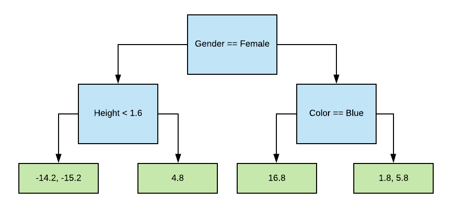
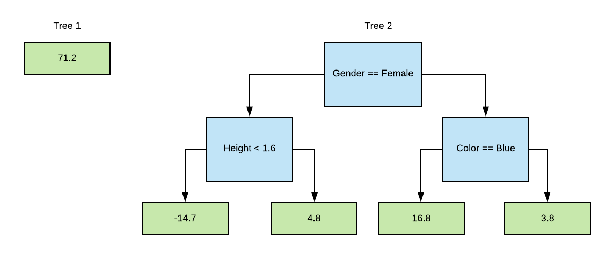
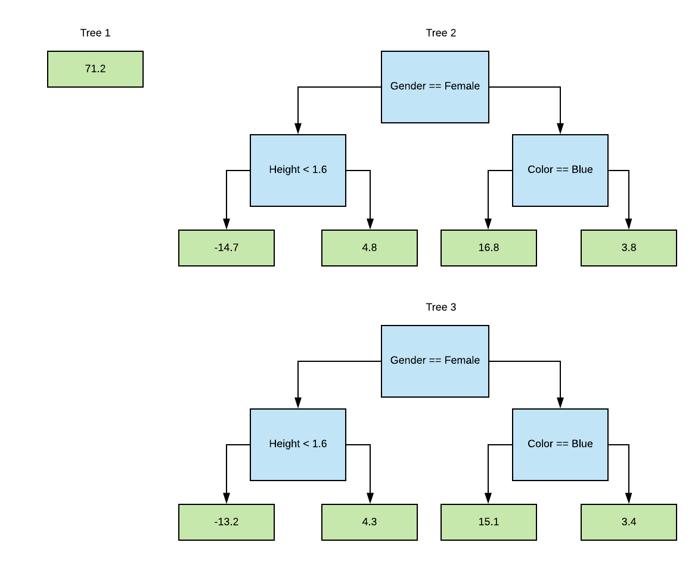

# Gradient Boosting

## Background

Before we dive into gradient boosting, couple important concepts need to be explained first.

### Evaluation Metrics

This is a quick review of metrics for evaluating machine learning models. Suppose I want to classify image into 3 categories, a dog, a cat, and a human, there only four possible outcome for a classification model if we center our attention on dog classification.

- True positive (TP): model predicted dog and it is a picture of dog.
- True negative (TP): model predicted not a dog, maybe a cat or a human, and indeed it is **NOT** a
  picture of dog.
- False positive (FP): model predicted dog but it is **NOT** a picture of dog.
- False negative (TP): model predicted not a dog but it **ACTUALLY** a picture of dog.

Sensitivity, or _recall_ or _true positive rate_ is asking, of all dog images, how many were predicted to be dog?

$$
\text{sensitivity}_{dog} = \frac{TP}{TP + FN}
$$

Specificity, or _true negative rate_ is asking, of all non-dog images, how many were predicted to be **NOT** dog?

$$
\text{specificity}_{dog} = \frac{TN}{TN + FP}
$$

Precision, or _positive predictive value_ is asking, of all the predicted dog labels, how of the input images are actually dogs?

$$
\text{precision}_{dog} = \frac{TP}{TP + FP}
$$

Precision and recall are the two most common metrics. I personally have not seen people using specificity. People tend only care about producing the correct label. Maybe specificity is useful for fraud and disease detection. However, for those cases, it's often better to have false positive than to have false negative because false negative could mean death to an ill person.

### Bias vs Variance

The inability for a machine learning method to capture the true relationship is called **bias**. The difference in fits between data sets is called **variance**. High variance means the fits vary greatly between different data set, which is often a result of overfitting to one data set. The perfect model would have low bias; it fits the data very well because it captures the relationship, have low variability because it produces consistent predictions across different datasets.

This is done by finding the sweeet spot between a simple model and a complicated model. There are three commonly used methods for finding the sweet spot between simple and complicated models.

- Regularization (to prevent overfitting as explained in my neural network sections)
- Boosting
- Bagging

## Random Forest

Decision trees are easy to build, easy to use, and easy to interpret but in practice they are not that useful.

> Quoted The Elements of Statistical Learning, "Trees have one apsect that prevents them from being the ideal tool
  for predictive learning, namely inaccuracy

In other words, they work great with the data used to create them, but they are not flexible when it comes to classifying new samples. Random forest solves this problem by combining the simplicity of decision trees with flexibility resulting in a vast improvement in accuracy.

### Bagging

Start off with bootstrapping, to create a bootstrapped dataset that is the same size as the original, we just randomly select samples from the original dataset but we're allowed to pick the same sample more than once. This is simply known as *random sampling with replacement.* Then we create a decision tree using the bootstrapped dataset, but only use a subset of variables or columns at each step. How many columns we use at each node splitting step is a hyperparameter that requires tuning.

In summary,

1. We build a tree using a bootstrapped dataset.
2. Only considering a random subset of variables at each step.
3. Repeat 1 & 2 until we have X trees and we have a forest.
4. Random forest will predict by aggregating the result of all tree, take the majority vote.
5. We take the out-of-bag data (data that didn't go into creating the tree) to evaluate accuracy of the forest.
6. Tune the hyperparemter by repeating step 1 to 5.

Why is it called _bagging_ ? Because it **b**ootstrapped and **ag**ggregated.

### AdaBoost

AdaBoost is short for adaptive boosting. It focuses on classification problems and aims to convert a set of weak classifiers into a strong one.

$$
F(x) = \text{sign}(\sum^{M}_{m=1} \theta_{m}f_{m}(x)))
$$

$$f_m$$ is a weaker learner and $$\theta_m$$ is the corresponding weight.

In the forest of trees made with AdaBoost, the trees are usually just a node with two leaves. We call this a **stump**. Stumps are not great at making accurate classifications because stump can only use one variable to make a decision. However, the trees of a regular random forest vote with an equal weight. In contrast, some stumps of a AdaBoosted forest get more say in the final classification than others.

Order matters when we construct stumps for an AdaBoosted forest. The errors that the first stump makes influence how the second stump is made.

Key ideas,

1. AdaBoost combines a lot of weaker learners to make classifications.
  The weak learners are almost always stumps.
2. Some stumps get more say in the classification than others.
3. Each stump is made by taking the previous stump's mistakes into
  account.

In order to take in the previous stump's mistakes, we assign each sample (data point) a weight initially. Each time a stump misclassifies these samples, the weights will be adjusted according.

> Since the focus of this writeup isn't on AdaBoost, I can skip the mathemtical details for now and re-add them     later.

When we try to make a second stump, if we have a weighted gini function, then we use it with the sample weights, otherwise use the sample weights to make a new dataset that reflects these weights.

## Gradient Boost

Now we can talk about gradient boost. Suppose we are given a data set to predict weight for a person.


```python
import pandas as pd
import numpy as np

df = pd.DataFrame(
    [[1.6, 'Blue', 'Male', 88],
     [1.6, 'Green', 'Female', 76],
     [1.5, 'Blue', 'Female', 56],
     [1.8, 'Red', 'Male', 73],
     [1.5, 'Green', 'Male', 77],
     [1.4, 'Blue', 'Female', 57]], columns=['height', 'favorite_color', 'gender', 'weight'])

display(df)
```

    /home/cfeng/Desktop/machine-learning-notebook/random_forest_py3/env/lib/python3.7/site-packages/pandas/compat/__init__.py:117: UserWarning: Could not import the lzma module. Your installed Python is incomplete. Attempting to use lzma compression will result in a RuntimeError.
      warnings.warn(msg)

<div>
<style scoped>
    .dataframe tbody tr th:only-of-type {
        vertical-align: middle;
    }

    .dataframe tbody tr th {
        vertical-align: top;
    }

    .dataframe thead th {
        text-align: right;
    }
</style>
<table border="1" class="dataframe">
  <thead>
    <tr style="text-align: right;">
      <th></th>
      <th>height</th>
      <th>favorite_color</th>
      <th>gender</th>
      <th>weight</th>
    </tr>
  </thead>
  <tbody>
    <tr>
      <th>0</th>
      <td>1.6</td>
      <td>Blue</td>
      <td>Male</td>
      <td>88</td>
    </tr>
    <tr>
      <th>1</th>
      <td>1.6</td>
      <td>Green</td>
      <td>Female</td>
      <td>76</td>
    </tr>
    <tr>
      <th>2</th>
      <td>1.5</td>
      <td>Blue</td>
      <td>Female</td>
      <td>56</td>
    </tr>
    <tr>
      <th>3</th>
      <td>1.8</td>
      <td>Red</td>
      <td>Male</td>
      <td>73</td>
    </tr>
    <tr>
      <th>4</th>
      <td>1.5</td>
      <td>Green</td>
      <td>Male</td>
      <td>77</td>
    </tr>
    <tr>
      <th>5</th>
      <td>1.4</td>
      <td>Blue</td>
      <td>Female</td>
      <td>57</td>
    </tr>
  </tbody>
</table>
</div>

### Build a Tree

The first tree we build assumes that the predicted weight for everyone is the mean of weight from the dataset. You can imagine that this tree only has a leaf node and that leaf node always return the following value regardless of inputs.

```python
df['weight'].mean()
```

    71.16666666666667

The second tree we build will be based on the errors that the previous tree made. We first need to compute the errors and save that errors as a new column named `pseudo_residual`. The term **Pseudo Residual** is based on linear regression, where the difference between observed values and the predicted values results in residuals.

```python
df['pseudo_residual_1'] = np.round(df['weight'] - df['weight'].mean(), decimals=1)
display(df)
```

<div>
<style scoped>
    .dataframe tbody tr th:only-of-type {
        vertical-align: middle;
    }

    .dataframe tbody tr th {
        vertical-align: top;
    }

    .dataframe thead th {
        text-align: right;
    }
</style>
<table border="1" class="dataframe">
  <thead>
    <tr style="text-align: right;">
      <th></th>
      <th>height</th>
      <th>favorite_color</th>
      <th>gender</th>
      <th>weight</th>
      <th>pseudo_residual_1</th>
    </tr>
  </thead>
  <tbody>
    <tr>
      <th>0</th>
      <td>1.6</td>
      <td>Blue</td>
      <td>Male</td>
      <td>88</td>
      <td>16.8</td>
    </tr>
    <tr>
      <th>1</th>
      <td>1.6</td>
      <td>Green</td>
      <td>Female</td>
      <td>76</td>
      <td>4.8</td>
    </tr>
    <tr>
      <th>2</th>
      <td>1.5</td>
      <td>Blue</td>
      <td>Female</td>
      <td>56</td>
      <td>-15.2</td>
    </tr>
    <tr>
      <th>3</th>
      <td>1.8</td>
      <td>Red</td>
      <td>Male</td>
      <td>73</td>
      <td>1.8</td>
    </tr>
    <tr>
      <th>4</th>
      <td>1.5</td>
      <td>Green</td>
      <td>Male</td>
      <td>77</td>
      <td>5.8</td>
    </tr>
    <tr>
      <th>5</th>
      <td>1.4</td>
      <td>Blue</td>
      <td>Female</td>
      <td>57</td>
      <td>-14.2</td>
    </tr>
  </tbody>
</table>
</div>

Now we use height, favorite color, and gender to predict the residuals. This seems strange to predict the residuals instead of the original weights. The answer will become clear soon. For this example, we will limit the maximum number of leaves to be 4. It's common to use 8 to 32 for larger dataset.



Some leaves have multiple values and we need to average them. Now we have two trees that look like this.



To produce a prediction for `[1.6, 'Blue', 'Male']`, we feed the input to first tree and obtain 71.2 as the output. We feed the data into the second tree, and obtain 16.8 as the second output. We sum the two values.

$$
71.2 + 16.8 = 88
$$

Looks like it is working! But it should be apparent athat this tree is way overfitted. It has low bias and very high variance.

### Build More Tree Incrementally

Gradient boost deals with the variance problem by using a learning rate to scale the contribution from the new tree (tree on the right hand side.) The learning rate is usually a value between 0 and 1. I will use $$\alpha$$ to denote learning rate. Suppose we want to use `learning_rate=0.1`, the contribution from second tree will become the following.

$$
71.2 + \alpha 16.8 = 71.2 + (0.1)(16.8) = 72.88
$$

Instead of making a big jump, we are taking an incremental approach to nudge the predicted value toward the desired place. So far we haven't talked about the gradient part yet.

> Empirical evidence shows that taking lots of small steps in the right direction results in better predictions
  with a testing data, ie. lower variance.

Let's build the third tree using the same algorithm we used to build the second tree. Pretend that we have the tree and we feed our data frame into it, here's the new residual value.

```python
df.insert(5, 'psuedo_residual_2', [15.1, 4.3, -13.7, 1.4, 5.4, -12.7])
display(df)
```

<div>
<style scoped>
    .dataframe tbody tr th:only-of-type {
        vertical-align: middle;
    }

    .dataframe tbody tr th {
        vertical-align: top;
    }

    .dataframe thead th {
        text-align: right;
    }
</style>
<table border="1" class="dataframe">
  <thead>
    <tr style="text-align: right;">
      <th></th>
      <th>height</th>
      <th>favorite_color</th>
      <th>gender</th>
      <th>weight</th>
      <th>pseudo_residual_1</th>
      <th>psuedo_residual_2</th>
    </tr>
  </thead>
  <tbody>
    <tr>
      <th>0</th>
      <td>1.6</td>
      <td>Blue</td>
      <td>Male</td>
      <td>88</td>
      <td>16.8</td>
      <td>15.1</td>
    </tr>
    <tr>
      <th>1</th>
      <td>1.6</td>
      <td>Green</td>
      <td>Female</td>
      <td>76</td>
      <td>4.8</td>
      <td>4.3</td>
    </tr>
    <tr>
      <th>2</th>
      <td>1.5</td>
      <td>Blue</td>
      <td>Female</td>
      <td>56</td>
      <td>-15.2</td>
      <td>-13.7</td>
    </tr>
    <tr>
      <th>3</th>
      <td>1.8</td>
      <td>Red</td>
      <td>Male</td>
      <td>73</td>
      <td>1.8</td>
      <td>1.4</td>
    </tr>
    <tr>
      <th>4</th>
      <td>1.5</td>
      <td>Green</td>
      <td>Male</td>
      <td>77</td>
      <td>5.8</td>
      <td>5.4</td>
    </tr>
    <tr>
      <th>5</th>
      <td>1.4</td>
      <td>Blue</td>
      <td>Female</td>
      <td>57</td>
      <td>-14.2</td>
      <td>-12.7</td>
    </tr>
  </tbody>
</table>
</div>

Now we build the third tree and using the same averaging technique we did before. We have 3 tree!



We will repeat this process many times until we reach the maximum number of tree or adding additional trees does not significantly reduce the size of the residuals. The final model can be summarized with the following equation.

$$
\text{prediction} = \text{tree}_1(X) + \alpha\Sigma^{M}_{m = 2}\text{tree}_m(X)
$$

### Mathematical Formulation

This is the mathematical interpretation of what we did above. We have a data set with N rows, denoted as follows

$$
{(X_i, y_i)}^N_{i=1}
$$

We have a loss function to evaluate how does the tree model produces predictions. We will use L2 loss which is just a squared residual. This loss function is differentiable.

$$
L(y_i, F(X_i)) = (y_i - y_{predicted})^2
$$

#### Step 1 Solve for First Term

We should imagine that we are trying to build a predictive model $$F$$ using series of first order approximation, or you can simply argue it is doing a first order Taylor series approximation. Let's start off with first term. We agree that $$F_0$$ is a term we want to compute but we don't know what value should it be. Let gamma $$\gamma$$ denote this value and we have an optimization task to perform.

$$
F_0 = \text{argmin}_{\gamma}\;\Sigma^N_{i=1} L(y_i, \gamma)
$$

We take derivative of this function with respect to gamma and find the optimal value of gamma that minimizes this equation by setting the derivative to 0 and solve for gamma. It shouldn't be too hard.

$$
0 = \Sigma^N_{i=1} 2 (y_i - \gamma) = \Sigma^N_{i=1} y_i - N\gamma
$$

Therefore,

$$
F_0 = \gamma = \frac{\Sigma^N_{i=1} y_i}{N}
$$

What does this look like? It's the mean of the observed values!

#### Step 2 Solve for Second, Third, etc... Terms

#### Step 2a

Now we know why we used mean for the first tree. We can proceed to solve for the second, third, ..., and Nth tree. We first need to compute the residual value for `i`th data and `m`th tree.

$$
r_{i,m} = -\frac{\partial L(y_i, F(X_i))}{\partial F(X_i)}_{F(X) = F_{m-1}(X)} \;\text{for i = 1, 2, ..., N}
$$

This looks scary but it's actually just a derivative of the loss function with respect to the predicted value which comes from step 1. The predicted value from the previous tree is $$\gamma$$.

Therefore, using chain rule, we can simplify it to the following.

$$
r_{i, m} = 2 * (y_i - \gamma)
$$

#### Step 2b

Now we need to fit a regression tree to the $$r_{i,m}$$ values and create terminal regions
$$R_{j, m}$$ for `j` = 1 to $$J_m$$. The $$J_m$$ is simply the number of leave nodes for the regression tree.

#### Step 2c

For each terminal region or leaf node, we need to compute the $$\gamma$$ value again. However, there's a small difference here. We have multiple leaf nodes for the second tree. We need to compute $$\gamma$$ for all of them.

$$
\text{for j = 1, 2, ...}\,J_m\;\text{compute}\; \gamma_{j, m} = \text{argmin}_{\gamma} \Sigma L(y_i, F_{m-1}(x_i) + \gamma)
$$

The minimization is the same as what we did in Step 1. One small difference is that now we are taking the previous prediction into account. This summation is also picky about which samples it includes, while before the summation included all samples. This new summation means that only sum over samples that belong to the leaf node. At this point we should be using the real loss function to simplify the math, aka.

$$
L = \frac{1}{2} (y_{observed} - y_{predicted})^2
$$

I will skip the chain rule and derivatives, and jump to the conclusion. We will discover that the new $$\gamma$$ is equal to the mean difference between observed value and previous tree predicted value.

$$
\gamma_{j, m} = \frac{1}{N}\Sigma( y_{i} - F_{m-1}(x_{i}))\;\text{sum over all samples that belong to this node}
$$

#### Step 2d

Finally, we update the original model.

$$
F_m(X) = F_{m-1}(X) + \alpha \Sigma^{J_m}_{j=1} \gamma_{j, m}\;\text{for leaves that X belongs to}
$$

This is basically saying the new prediction using 2 tree is based on the predictions made by the first tree plus the learning rate scaled predictions made by the second tree. Now we must repeat this step until `m ~ 100` or even more, depending on complexity of the data we are trying to model.

#### Step 3

The final step is that the output of the model is $$F_{100}$$ if we set $$M = 100$$. There we have it, **gradient boosted random forest**. Notice the similarity between Gradient Boost and AdaBoost? Gradient Boost has trees that are multiple layers deep depending on how many max leaf nodes we set of the model. Gradient Boost uses gradient or derivative to make incremental directional improvement while AdaBoost uses weights and resampling to guide the search.

## For Classifcation Problems

So far we've only covered gradient boosting for regression problem. The usage of **Gradient Boost** in classification will be similiar to that of a logistc function. We will be working with probabilities.

Suppose we are performing a binary classification, answering a yes-or-no question, the following is the list of modication needed to make Gradient Boost work for the problem.

### Initial Predictions

Instead of using the mean or average of all samples, the initial prediction should be log of the odds. The odds is a ratio of yes to no samples. Suppose we have 6 people, we ask whether they like Toy Story and we have:

```python
user_responses = [True, True, False, False, True, True]
```

The odds would be 4 to 2, or 0.5. Side note, there's another name for log of the odds, it's called the _logit_ function.

$$
\text{log(odds)} = \frac{N_{true}}{N_{false}}
$$

Therefore, the initial prediction, or intiial leaf node is

$$
log(\frac{4}{2}) = 0.693
$$

### Conversion to Probability

We cannot use the output of logit function as output of the leaf directly. We need to convert it to value of probability.

$$
P = \frac{e^{\text{log}(odds)}}{1 + e^{\text{log}(odds)}}
$$

For the example above, the exponential functions will cancel with the log functions. We are left with a simple calculation.

$$
P = \frac{2}{1 + 2} = 0.667
$$

### Residual Calculation

The calculation for residual here is a bit different from regression example because we are dealing with probability here. If a sample says yes, he/she likes Toy Story, the value for `True` is 1, and the value for `False` is 0. Our first leaft node will always predict `0.667` for the likelihood of liking Toy Story. Suppose for a sample that likes Toy Story, residual is calculated as follows.

$$
\text{Residual} = \text{P}_{observed} - \text{P}_{predicted} = 1 - 0.667 = 0.333
$$

### Subsequent Tree Terminal Region Outputs

The first tree has only one leaf node, the output is the same for all samples. The second tree will have more leaf nodes and decision branching. When we used **Gradient Boost** for regression, a leaf with single residual had an output value equal to that residual. If the leaf had more than one residual values, the output value would equal to the mean of all residual values in that leaf.

The situation is different for probability. We need a transformation, and the output value would be the following.

$$
logit = \frac{\Sigma_{i} \text{Residual}_i}{\Sigma_{i} \text{Previous Probability}_i \cdot (1 - \text{Previous Probaility}_i)}
$$

The previous probability refers to the previous output from the initial leaf of tree 1. Also notice that final output of each tree is a logit or log of the odds output. Suppose we have 100 trees, we would sum up the contribution of all tree as logits and convert the final sum to a probability value.
