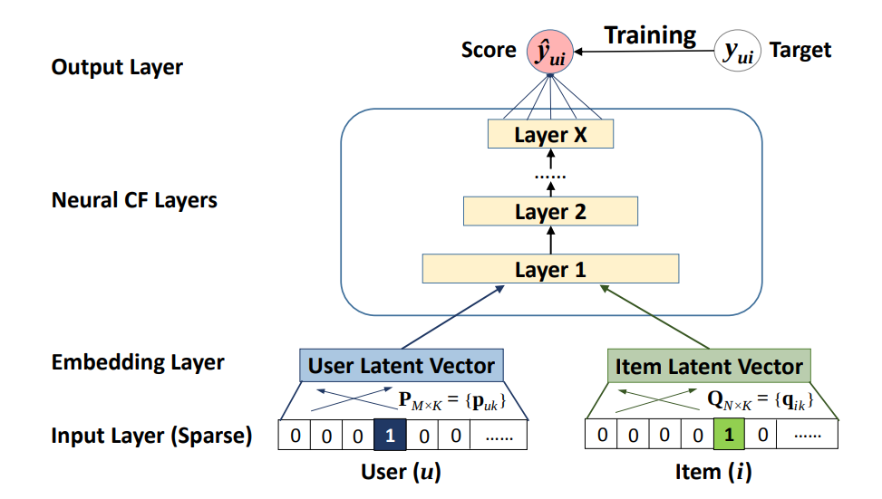
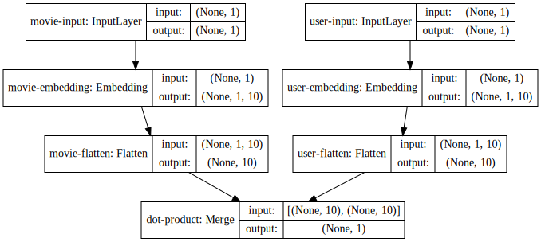
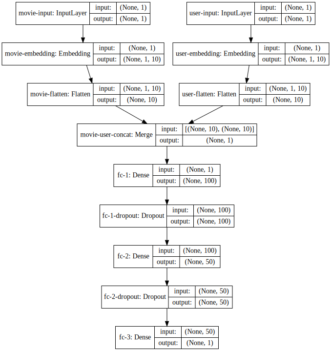
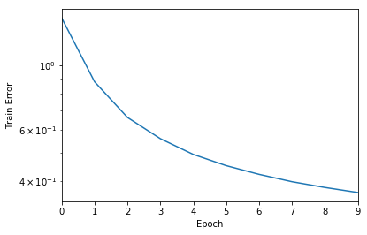
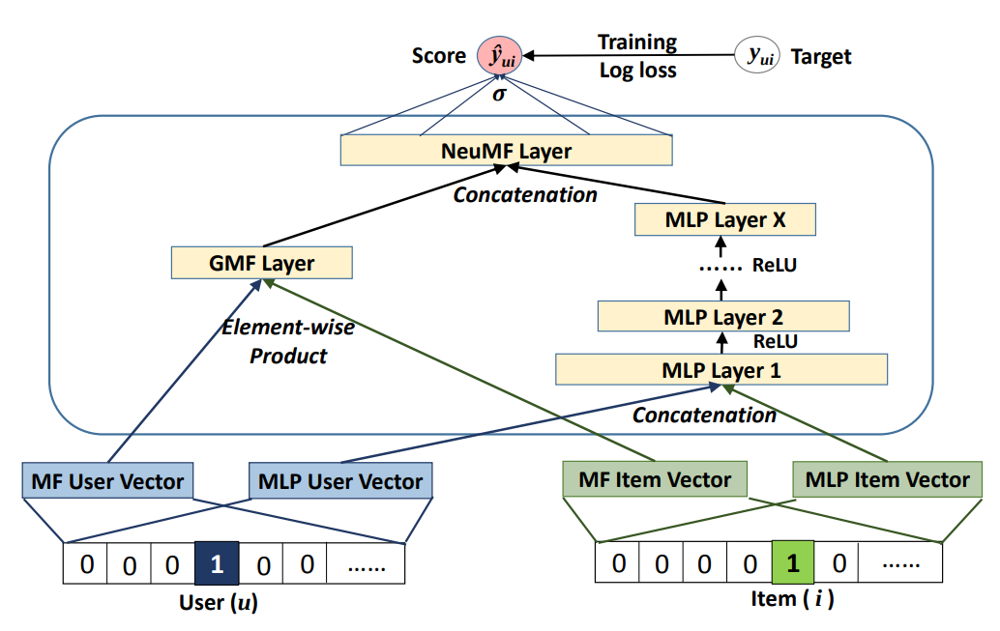
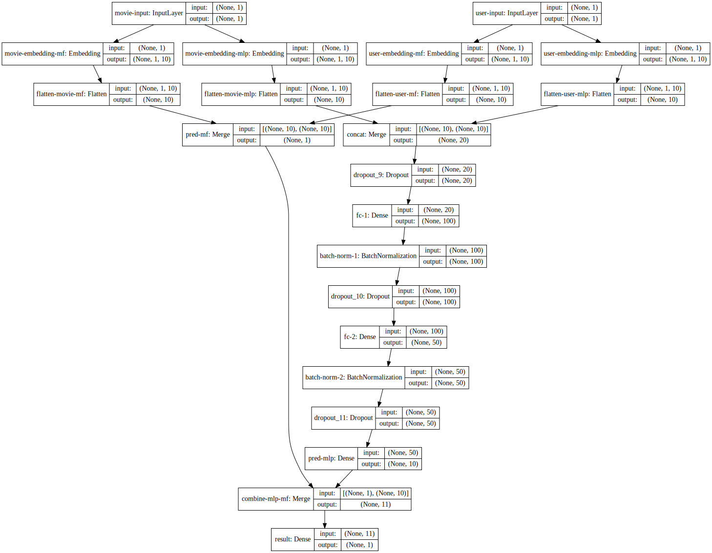

# Neural Collaborative Filtering

Collaborative filtering is traditionally done with matrix factorization. I did my movie recommendation
project using good ol' matrix factorization. However, recently I discovered that people have proposed
new ways to do collaborative filtering with deep learning techniques! There's a paper, titled
[Neural Collaborative Filtering](https://www.comp.nus.edu.sg/~xiangnan/papers/ncf.pdf), from 2017
which describes the approach to perform collaborative filtering using neural networks.

> In recent years, deep neural networks have yielded immense success on speech recognition, computer
> vision and natural language processing. However, the exploration of deep neural networks on
> recommender systems has received relatively less scrutiny. In this work, we strive to develop
> techniques based on neural networks to tackle the key problem in recommendation — collaborative
> filtering — on the basis of implicit feedback.

Here's the high level idea.



## Embeddings

We perform embedding for each user and item(movie). The embedding layer is simply a matrix dot product
of one hot encoding of a user/movie and the embedding weights. Let's put it concretely. Suppose I have
ten users, the one hot encoding of each users will look like the following.

```python
from keras.utils.np_utils import to_categorical

# We have 10 users, each is uniquely identified by an ID.
users = [i for i in range(10)]
to_categorical(users)
```

    array([[ 1.,  0.,  0.,  0.,  0.,  0.,  0.,  0.,  0.,  0.],
           [ 0.,  1.,  0.,  0.,  0.,  0.,  0.,  0.,  0.,  0.],
           [ 0.,  0.,  1.,  0.,  0.,  0.,  0.,  0.,  0.,  0.],
           [ 0.,  0.,  0.,  1.,  0.,  0.,  0.,  0.,  0.,  0.],
           [ 0.,  0.,  0.,  0.,  1.,  0.,  0.,  0.,  0.,  0.],
           [ 0.,  0.,  0.,  0.,  0.,  1.,  0.,  0.,  0.,  0.],
           [ 0.,  0.,  0.,  0.,  0.,  0.,  1.,  0.,  0.,  0.],
           [ 0.,  0.,  0.,  0.,  0.,  0.,  0.,  1.,  0.,  0.],
           [ 0.,  0.,  0.,  0.,  0.,  0.,  0.,  0.,  1.,  0.],
           [ 0.,  0.,  0.,  0.,  0.,  0.,  0.,  0.,  0.,  1.]])

Now I need an embedding weight matrix which will map a user or movie to an embedding vector. Let's
define the embedding matrix to be a matrix of shape `(N, D)` where `N` is the number of users or
movies and `D` is the latent dimension of embedding.

```python
import numpy as np

latent_dim = 5
inputs = to_categorical(users)
embed_mat = np.random.randn(len(users), latent_dim)

inputs.dot(embed_mat)
```

    array([[ 1.1391344 , -0.8752648 ,  1.25233597,  0.53437767, -0.18628979],
           [-0.66419168, -0.74328276, -0.01321763, -0.04430944, -1.44137598],
           [-2.07073338, -0.87598221, -1.49988311, -0.12476621, -0.34515032],
           [-0.75660572,  1.6298614 , -0.42899322,  0.24503306,  1.1110078 ],
           [ 0.75315852,  0.23002451,  0.36444158, -1.06237341,  0.8600944 ],
           [-0.4396186 , -0.87063947,  1.16428906, -1.13963026,  0.39431238],
           [ 0.25307581, -0.44974305, -0.30059679, -1.23073221,  2.35907361],
           [-0.47112505, -0.06720194,  1.46029474, -0.26472244, -0.1490059 ],
           [-0.58985416,  1.61182459,  0.41248058, -0.49178183, -0.24696098],
           [ 0.28085462,  0.21408553,  0.46972469, -0.03689734, -0.36638611]])

The embedded vectors will then be fed into a deep neural network and its objective is to predict the
rating from a user given to a movie. For example, user 1 may rate movie 1 with five stars. The network
should be able to predict that after training.

## Dataset: Movie Ratings

Before we dive into the details of the architecture, let's take a look at the datasets that we will
be using for this exercise. I got the data from MovieLens. I will use the small dataset with 100,000
movie ratings.

```python
import pandas as pd
import numpy as np
from sklearn.model_selection import train_test_split

dataset = pd.read_csv('../datasets/100k/ratings.csv', header=0, names=['user_id', 'movie_id', 'rating', 'timestamp'])

# Need to map movie ID to [1, num_movies]
movie_id_to_new_id = dict()
id = 1 
for index, row in dataset.iterrows():
    if movie_id_to_new_id.get(row['movie_id']) is None:
        movie_id_to_new_id[row['movie_id']] = id
        dataset.at[index, 'movie_id'] = id
        id += 1
    else:
        dataset.at[index, 'movie_id'] = movie_id_to_new_id.get(row['movie_id'])

num_users = len(dataset.user_id.unique())
num_movies = len(dataset.movie_id.unique())
train, test = train_test_split(dataset, test_size=0.2)

print 'Number of movies', num_movies
print 'Number of users', num_users
```

    Number of movies 9066
    Number of users 671

```python
train.head()
```

<div>
<style scoped>
    .dataframe tbody tr th:only-of-type {
        vertical-align: middle;
    }

    .dataframe tbody tr th {
        vertical-align: top;
    }

    .dataframe thead th {
        text-align: right;
    }
</style>
<table border="1" class="dataframe">
  <thead>
    <tr style="text-align: right;">
      <th></th>
      <th>user_id</th>
      <th>movie_id</th>
      <th>rating</th>
      <th>timestamp</th>
    </tr>
  </thead>
  <tbody>
    <tr>
      <th>70647</th>
      <td>492</td>
      <td>7625</td>
      <td>4.0</td>
      <td>898107789</td>
    </tr>
    <tr>
      <th>29726</th>
      <td>213</td>
      <td>2029</td>
      <td>4.0</td>
      <td>1462639144</td>
    </tr>
    <tr>
      <th>60508</th>
      <td>439</td>
      <td>956</td>
      <td>3.0</td>
      <td>1041115006</td>
    </tr>
    <tr>
      <th>79013</th>
      <td>547</td>
      <td>4826</td>
      <td>4.0</td>
      <td>1022676793</td>
    </tr>
    <tr>
      <th>65442</th>
      <td>466</td>
      <td>2176</td>
      <td>2.0</td>
      <td>945836678</td>
    </tr>
  </tbody>
</table>
</div>

```python
test.head()
```

<div>
<style scoped>
    .dataframe tbody tr th:only-of-type {
        vertical-align: middle;
    }

    .dataframe tbody tr th {
        vertical-align: top;
    }

    .dataframe thead th {
        text-align: right;
    }
</style>
<table border="1" class="dataframe">
  <thead>
    <tr style="text-align: right;">
      <th></th>
      <th>user_id</th>
      <th>movie_id</th>
      <th>rating</th>
      <th>timestamp</th>
    </tr>
  </thead>
  <tbody>
    <tr>
      <th>78939</th>
      <td>547</td>
      <td>1966</td>
      <td>4.5</td>
      <td>1093832403</td>
    </tr>
    <tr>
      <th>28074</th>
      <td>205</td>
      <td>3576</td>
      <td>4.0</td>
      <td>1442152429</td>
    </tr>
    <tr>
      <th>27716</th>
      <td>201</td>
      <td>178</td>
      <td>5.0</td>
      <td>1110498354</td>
    </tr>
    <tr>
      <th>20913</th>
      <td>144</td>
      <td>76</td>
      <td>3.0</td>
      <td>837455700</td>
    </tr>
    <tr>
      <th>58482</th>
      <td>425</td>
      <td>416</td>
      <td>0.5</td>
      <td>1112537722</td>
    </tr>
  </tbody>
</table>
</div>

## Generalized Matrix Factorization (GMF)

In the context of the paper, a generalized matrix factorization can be described by the following
equation.

$$
\hat{y}_{ui} = a\left(h^{T}(p_{u} \cdot q_{i})\right)
$$

where $a$ is an activation function and $h$ is the edge weight matrix of the output layer. The edge
weight matrix can be seen as an additional weight to the layer.

### Matrix Factorization

If we use an identity function for activation and enforce the edge weight matrix to be a uniform
vector of 1, we can exactly recover the standard matrix factorization model.

```python
from keras.models import Model, Sequential
from keras.layers import Embedding, Flatten, Input, merge
from keras.utils.visualize_util import model_to_dot
from IPython.display import SVG

# Let's use a higher latent dimension.
latent_dim = 10

movie_input = Input(shape=[1],name='movie-input')
movie_embedding = Embedding(num_movies + 1, latent_dim, name='movie-embedding')(movie_input)
movie_vec = Flatten(name='movie-flatten')(movie_embedding)

user_input = Input(shape=[1],name='user-input')
user_embedding = Embedding(num_users + 1, latent_dim, name='user-embedding')(user_input)
user_vec = Flatten(name='user-flatten')(user_embedding)

prod = merge([movie_vec, user_vec], mode='dot',name='dot-product')

model = Model([user_input, movie_input], prod)
model.compile('adam', 'mean_squared_error')

SVG(model_to_dot(model, show_shapes=True).create(prog='dot', format='svg'))
```



In the model above, we are not using any activation function and there is no additional weight to
layer. The model above represents a classic matrix factorization. It takes two inputs, a user ID and
a movie ID. The inputs are embedded into `(1, 5)` vectors. The vectors are then flattened. The dot
product of the flattened vectors is the predicted rating.

```python
model.summary()
```

    ____________________________________________________________________________________________________
    Layer (type)                     Output Shape          Param #     Connected to                     
    ====================================================================================================
    movie-input (InputLayer)         (None, 1)             0                                            
    ____________________________________________________________________________________________________
    user-input (InputLayer)          (None, 1)             0                                            
    ____________________________________________________________________________________________________
    movie-embedding (Embedding)      (None, 1, 10)         90670       movie-input[0][0]                
    ____________________________________________________________________________________________________
    user-embedding (Embedding)       (None, 1, 10)         6720        user-input[0][0]                 
    ____________________________________________________________________________________________________
    movie-flatten (Flatten)          (None, 10)            0           movie-embedding[0][0]            
    ____________________________________________________________________________________________________
    user-flatten (Flatten)           (None, 10)            0           user-embedding[0][0]             
    ____________________________________________________________________________________________________
    dot-product (Merge)              (None, 1)             0           movie-flatten[0][0]              
                                                                       user-flatten[0][0]               
    ====================================================================================================
    Total params: 97,390
    Trainable params: 97,390
    Non-trainable params: 0
    ____________________________________________________________________________________________________

```python
import matplotlib.pyplot as plt
from sklearn.metrics import mean_absolute_error
history = model.fit([train.user_id, train.movie_id], train.rating, nb_epoch=10)
pd.Series(history.history['loss']).plot(logy=True)
plt.xlabel("Epoch")
plt.ylabel("Train Error")
plt.show()

y_hat = np.round(model.predict([test.user_id, test.movie_id]), decimals=2)
y_true = test.rating
mean_absolute_error(y_true, y_hat)
```

    Epoch 1/10
    80003/80003 [==============================] - 3s - loss: 11.3523     
    Epoch 2/10
    80003/80003 [==============================] - 3s - loss: 3.7727     
    Epoch 3/10
    80003/80003 [==============================] - 3s - loss: 1.9556     
    Epoch 4/10
    80003/80003 [==============================] - 3s - loss: 1.3729     
    Epoch 5/10
    80003/80003 [==============================] - 3s - loss: 1.1114     
    Epoch 6/10
    80003/80003 [==============================] - 3s - loss: 0.9701     
    Epoch 7/10
    80003/80003 [==============================] - 3s - loss: 0.8845     
    Epoch 8/10
    80003/80003 [==============================] - 3s - loss: 0.8266     
    Epoch 9/10
    80003/80003 [==============================] - 2s - loss: 0.7858     
    Epoch 10/10
    80003/80003 [==============================] - 3s - loss: 0.7537     

    0.7882400871806331

We can go a little further by making it a non-negative matrix factorization by adding a `non-negativity`
constraints on embeddings.

```python
from keras.constraints import non_neg

latent_dim = 5

movie_input = Input(shape=[1],name='movie-input')
movie_embedding = Embedding(num_movies + 1, latent_dim, name='movie-embedding',
                                                        embeddings_constraint=non_neg())(movie_input)
movie_vec = Flatten(name='movie-flatten')(movie_embedding)

user_input = Input(shape=[1],name='user-input')
user_embedding = Embedding(num_users + 1, latent_dim, name='user-embedding',
                                                      embeddings_constraint=non_neg())(user_input)
user_vec = Flatten(name='user-flatten')(user_embedding)

prod = merge([movie_vec, user_vec], mode='dot',name='dot-product')

model = Model([user_input, movie_input], prod)
model.compile('adam', 'mean_squared_error')
```

### Neural Network with MF

Now let's add some non-linearities to make it non-linear matrix factorization, which is essentially
appending a neural network to the end of the model.

```python
from keras.models import Model, Sequential
from keras.layers import Embedding, Flatten, Input, merge, Dropout, Dense
from keras.optimizers import Adam
from keras.utils.visualize_util import model_to_dot
from IPython.display import SVG

latent_dim = 10

movie_input = Input(shape=[1],name='movie-input')
movie_embedding = Embedding(num_movies + 1, latent_dim, name='movie-embedding')(movie_input)
movie_vec = Flatten(name='movie-flatten')(movie_embedding)

user_input = Input(shape=[1],name='user-input')
user_embedding = Embedding(num_users + 1, latent_dim, name='user-embedding')(user_input)
user_vec = Flatten(name='user-flatten')(user_embedding)

concat = merge([movie_vec, user_vec], mode='dot',name='movie-user-concat')
concat_dropout = Dropout(0.2)(concat)
fc_1 = Dense(100, name='fc-1', activation='relu')(concat)
fc_1_dropout = Dropout(0.2, name='fc-1-dropout')(fc_1)
fc_2 = Dense(50, name='fc-2', activation='relu')(fc_1_dropout)
fc_2_dropout = Dropout(0.2, name='fc-2-dropout')(fc_2)
fc_3 = Dense(1, name='fc-3', activation='relu')(fc_2_dropout)


model = Model([user_input, movie_input], fc_3)
model.compile(optimizer=Adam(lr=0.1), 'mean_squared_error')
SVG(model_to_dot(model, show_shapes=True).create(prog='dot', format='svg'))
```



```python
model.summary()
```

    ____________________________________________________________________________________________________
    Layer (type)                     Output Shape          Param #     Connected to                     
    ====================================================================================================
    movie-input (InputLayer)         (None, 1)             0                                            
    ____________________________________________________________________________________________________
    user-input (InputLayer)          (None, 1)             0                                            
    ____________________________________________________________________________________________________
    movie-embedding (Embedding)      (None, 1, 10)         90670       movie-input[0][0]                
    ____________________________________________________________________________________________________
    user-embedding (Embedding)       (None, 1, 10)         6720        user-input[0][0]                 
    ____________________________________________________________________________________________________
    movie-flatten (Flatten)          (None, 10)            0           movie-embedding[0][0]            
    ____________________________________________________________________________________________________
    user-flatten (Flatten)           (None, 10)            0           user-embedding[0][0]             
    ____________________________________________________________________________________________________
    movie-user-concat (Merge)        (None, 1)             0           movie-flatten[0][0]              
                                                                       user-flatten[0][0]               
    ____________________________________________________________________________________________________
    fc-1 (Dense)                     (None, 100)           200         movie-user-concat[0][0]          
    ____________________________________________________________________________________________________
    fc-1-dropout (Dropout)           (None, 100)           0           fc-1[0][0]                       
    ____________________________________________________________________________________________________
    fc-2 (Dense)                     (None, 50)            5050        fc-1-dropout[0][0]               
    ____________________________________________________________________________________________________
    fc-2-dropout (Dropout)           (None, 50)            0           fc-2[0][0]                       
    ____________________________________________________________________________________________________
    fc-3 (Dense)                     (None, 1)             51          fc-2-dropout[0][0]               
    ====================================================================================================
    Total params: 102,691
    Trainable params: 102,691
    Non-trainable params: 0
    ____________________________________________________________________________________________________

```python
import matplotlib.pyplot as plt
from sklearn.metrics import mean_absolute_error
history = model.fit([train.user_id, train.movie_id], train.rating, nb_epoch=10)
pd.Series(history.history['loss']).plot(logy=True)
plt.xlabel("Epoch")
plt.ylabel("Train Error")
plt.show()

y_hat = np.round(model.predict([test.user_id, test.movie_id]), decimals=2)
y_true = test.rating
mean_absolute_error(y_true, y_hat)
```

    Epoch 1/10
    80003/80003 [==============================] - 4s - loss: 1.4558     
    Epoch 2/10
    80003/80003 [==============================] - 4s - loss: 0.8774     
    Epoch 3/10
    80003/80003 [==============================] - 4s - loss: 0.6612     
    Epoch 4/10
    80003/80003 [==============================] - 4s - loss: 0.5588     
    Epoch 5/10
    80003/80003 [==============================] - 4s - loss: 0.4932     
    Epoch 6/10
    80003/80003 [==============================] - 4s - loss: 0.4513     
    Epoch 7/10
    80003/80003 [==============================] - 4s - loss: 0.4212     
    Epoch 8/10
    80003/80003 [==============================] - 4s - loss: 0.3973     
    Epoch 9/10
    80003/80003 [==============================] - 4s - loss: 0.3796     
    Epoch 10/10
    80003/80003 [==============================] - 4s - loss: 0.3647     



    0.76091345600364002

## Multi-Layer Perceptron

The paper proposes a slightly different architecture than the one I showed above. Previously, we have
already covered what is a **generalized matrix factorization** model. It's just a framing the original
matrix factorization technique in a neural network architecture. Now we take a step even further to
create two pathways to model users and items interactions. The multi-layer perceptron is essentially
a deep neural network similar to what is shown above, except now we will take it out and put it into
a separate path way instead of appending it to the end of the vanilla matrix factorization.

Here's a straightforward approach, quoted directly from the paper.

> Let GMF and MLP share the same embedding layer and then combine the outputs of their interactive
> functions. This way shares a similar spirit with the well-known Neural Tensor Network (NTN).
> Specifically, the model for combining GMF with a one-layer MLP can be forumated as.

$$
\hat{y}_{ui} = \sigma\left(h^{T}a\left(p_{u} \cdot q_{u} + W\begin{bmatrix}p_{u}\\q_{u}\end{bmatrix}+b\right)\right)
$$

However, the authors believed that sharing the embeddings of GMF and MLP might limit the performance
of fused model. They want to provide more flexibility to the model and allow GMF and MLP to learn
separate embeddings. They will combine the two models by concatenating the last hidden layer.



```python
from keras.models import Model, Sequential
from keras.layers import Embedding, Flatten, Input, merge, Dropout, Dense, BatchNormalization
from keras.optimizers import Adam
from keras.utils.visualize_util import model_to_dot
from IPython.display import SVG

latent_dim = 10

# Define inputs
movie_input = Input(shape=[1],name='movie-input')
user_input = Input(shape=[1], name='user-input')

# MLP Embeddings
movie_embedding_mlp = Embedding(num_movies + 1, latent_dim, name='movie-embedding-mlp')(movie_input)
movie_vec_mlp = Flatten(name='flatten-movie-mlp')(movie_embedding_mlp)

user_embedding_mlp = Embedding(num_users + 1, latent_dim, name='user-embedding-mlp')(user_input)
user_vec_mlp = Flatten(name='flatten-user-mlp')(user_embedding_mlp)

# MF Embeddings
movie_embedding_mf = Embedding(num_movies + 1, latent_dim, name='movie-embedding-mf')(movie_input)
movie_vec_mf = Flatten(name='flatten-movie-mf')(movie_embedding_mf)

user_embedding_mf = Embedding(num_users + 1, latent_dim, name='user-embedding-mf')(user_input)
user_vec_mf = Flatten(name='flatten-user-mf')(user_embedding_mf)

# MLP layers
concat = merge([movie_vec_mlp, user_vec_mlp], mode='concat', name='concat')
concat_dropout = Dropout(0.2)(concat)
fc_1 = Dense(100, name='fc-1', activation='relu')(concat_dropout)
fc_1_bn = BatchNormalization(name='batch-norm-1')(fc_1)
fc_1_dropout = Dropout(0.2)(fc_1_bn) 
fc_2 = Dense(50, name='fc-2', activation='relu')(fc_1_dropout)
fc_2_bn = BatchNormalization(name='batch-norm-2')(fc_2)
fc_2_dropout = Dropout(0.2)(fc_2_bn)

# Prediction from both layers
pred_mlp = Dense(10, name='pred-mlp', activation='relu')(fc_2_dropout)
pred_mf = merge([movie_vec_mf, user_vec_mf], mode='dot', name='pred-mf')
combine_mlp_mf = merge([pred_mf, pred_mlp], mode='concat', name='combine-mlp-mf')

# Final prediction
result = Dense(1, name='result', activation='relu')(combine_mlp_mf)

model = Model([user_input, movie_input], result)
model.compile(optimizer=Adam(lr=0.01), loss='mean_absolute_error')
SVG(model_to_dot(model, show_shapes=True).create(prog='dot', format='svg'))
```



```python
model.summary()
```

    ____________________________________________________________________________________________________
    Layer (type)                     Output Shape          Param #     Connected to                     
    ====================================================================================================
    movie-input (InputLayer)         (None, 1)             0                                            
    ____________________________________________________________________________________________________
    user-input (InputLayer)          (None, 1)             0                                            
    ____________________________________________________________________________________________________
    movie-embedding-mlp (Embedding)  (None, 1, 10)         90670       movie-input[0][0]                
    ____________________________________________________________________________________________________
    user-embedding-mlp (Embedding)   (None, 1, 10)         6720        user-input[0][0]                 
    ____________________________________________________________________________________________________
    flatten-movie-mlp (Flatten)      (None, 10)            0           movie-embedding-mlp[0][0]        
    ____________________________________________________________________________________________________
    flatten-user-mlp (Flatten)       (None, 10)            0           user-embedding-mlp[0][0]         
    ____________________________________________________________________________________________________
    concat (Merge)                   (None, 20)            0           flatten-movie-mlp[0][0]          
                                                                       flatten-user-mlp[0][0]           
    ____________________________________________________________________________________________________
    dropout_9 (Dropout)              (None, 20)            0           concat[0][0]                     
    ____________________________________________________________________________________________________
    fc-1 (Dense)                     (None, 100)           2100        dropout_9[0][0]                  
    ____________________________________________________________________________________________________
    batch-norm-1 (BatchNormalization (None, 100)           400         fc-1[0][0]                       
    ____________________________________________________________________________________________________
    dropout_10 (Dropout)             (None, 100)           0           batch-norm-1[0][0]               
    ____________________________________________________________________________________________________
    fc-2 (Dense)                     (None, 50)            5050        dropout_10[0][0]                 
    ____________________________________________________________________________________________________
    movie-embedding-mf (Embedding)   (None, 1, 10)         90670       movie-input[0][0]                
    ____________________________________________________________________________________________________
    user-embedding-mf (Embedding)    (None, 1, 10)         6720        user-input[0][0]                 
    ____________________________________________________________________________________________________
    batch-norm-2 (BatchNormalization (None, 50)            200         fc-2[0][0]                       
    ____________________________________________________________________________________________________
    flatten-movie-mf (Flatten)       (None, 10)            0           movie-embedding-mf[0][0]         
    ____________________________________________________________________________________________________
    flatten-user-mf (Flatten)        (None, 10)            0           user-embedding-mf[0][0]          
    ____________________________________________________________________________________________________
    dropout_11 (Dropout)             (None, 50)            0           batch-norm-2[0][0]               
    ____________________________________________________________________________________________________
    pred-mf (Merge)                  (None, 1)             0           flatten-movie-mf[0][0]           
                                                                       flatten-user-mf[0][0]            
    ____________________________________________________________________________________________________
    pred-mlp (Dense)                 (None, 10)            510         dropout_11[0][0]                 
    ____________________________________________________________________________________________________
    combine-mlp-mf (Merge)           (None, 11)            0           pred-mf[0][0]                    
                                                                       pred-mlp[0][0]                   
    ____________________________________________________________________________________________________
    result (Dense)                   (None, 1)             12          combine-mlp-mf[0][0]             
    ====================================================================================================
    Total params: 203,052
    Trainable params: 202,752
    Non-trainable params: 300
    ____________________________________________________________________________________________________

```python
import matplotlib.pyplot as plt
from sklearn.metrics import mean_absolute_error
history = model.fit([train.user_id, train.movie_id], train.rating, nb_epoch=10)
pd.Series(history.history['loss']).plot(logy=True)
plt.xlabel("Epoch")
plt.ylabel("Train Error")
plt.show()

y_hat = np.round(model.predict([test.user_id, test.movie_id]), decimals=2)
y_true = test.rating
mean_absolute_error(y_true, y_hat)
```

    Epoch 1/10
    80003/80003 [==============================] - 6s - loss: 0.7955     
    Epoch 2/10
    80003/80003 [==============================] - 6s - loss: 0.6993     
    Epoch 3/10
    80003/80003 [==============================] - 6s - loss: 0.6712     
    Epoch 4/10
    80003/80003 [==============================] - 6s - loss: 0.6131     
    Epoch 5/10
    80003/80003 [==============================] - 6s - loss: 0.5646     
    Epoch 6/10
    80003/80003 [==============================] - 6s - loss: 0.5291     
    Epoch 7/10
    80003/80003 [==============================] - 6s - loss: 0.5070     
    Epoch 8/10
    80003/80003 [==============================] - 6s - loss: 0.4896     
    Epoch 9/10
    80003/80003 [==============================] - 6s - loss: 0.4744     
    Epoch 10/10
    80003/80003 [==============================] - 6s - loss: 0.4630     

    0.7199715004626599