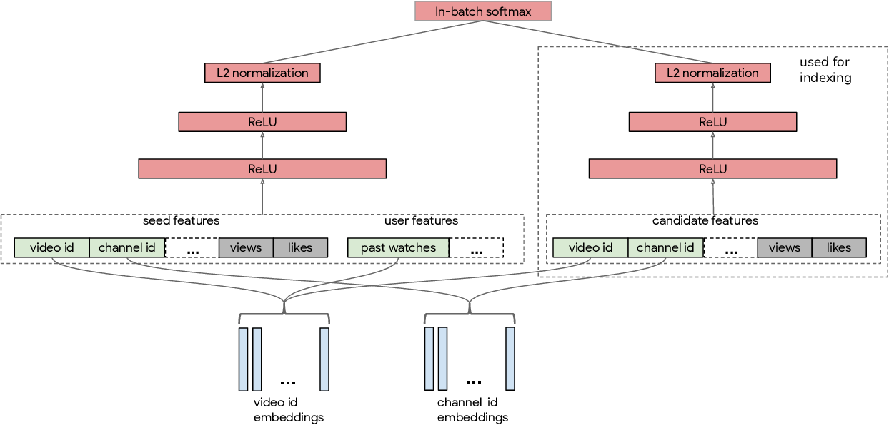
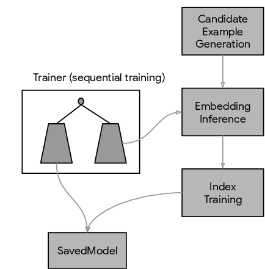

# Sampling Bias Corrected Neural Modeling for Large Corpus Item Recommendations

## Modeling Framework: Two-tower

We have a set of queries and items. Queries and items are represented by feature vectors

- Queries: $$\{x_i\}^N_{i=1}$$
- Items: $$\{y_j\}^M_{j=1}$$

Here $$x_i$$ and $$y_i$$ are both mixtures of a wide variety of features (e.g. sparse IDs and dense
features) and could be in a a very high dimensional space. The goal is to retrieve a subset of items
given a query. In personalization scenario, we assume user and context are fully captured in
$$x_i$$. Note that we begin with a finite number of queries and items to explain the intuition.
Our modeling framework works without such an assumption.

We aim to build a model with two parameterized embedding functions:

- $$u: X \times \mathbb{R}^d \rightarrow \mathbb{R}^k$$
- $$v: Y \times \mathbb{R}^d \rightarrow \mathbb{R}^k$$

They map model parameters $$\theta \in \mathbb{R}^d$$ and features of query and candidates to a
k-dimensional embedding space. The output of the model is the inner product of two embeddings.

$$
s(x, y) = \left \langle u(x, \theta), v(y, \theta) \right \rangle
$$

The goal is to learn model parameter $$\theta$$ from a training dataset of `T` examples.

$$
\tau = \{(x_i, y_i, r_i)\}^T_{i=1}
$$

where $$(x_i, y_i)$$ denotes the pair of query and item, and $$r_i \in mathbb{R}$$ is the associated
reward for each pair. The reward does not have to be user ratings. It could be user engagement time
or clicks.

Given a query $$x$$, a common choice for the probability distribution of picking candidate $$y$$
from M items is based on the softmax function.

$$
P(y \mid x;\theta) = \frac{e^{s(x,y)}}{\Sigma_{j=1}^{M} e^{s(x,y_j)}}
$$

By further incorporating rewards $$r_i$$, we consider the following weighted log-likelihood as the
loss function.

$$
L_{\tau}(\theta) = \frac{-1}{T} \Sigma_{i \in T} r_i \cdot log \left( P(y_i \mid x_i; \theta) \right)
$$

When M is very large, it is not feasible to include all candidate examples in computing the
denominator. A common idea is to use a subset of items in constructing the denominator. Given a
mini-batch of B pairs for each $$i \in B$$, the batch softmax is

$$
P_B(y_i \mid x_i; \theta) = \frac{e^{s(x_i, y_i)}}{\Sigma_{j \in B} e^{s(x_i, y_j)}}
$$

In-batch items are normally sampled from a power-law distribution. As a result, the probability
function introduces a large bias toward full softmax: popular items are overly penalized as
negatives due to the high probability of being included in a batch. Inspired by the logQ correction
used in sampled softmax model, we correct each logit $$s(x_i,y_j)$$ by the following equation.

$$
s^c(x_i, y_j) = s(x_i, y_j) - log(p_j)
$$

Here $$p_j$$ denotes the sampling probability of item $$j$$ in a random batch. With the correction,
we have

$$
P_B^c(y_i \mid x_i; \theta) = \frac{e^{s^c(x_i, y_i)}}{e^{s^c(x_i, y_i)} + \Sigma_{j \in B, j \neq i} e^{s^c(x_i, y_j)}}
$$

The mini-batch loss function is

$$
L_B(\theta) = \frac{-1}{B} \Sigma_{i \in B} r_i \cdot log\left( P_B^c (y_i \mid x_i; \theta) \right)
$$

Running SGD with learning rate $$\gamma$$ yields the model parameter update as

$$
\theta = \theta - \gamma \cdot \nabla L_B(\theta)
$$

### Algorithm 1 Training

**Inputs**

- Two parameterized embedding functions $$u(...,\theta)$$ and $$v(...,\theta)$$ where each one maps
  input features to an embedding space through a neural network.

- Learning rate $$\gamma$$ either fixed or adaptive.

**Repeat**

- Sample or receive a batch of training data from a stream
- Obtain the estimated sampling probability $$p_i$$ from each $$y_i$$ from the frequency estimation
  algorithm below.
- Construct loss $$L_B(\theta)$$
- Apply backpropagation and update $$\theta$$

**Until** stopping criterion

Note that $$L_B$$ does not require a fixed set of queries or candidates. Accordingly, the gradient
update can be applied to streaming training data whose distribution changes over time.

### Algorithm 2 Streaming Frequency Estimation

**Inputs**

- Learning rate $$\alpha$$.
- Arrays `A` and `B` with size `H`
- Hash function `h` with output space `H`

**Training**

For steps `t = 1, 2, ...`, sample a batch of items $$\beta$$. For each $$y \in \beta$$ do:

$$
B[h(y)] = (1 - \alpha) \cdot B[h(y)] + \alpha \cdot (t - A[h(y)])
$$

$$
A[h(y)] = t
$$

**Until** stopping criterion

During interference step, for any item $$y$$, estimated sampling probability

$$
\hat{p} = \frac{1}{B[h(y)]}
$$

### Normalization and Temperature

Empirically we find that adding embedding normalization, i.e.

$$
u(x, \theta) = \frac{u(x, \theta)}{\left \| u(x, \theta)  \right \|_2} \\
v(y, \theta) = \frac{v(y, \theta)}{\left \| v(y, \theta)  \right \|_2}
$$

improves model trainability and thus leads to better retrieval quality. In addition, a temperature $$\tau$$ is added to each logit to sharpen the predictions, namely,

$$
s(x, y) = \frac{1}{\tau} \left \langle u(x, \theta), v(y, \theta) \right \rangle
$$

In practice $$\tau$$ is a hyper-parameter tuned to maximize retrieval metrics such as recall or
precision.

## Neural Retrieval System for YouTube

YouTube generates video recommendations conditioned on a video (called seed video) being watched by
a user. The recommendation system consists of two stages: nomination (a.k.a. retrieval) and ranking.
At nomination stage, we have multiple nominators that each generates hundreds of video
recommendations given constraints of a user and a seed video. These videos are subsequently scored
and re-ranked by a fully-blown neural network ranking model.

### Modeling Overview

The YouTube neural retrieval model consists of query and candidate networks. At any point of time,
the video which a user is watching, i.e. the seed video, provides a strong signal about the user's
current interest. As a result, we make use of large set of seed video features along with the
user's watch history. The candidate tower is built to learn from candidate video features.

**Training Label**

Video clicks are used as positive labels. In addition, for each click, we construct a reward $$r_i$$
to reflect different degrees of user engagement with the video. For example, $$r_i = 0$$ for clicked
videos with little watch time. On the other hand $$r_i = 1$$ indicates the whole video got watched.

**Video Features**

The video features include both categorical and dense features. Examples of categorical features
include video ID and channel ID. For each of these entities, an embedding layer is created to map
each categorical feature to a dense vector.

Normally we are dealing with two kinds of categorical features. Some features (e.g. video ID) have
strictly one categorical value per video, so we have one embedding vector representing that.
Alternatively, one feature (e.g. video topics) might be a sparse vector of categorical values, and
the final embedding representing that feature would be a weighted sum of the embeddings for each of
the values in the sparse vector.

To handle out-of-vocabulary entities, we randomly assign them to a fixed set of hash buckets, and learn an embedding for each one.

**User Features**

We use a user's watch history to capture the user's interest besides the seed video. One example is
a sequence of K video IDs the user recently watched. We treat the watch history as a bag of words,
and represent it by the average of video ID embeddings.

> Bag of word is treating watch history as a bag of its videos, similar to NLP where a sentence is
> represented by a list of word IDs. The averaging is presumably finding the centroid in the
> embedding space.

In the query tower, user and seed video features are fused in the input layer, which is then passed
through a feed forward neural network.

For the same type of IDs, embeddings are shared among the related features. For example, the same
set of video ID embddings is used for seed, candidate, and users' past watches.

### Sequential Training

In YouTube, new training data is generated every day, and training datasets are accordingly
organized by days. The model training makes use of this sequential structure in the following way.

Trainer consumes the data sequentially from the oldest training training examples to most recent
training examples. Once the trainer has caught up to the latest day of training data, it waits for
the next day's training data to arrive. In this way, the model is able to keep up with latest data
distribution shift. Training data is essentially consumed by trainer in a streaming manner.

### Indexing and Model Serving

The index pipeline in the retrieval system periodically creates a Tensorflow SavedModel for online serving. The index pipeline was built in three stages.

1. **Candidate example generation**: In the first stage, a set of videos are selected from YouTube
  corpus based on certain criterion. Their features are fetched and added to the candidate examples.
2. **Embedding inference**: In the second stage, right tower (candidate tower) is applied to compute
  embeddings from candidate examples.
3. **Embedding indexing**: In the third stage, we train a Tensorflow-based embedding index model based
  on tree and quantized hashing techniques.

Finally, the SavedModel used in serving is created by stitching the query tower and the indexing model together.
