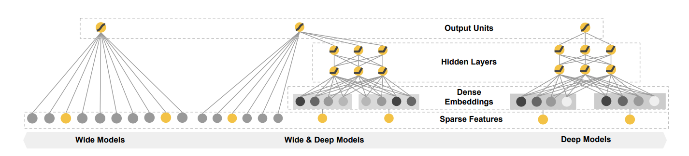
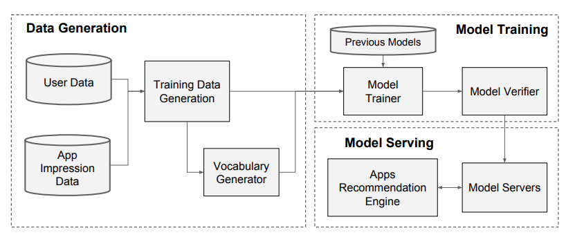
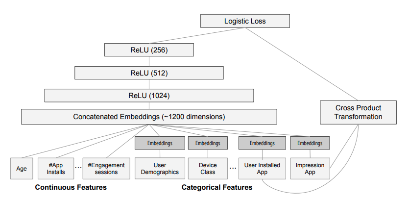

# Wide & Deep Learning for Recommender Systems

[Source](https://arxiv.org/pdf/1606.07792.pdf)

## Abstract

> Generalized Linear models with nonlinear feature transformations are widely used for large scale
regression and classification problems with sparse inputs. Memorization of feature interactions
through a wide set of cross-product feature transformations are effective and interpretable, while
generalization requires more feature engineering effort. With less feature engineering, deep neural
networks can generalize better to unseen feature combinations through low-dimensional dense
embeddings learned for the sparse features.

Wide is referred to linear models like logistic regressions and gradient boosted decision tree. It
captures a wide range features with importance scores. Each tree may be pretty shallow (not deep).
However, generalization requires our effort to pick out what features to keep or to toss away. On
the other hand, if data is abundant, neural network can do the learning for us. GBDT cannot do well
with high cardinality dataset.

> In this paper, we present Wide & Deep learning - jointly trained wide linear models and deep
neural networks - to combine the benefits of memorization and generalization for recommender systems.

## Introduction

> One challenge in recommender systems, similar to the general search ranking problem, is to achieve
both memorization and generalization. Memorization can be loosely defined as learning the frequent
co-occurrence of items or features and exploiting the correlation available in the historical data.
Generalization, on the other hand, is based on transitivity of correlation and explores new feature
combinations that have never or rarely occurred in the past.

> For massive-scale online recommendation and ranking systems in an industrial setting, generalized
linear models such as logistic regression are widely used because they are simple, scalable, and
interpretable. The models are often trained on binary sparse features with one-hot encoding.
E.g. the binary feature "user_installed_app=netflix" has value 1 if user installed Netflix.
Memorization can be achieved effectively using cross-product transformations over sparse features,
such as AND(user_installed_app=netflix, impression_app=pandora"), whose value is 1 if the user
installed Netflix and then is later shown Pandora.

Recall that logistic regression is defined as follows.

$$
z = \vec{W} \cdot \vec{x} + \vec{b}
$$

$$
P(\vec{x}) = \hat{y} = \frac{1}{1 + e^{-z(\vec{x})}}
$$

The cross entropy loss is defined as follows.

$$
L(\hat{y}, y) = y\;log(\hat{y}) + (1-y)\;log(1 - \hat{y})\\ 
= - \left[
y \; log\left( \sigma(\vec{W}\cdot\vec{x})\right) +
(1 - y) \; log\left(1 - \sigma(\vec{W}\cdot\vec{x})\right)
\right]
$$

> Generalization can be added by using features that are less granular, such as
AND(user_installed_category=video, impression_category=music), but manual feature engineering is
often required. One limitation of cross product transformations is that they do not generalize to
query-item feature pairs that have not appeared in the training data.

> Embedding-based models, such as factorization machines or deep neural networks, can generalize to
previously unseen query-item feature pairs by learning a low-dimensional dense embedding vector for
each query and item feature, with less burden of feature engineering. However it is difficult to
learn effective low-dimensional representations for queries and items when the underlying query-item
matrix is sparse and high rank, such as users with specific preferences or niche items with a narrow
appeal. In such cases, there should be no interactions between most query-item pairs, but dense
embeddings will lead to nonzero predictions for all query-item pairs, and thus can over-generalize
and make less relevant recommendations.

Movie ratings are classic example of sparse high rank matrix.

$$
A = \begin{bmatrix}
1 & ? & ? & ... & a_{0,M} \\
? & ? & ? & ... & a_{1,M} \\
1 & 1 & ? & ... & a_{2,M} \\
... & ... & ... & ... & ... \\
a_{N, 0} & ... & ... & ... & a_{N, M}
\end{bmatrix}
$$

> In this paper, we present Wide & Deep learning framework to achieve both memorization and
generalization in one model, by jointly training a linear model component and a neural network
component.

## Recommender System Overview

> A query, which can include various user and contextual features, is generated when a user visits
the app store. The recommender system returns a list of apps (also referred to as impressions) on
which users can perform certain actions such as clicks or purchases. These user actions, along with
the queries and impressions, are recorded in the logs as the training data for the learner.

> Since there are over a million apps in the database, it is intractable to exhaustively score every
app for every query within the serving latency requirements. Therefore, the first step upon
receiving a query is retrieval. The retrieval system returns a short list of items that best match
the query using various signals, usually a combination of machine-learned models and human-defined
rules. After reducing the candidate pool, the ranking system ranks all items by their scores. The
scores are usually $$P(y \mid x)$$, the probability of a user action label $$y$$ given the features
$$x$$, including user features (e.g. country, language, demographics), contextual features (e.g.
device, hour of the day, day of the week), and impression features (e.g. app age, historical
statistics of an app).

## Wide & Deep Learning

### The Wide Component

> The wide component is a generalized linear model of the form $$y = w^Tx + b$$. $$y$$ is the
prediction, $$x = [x_1, x_2, ..., x_d]$$ is a vector of `d` features, $$w = [w_1, w_2, ..., w_d]$$
are the model parameters and $$b$$ is the bais. The feature set includes raw input features and
transformed features. One of the most important transformations is the
**cross-product transformation**, which is defined as:

$$
\phi_k(x) = \prod_{i=1}^d x_{i}^{c_{ki}} \quad c_{ki} \in \{0, 1\}
$$

> where $$c_{ki}$$ is a boolean variable that is 1 if the `i`th feature is part of the `k`th
transformation $$\phi_k$$, and 0 otherwise. For binary features, a cross product transformation
(e.g. "AND(gender=female, language=en)") is 1 if and only if the constituent features are all 1, and
0 otherwise. This captures the interactions between the binary features, and adds nonlinearity to
the generalized linear model.

Then question arises, how is the $$\vec{c}$$ defined in cross product transformation? Do we manually
parameterize it? [How is the cross product transformation defined for binary features?](https://datascience.stackexchange.com/questions/57435/how-is-the-cross-product-transformation-defined-for-binary-features)

### The Deep Component

> The deep component is a feed-forward neural network. For categorical features, the original inputs
are feature strings. Each of these sparse, high-dimensional categorical features are first converted
into a low-dimensional and dense real-valued vector, often referred as an embedding vector. The
dimensionality of the embeddings are usually on the order of O(10) to O(100). The embedding vectors
are initialized randomly and then the values are minimize the final loss function during model
training. These low-dimensional dense embedding vectors are then fed into the hidden layers of a
neural network in the forward pass. Specifically, each hidden layer performs the following
computation.

$$
a^{l+1} = f\left(W^la^l + b^l\right)
$$

> where $$l$$ is the layer number and $$f$$ is the activation function, often ReLU. $$a$$, $$b$$,
and $$W$$ are the activations, bias, and model weights at $$l$$th layer.

### Joint Training of Wide & Deep Model

>The wide component and deep component are combined using a weighted sum of their output log odds as
the prediction, which is then fed to one common logistic loss function for joint training.

>Note that there is a distinction between joint training and ensemble. In an ensemble, individual
models are trained separately without knowing each other, and their predictions are combined only at
inference time but not at training time. In contrast, joint training optimizes all parameters
simultaneously by taking both the wide and deep part as well as the weights of their sum into
account at training time. There are implications on model size too: For an ensemble, since the
training is disjoint, each individual model size usually needs to be larger to achieve reasonable
accuracy for an ensemble to work. In comparison, for joint training the wide part only needs to
complment the weaknesses of the deep part with a small number of cross-product feature
transformations, rather than a full-size wide model.

Once we combine the models, the output can be a logistic regression. 

$$
P(Y = 1 \mid x) = \sigma\left( w^T_{wide} [x, \phi(x)] + w^T_{deep}a^{\text{final layer}} + b \right)
$$

where $$Y$$ is the binary class label, $$\sigma$$ is the sigmoid function, $$\phi(x)$$ are the cross
product transformations of the original features $$x$$, and $$b$$ is the bias term. $$w_{wide}$$ is
the vector of all wide model weights, and $$w_{deep}$$ are the weights applied on the final
activations.

## System Implementation

### Data Generation

> In this stage, user and app impression data within a period of time are used to generate training
data. Each example corresponds to one impression. The label is app acquisition: 1 if the impressed
app was installed, and 0 otherwise.

> Vocabularies, which are tables mapping categorical feature strings to integer IDs, are also
generated in this stage. The system computes the ID space for all the string features that occurred
more than a minimum number of times. Continuous real-valued features are normalized to `[0, 1]` by
mapping a feature value $$x$$ to its cumulative distribution function $$P( X \leq x )$$ into $$n_q$$
quantiles.

### Model Training

> During training, our input layer takes in training data and vocabularies and generate sparse and
dense features together with a label. The wide component consists of the cross-product
transformation of user installed apps and impression apps. For the deep part of the model, a
32-dimensional embedding vector is learned for each categorical feature. We concatenate all the
embeddings together with the dense features, resulting in a dense vector of approximately 1200
dimensions. The concatenated vector is then fed into 3 ReLU layers, and finally the logistic output
unit.

> The Wide & Deep models are trained on over 500 billion examples. Every time a new set of training
data arrives, the model needs to be re-trained. However, retraining from scratch every time is
computationally expensive and delays the time from data arrival to serving an updated model. To
tackle this challenge, we implemented a warm-starting system which initializes a new model with the
embeddings and the linear model weights from the previous model.

> Before loading the models into the model servers, a dry run of the model is done to make sure that
it does not cause problems in serving live traffic. We empirically validate the model quality
against the previous model as a sanity check.

### Model Serving

> Once the model is trained and verified, we load it into the model servers. For each request, the
servers receive a set of app candidates from the app retrieval system and user features to score
each app. Then, the apps are ranked from the highest scores to the lowest, and we show the apps to
the users in this order. The scores are calculated by running a forward inference pass over the
Wide & Deep model.

Each candidate receives a probability score from the logistic output unit $$y \in [0, 1]$$.
