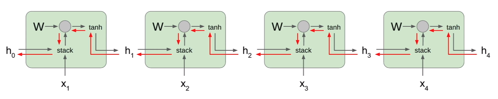

# LSTM (Long Short-term Memory)
## Exploding Gradient in Vanilla RNN
Recall that our RNN model:

$$
h_{t} = tanh(W_{hh} h_{t-1} + W_{xh}x_{t})
$$

$$
h_{t} = tanh \begin{pmatrix} (W_{hh} W_{xh}) \begin{pmatrix} h_{t-1} \\ x_{t} \end{pmatrix} \end{pmatrix}
$$

$$
h_{t} = tanh \begin{pmatrix} W \begin{pmatrix} h_{t-1} \\ x_{t} \end{pmatrix} \end{pmatrix}
$$

For every time step of a sequence, we backprogate from `h[t]` to `h[t-1]`. First the gradient will flow through the `tanh` gate and then to matrix multiplication gate. As we know, whenever we backprop into matrix multiplication gate, the upstream gradient is multiplied by the tranpose of the `W` matrix. This happens at every time step throughout the sequence. What if the sequence is very long?



The final expression for gradient on `h[0]` will involve many factors of this weight matrix. This will either lead to an exploding gradient problem or vanishing gradient problem. There' a simple hack to address this problme, which is using `numpy.clip`. However, if the problem is vanishing gradient, clipping isn't going to help.

## Introducing LSTM

LSTM has a fancier recurrence relation than the vanilla RNN. LSTM has two states, one is being the usual hidden state `h[t]` we see in vanilla RNN and another one is called the cell state `c[t]`. Cell state is an internal vector that is not exposed to the outside world.

Let's define some terminologies here:

* `f` **forget gate**: whether to erase cell
* `i` **input gate**: whether to write to cell
* `g` **gate gate**: how much to write to cell
* `o` **output gate**: how much to reveal cell

$$
\begin{pmatrix} i \\ f \\ o \\ g \end{pmatrix} = \begin{pmatrix} \sigma \\ \sigma \\ \sigma \\ tanh \end{pmatrix}
W \begin{pmatrix} h_{t - 1} \\ x_{t} \end{pmatrix}
$$

**Note** that the sigma symbol represents sigmoid activation function.

$$
c_{t} = f \odot c_{t - 1} + i \odot g
$$

which is equivalent to

$$
c_{t} = \sigma(W_{hhf} h_{t-1} + W_{xhf} x_{t}) \odot c_{t-1} + \sigma(W_{hhi} h_{t-1} + W_{xhi} x_{t}) \odot tanh(W_{hhg} h_{t-1} + W_{xhg} x_{t})
$$

And

$$
h_{t} = o \odot tanh(c_{t})
$$

which is equivalent to

$$
h_{t} = \sigma \begin{pmatrix} W_{hho} h_{t-1} + W_{xho} x_{t} \end{pmatrix} \odot tanh(c_{t})
$$

We take the previous cell state and hidden state as the inputs to our LSTM cell. The previous hidden state is combined with the input vector and multiply with the weight matrix to produce `ifog`. The forget gate multiplies element-wise with the previous cell state. The input and gate gate also multiply element wise. The two results are combined through sum elemenwise to produce a new cell state. The cell state is then squashed by a `tanh` and multiplied element-wise by the output gate to produce our next hidden state.


### LSTM Gradient Flow
Backpropagating from `c[t]` to `c[t-1]` is only element-wise multiplication by the `f` gate, and there is no matrix multiplication by W. The `f` gate is different at every time step, ranged between 0 and 1 due to sigmoid property, thus we have avoided of the problem of multiplying the same thing over and over again.

Backpropagating from `h[t]` to `h[t-1]` is going through only one single `tanh` nonlinearity rather than `tanh` for every single step.


### LSTM Forward Propagation
The forward propagation isn't all that different from the vanilla recurrent neural network, we just now have more variables.


```python
import numpy as np


def sigmoid(X):
    """A numerically stable version of logistic sigmoid function."""
    pos_mask = (X >= 0)
    neg_mask = (X < 0)
    z = np.zeros_like(X)
    z[pos_mask] = np.exp(-X[pos_mask])
    z[neg_mask] = np.exp(X[neg_mask])
    top = np.ones_like(X)
    top[neg_mask] = z[neg_mask]
    return top / (1 + z)


class LSTMRecurrentNetwork(object):
    def __init__(self, input_dim, hidden_dim):
        self.input_dim, self.output_dim = input_dim, input_dim
        self.hidden_dim = hidden_dim

        scaling = 0.01
        self.Wx = np.random.randn(input_dim, 4*hidden_dim) # Creating one giant weight matrix for i, f, o, g gates.
        self.Wh = np.random.randn(hidden_dim, 4*hidden_dim)
        self.Bh = np.random.randn(4*hidden_dim,)

    def forward_prop(X, prev_H, prev_C):
        """
        :param np.array X: Input data of shape (N, D) where D is the input dimension
        :param np.array prev_H: Previous hidden state matrix of shape (N, H)
        :param np.array prev_C: Previous cell state matrix of shape (N, H)
        """
        activations = np.dot(X, self.Wx) + np.dot(prev_H, self.Wh) + self.Bh
        input_gate = sigmoid(activations[:, 0:H])
        forget_gate = sigmoid(activations[:, H:2*H])
        output_gate = sigmoid(activations[:, 2*H:3*H])
        gain_gate = sigmoid(activations[:, 3*H:4*H])

        # In order to backprop correctly, we'd need to cache these variables but we will do that later.
        next_C = forget_gate * prev_C + input_gate * gain_gate
        next_H = output_gate * np.tanh(next_C)

        return next_H, next_C


```
