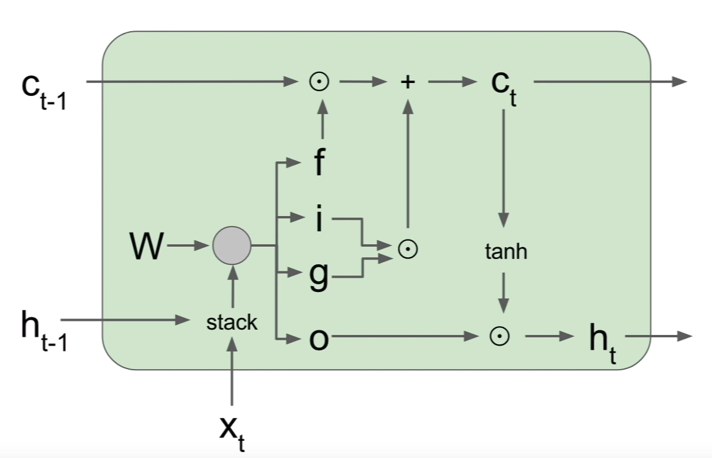
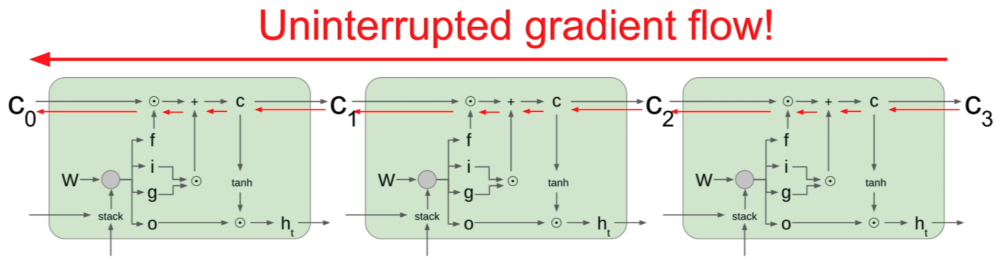

# LSTM Recurrent Neural Network
## Exploding Gradient in Vanilla RNN
Recall that our RNN model:

$$
h_{t} = tanh(W_{hh} h_{t-1} + W_{xh}x_{t})
$$

$$
h_{t} = tanh \begin{pmatrix} (W_{hh} W_{xh}) \begin{pmatrix} h_{t-1} \\ x_{t} \end{pmatrix} \end{pmatrix}
$$

$$
h_{t} = tanh \begin{pmatrix} W \begin{pmatrix} h_{t-1} \\ x_{t} \end{pmatrix} \end{pmatrix}
$$

For every time step of a sequence, we backprogate from `h[t]` to `h[t-1]`. First the gradient will flow through the `tanh` gate and then to matrix multiplication gate. As we know, whenever we backprop into matrix multiplication gate, the upstream gradient is multiplied by the tranpose of the `W` matrix. This happens at every time step throughout the sequence. What if the sequence is very long?


The final expression for gradient on `h[0]` will involve many factors of this weight matrix. This will either lead to an exploding gradient problem or vanishing gradient problem. There' a simple hack to address this problme, which is using `numpy.clip`. However, if the problem is vanishing gradient, clipping isn't going to help.

## Introducing LSTM

LSTM has a fancier recurrence relation than the vanilla RNN. LSTM has two states, one is being the usual hidden state `h[t]` we see in vanilla RNN and another one is called the cell state `c[t]`. Cell state is an internal vector that is not exposed to the outside world. 

Let's define some terminologies here: 

* `f` **forget gate**: whether to erase cell
* `i` **input gate**: whether to write to cell
* `g` **gate gate**: how much to write to cell
* `o` **output gate**: how much to reveal cell

$$
\begin{pmatrix} i \\ f \\ o \\ g \end{pmatrix} = \begin{pmatrix} \sigma \\ \sigma \\ \sigma \\ tanh \end{pmatrix}
W \begin{pmatrix} h_{t - 1} \\ x_{t} \end{pmatrix}
$$

**Note** that the sigma symbol represents sigmoid activation function.

$$
c_{t} = f \odot c_{t - 1} + i \odot g
$$

which is equivalent to 

$$
c_{t} = \sigma(W_{hhf} h_{t-1} + W_{xhf} x_{t}) \odot c_{t-1} + \sigma(W_{hhi} h_{t-1} + W_{xhi} x_{t}) \odot tanh(W_{hhg} h_{t-1} + W_{xhg} x_{t})
$$

And

$$
h_{t} = o \odot tanh(c_{t})
$$

which is equivalent to

$$
h_{t} = \sigma \begin{pmatrix} W_{hho} h_{t-1} + W_{xho} x_{t} \end{pmatrix} \odot tanh(c_{t})
$$

We take the previous cell state and hidden state as the inputs to our LSTM cell. The previous hidden state is combined with the input vector and multiply with the weight matrix to produce `ifog`. 

The forget gate multiplies element-wise with the previous cell state. The input and gate gate also multiply element wise. The two results are combined through sum elemenwise to produce a new cell state. The cell state is then squashed by a `tanh` and multiplied element-wise by the output gate to produce our next hidden state.


### LSTM Gradient Flow
Backpropagating from `c[t]` to `c[t-1]` is only element-wise multiplication by the `f` gate, and there is no matrix multiplication by W. The `f` gate is different at every time step, ranged between 0 and 1 due to sigmoid property, thus we have avoided of the problem of multiplying the same thing over and over again. 

Backpropagating from `h[t]` to `h[t-1]` is going through only one single `tanh` nonlinearity rather than `tanh` for every single step.



## LSTM Forward Propagation
The forward propagation isn't all that different from the vanilla recurrent neural network, we just now have more variables. Suppose we take a mini-batch of data, of shape `(N, T, D)`. `N` is our batch size, `T` is the size of the sequence, and `D` is the dimension of our input. 

For example, I have a sentence, `"hello world I am Calvin"`. We can treat this sentence as one input sequence with size `T=5` because it has five words. The dimension of the input depends on how we represent each word. Before we feed the sentence into a RNN, each word of a sentence has to be converted to a word vector which has dimension of `D`. 


```python
import numpy as np

# Use null token to ensure each input sentence has the same length
raw_txt_inputs = ['hello world i am calvin', 'calvin says hello world <null>']
word_to_idx = dict()

idx = 0
for sentence in raw_txt_inputs:
    for word in sentence.split():
        if word_to_idx.get(word) is None:
            word_to_idx[word] = idx
            idx += 1

# Create a weight matrix for mapping word to its word vector representation
vocab_size = len(word_to_idx)
word_vec_dim = 5
word_embedding_weight = np.random.rand(vocab_size, word_vec_dim)

# Convert raw_txt_input to tensor representation
index_sequences = []
for sentence in raw_txt_inputs:
    seq = []
    for word in sentence.split():
        seq.append(word_to_idx[word])
    index_sequences.append(seq)

input_sequences = word_embedding_weight[np.array(index_sequences)]

print input_sequences
print '\nInput sequence has shape', input_sequences.shape
```

    [[[ 0.92316896  0.42683601  0.09736801  0.42345096  0.16077895]
      [ 0.76913305  0.19142192  0.17194874  0.64221621  0.38024893]
      [ 0.34509468  0.05679093  0.17179702  0.09890025  0.38915591]
      [ 0.59768999  0.51223228  0.53420898  0.48474058  0.02789487]
      [ 0.93754868  0.97818453  0.03263516  0.39473973  0.41731715]]
    
     [[ 0.93754868  0.97818453  0.03263516  0.39473973  0.41731715]
      [ 0.06547563  0.62950683  0.88021683  0.52397818  0.48162677]
      [ 0.92316896  0.42683601  0.09736801  0.42345096  0.16077895]
      [ 0.76913305  0.19142192  0.17194874  0.64221621  0.38024893]
      [ 0.91825584  0.85292219  0.11624048  0.21388636  0.39841289]]]
    
    Input sequence has shape (2, 5, 5)


When we pass a mini batch of sequences to the LSTM layer, we will run through the each word vector of each sequence through series of time step. In each time step, we perform the following forward propagation:
```python
    def _forward_step(self, x, prev_hidden_state, prev_cell_state):
        """Forward pass for a single time step of the LSTM layer.

        :param np.array x: Input data of shape (N, D)
        :param np.array prev_hidden_state: Previous hidden state of shape (N, H)
        :param np.array prev_cell_state: Previous cell state of shape (N, H)

        Returns tuple:
            - next_hidden_state: Next hidden state, of shape (N, H)
            - next_cell_state: Next cell state, of shape (N, H)
            - cache: Tuple of values needed for back-propagation
        """
        _, H = prev_hidden_state.shape

        # Compute activations
        acts = np.dot(x, self.Wx) + np.dot(prev_hidden_state, self.Wh) + self.b

        # Compute the internal gates
        input_gate = sigmoid(acts[:, 0:H])
        forget_gate = sigmoid(acts[:, H:2*H])
        output_gate = sigmoid(acts[:, 2*H:3*H])
        gain_gate = np.tanh(acts[:, 3*H:4*H])

        # Compute next states
        next_cell_state = forget_gate * prev_cell_state + input_gate * gain_gate
        next_hidden_state = output_gate * np.tanh(next_cell_state)

        # Cache the results
        cache = {
            'x': x,
            'next-c': next_hidden_state,
            'next-h': next_cell_state,
            'i-gate': input_gate,
            'f-gate': forget_gate,
            'o-gate': output_gate,
            'g-gate': gain_gate,
            'prev-h': prev_hidden_state,
            'prev-c': prev_cell_state
        }

        return next_hidden_state, next_cell_state, cache
```

The cache is necessary for back propagation later. The forward propagation of a LSTM layer can be thought as breaking a sequence into time steps and feed each time step to the above code snippet.
```python
    def forward(self, input_sequence, h0, Wx=None, Wh=None, b=None):
        """Forward pass for a LSTM layer over an entire sequence of data. 
        This assumes an input sequence composed of T vectors, each of dimension D. 
        The LSTM uses a hidden size of H, and it works over a mini-batch containing N sequences.

        :param np.array input_sequence: Input data of shape (N, T, D)
        :param np.array h0: Initial hidden state of shape (N, H)
        :param np.array Wx: Optional input-to-hidden weight matrix, of shape (D, 4H)
        :param np.array Wh: Optional hidden-to-hidden weight matrix, of shape (H, 4H)
        :param np.array b: Optional bias vector, of shape (4H,)

        Returns np.array:
            Hidden state over time of shape (N, T, H)
        """
        if Wx is not None and Wh is not None and b is not None:
            self.Wx, self.Wh, self.b = Wx, Wh, b

        N, T, D = input_sequence.shape
        _, H = h0.shape

        # Cache the inputs and create time series variables, 
        # i.e. hidden states over time and cell states over time.
        self.input_sequence = input_sequence
        self.h0 = h0

        self.hidden_states_over_t = np.zeros((N, T, H))        
        self.cell_states_over_t = np.zeros((N, T, H))
        self.caches = dict()

        # Run the sequence
        prev_hidden_state = h0
        prev_cell_state = np.zeros(h0.shape)
        for t in range(T):
            hidden_state, cell_state, self.caches[t] = self._forward_step(input_sequence[:, t, :],
                                                                         prev_hidden_state,
                                                                         prev_cell_state)
            self.hidden_states_over_t[:, t, :] = hidden_state
            self.cell_states_over_t[:, t, :] = cell_state

            prev_hidden_state, prev_cell_state = hidden_state, cell_state

        return self.hidden_states_over_t
```

## LSTM Back Propagation
We are given the following upstream gradients:

$$
\frac{\partial L}{\partial c_{t}} \;,\; \frac{\partial L}{\partial h_{t}}
$$

The objective is to find `ifog` gate gradients and matrix weight gradients:

$$
\frac{\partial L}{\partial i} \;,\;
\frac{\partial L}{\partial f} \;,\;
\frac{\partial L}{\partial o} \;,\;
\frac{\partial L}{\partial g} \;,\;
\frac{\partial L}{\partial W_{x}} \;,\;
\frac{\partial L}{\partial W_{h}} \;,\;
\frac{\partial L}{\partial b} \;,\;
\frac{\partial L}{\partial x} \;,\;
\frac{\partial L}{\partial h_{0}}
$$

Recall that `ifog` gates are declared as follows:
$$
\begin{pmatrix} i \\ f \\ o \\ g \end{pmatrix} = 
\begin{pmatrix} \sigma \\ \sigma \\ \sigma \\ tanh \end{pmatrix}
\left( \vec{x}W_{x} + \vec{h}_{t-1}W_{h} + b\right)
$$

The expected output of above calculation is a matrix of shape `(N, 4H)` where N is the mini-batch size and H is the hidden dimension. Using what we have above, we can compute the next cell state as follows:

$$
c_{t} = f \cdot c_{t-1} + i \cdot g
$$

With cell state, we can compute the next hidden state:

$$
h_{t} = o \cdot tanh\left(c_{t}\right)
$$

### Compute Gradients
Since we are given upstream gradients of loss with respect to output cell state and output hidden state, we will first compute gradients of hidden state with respect to cell state and gradient of new cell state with respect to old cell state.

$$
\frac{\partial h_{t}}{\partial c_{t}} = o \cdot (1 - tanh^{2}(c_{t}))
$$

$$
\frac{\partial c_{t}}{\partial c_{t - 1}} = f
$$

Now we can calculate gradient of loss with respect to previous cell state, which is a sum of contributions from both upstream gradients.

$$
\frac{\partial L}{\partial c_{t-1}} = \frac{\partial L}{\partial c_{t}} \frac{\partial c_{t}}{\partial c_{t-1}} +
\frac{\partial L}{\partial h_{t}} \frac{\partial h_{t}}{\partial c_{t}} \frac{\partial c_{t}}{\partial c_{t-1}}
$$

Proceed and compute gradients for `ifog` gates:

$$
\frac{\partial L}{\partial i} = \frac{\partial L}{\partial c_{t}} \frac{\partial c_{t}}{\partial i} + 
\frac{\partial L}{\partial h_{t}} \frac{\partial h_{t}}{\partial c_{t}} \frac{\partial c_{t}}{\partial i}
$$

$$
\frac{\partial L}{\partial f} = \frac{\partial L}{\partial c_{t}} \frac{\partial c_{t}}{\partial f} + 
\frac{\partial L}{\partial h_{t}} \frac{\partial h_{t}}{\partial c_{t}} \frac{\partial c_{t}}{\partial f}
$$

$$
\frac{\partial L}{\partial o} = \frac{\partial L}{\partial h_{t}} \frac{\partial h_{t}}{\partial o}
$$

$$
\frac{\partial L}{\partial g} = \frac{\partial L}{\partial c_{t}} \frac{\partial c_{t}}{\partial g} + 
\frac{\partial L}{\partial h_{t}} \frac{\partial h_{t}}{\partial c_{t}} \frac{\partial c_{t}}{\partial g}
$$

Continue to back-propagate and we are almost done! Compute the non-linearity for each of the `ifog` gates and then combine the gradients to form one combined matrix of shape `(N, 4H)`. We will call this our activiation matrix `A`. Then the following gradients can be obtained:

$$
\frac{\partial L}{\partial W_{x}} = \frac{\partial L}{\partial A} \frac{\partial A}{\partial W_{x}}
$$

$$
\frac{\partial L}{\partial W_{h}} = \frac{\partial L}{\partial A} \frac{\partial A}{\partial W_{h}}
$$

$$
\frac{\partial L}{\partial b} = \frac{\partial L}{\partial A} \frac{\partial A}{\partial b}
$$

$$
\frac{\partial L}{\partial x} = \frac{\partial L}{\partial A} \frac{\partial A}{\partial x}
$$

$$
\frac{\partial L}{\partial h_{0}} = \frac{\partial L}{\partial A} \frac{\partial A}{\partial h_{0}}
$$
