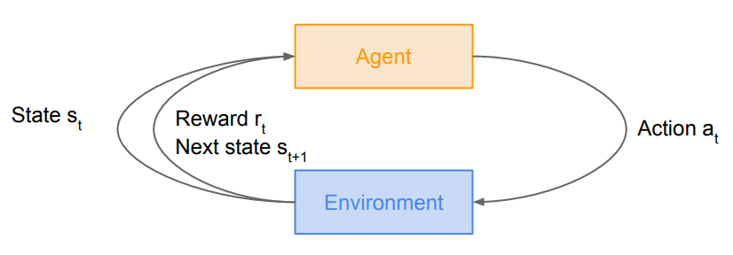
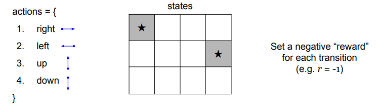
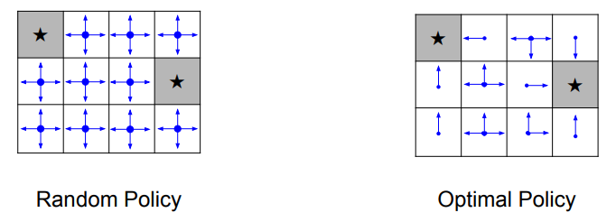

# Deep Reinforcement Learning

In a reinforcement learning setup, we have an agent and an environment. The environment gives the agent a state `s[t]` which is a function of time step. The agent will perform an action based on the given state. The environment will then give back either a reward or a punishment for the action performed. The process goes on and on until the environment gives the agent a terminal state.

## Markov Decision Process
We can mathematically formualize a reinforcement learning problem as a Markov decision process, such that current state of the agent completely characterizes the state of the *world*. 

The process is defined by a tuple of objects:
$$
\left( S, A, R, P, \gamma \right)
$$

* $S$ is a set of possible states.
* $A$ is a set of possible actions.
* $R$ is a distribution of reward, given the state-action pair.
* $P$ is a transition probability, i.e. distribution over the next state given state-action pair.
* $\gamma$ is a discount factor.

### Procedure
1. At time step `t=0`, environment samples an initial state $s_{0}$ using the initial state probability distributions.
2. For `t=0` until `t=final`:
    * Agent selects an action $a_{t}$.
    * Environment samples reward $r_{t}$ using the distribution set $R$.
    * Environment samples next state $s_{t+1}$ using probaility transition $P$.
    * Agent receives reward $r_{t}$ and next state $s_{t+1}$.

A policy $\pi$ is a function that maps from $S$ to $A$ that specifies what action to take in each state. **Objective** is to find policy $\pi$ that maximizes cumulative discounted reward:

$$
\Sigma_{t > 0} \; \gamma^{t}r_{t}
$$
    

### Example: Grid World
We are given a grid, and the coordinates of the grid represent the states for our agent. The objective is to get the terminal states (starred states) with the least number of step, starting from an initial state. 

A random policy is to sample random actions at any given state while an optimal policy will limit sampling options depending on state.

### Optimal Policy
The optimal policy maximizes the sum of rewards but there are quite a few randomness involved in the decision process. We can look at the example above, for a given optimal policy, at each state (i.e. coordinate) there are multiple directions to go. The policy will sample from one of these directions and produce an action output. In order to deal with the probablistic nature of the policy function, we will need to maximize the **expected** sum of rewards. Formally speaking:

$$
\pi = argmax \;\mathbf{E}\left[\Sigma \; \gamma^{t}r_{t} \;\mid\; \pi \right]
$$

## Q-Learning
We know vaguely what an optimal policy is, but we don't know how to find it. Before we learn how to find it, we must first define couple terms. When our agent follows a policy, it produces a sample trajectory that is composed of states, actions, and rewards:

$$
\{s_{0}, \; a_{0}, \; r_{0}\}, \; \{s_{1}, \; a_{1}, \; r_{1}\}, \; ...
$$

### Value Function
The **value function** at state `s`, is the expected cumulative reward from following the policy from state `s`. This gives us an idea of how *good* is a state. 

$$
V(s) = \mathbf{E} \left[ \Sigma \; \gamma^{t}r_{t} \mid s_{0} = s, \pi \right]
$$

### Q Function
The **Q-value function** at state `s` and action `a`, is the expected cumulative reward from taking action `a` in state `s` and then following the policy from state `s` and action `a`. This gives us an idea of how *good* is a state-action pair, or an indication for how good it is for an agent to pick action `a` while being in state `s`. It's just slightly different from the value function.

$$
Q(s, a) = \mathbf{E} \left[ \Sigma \; \gamma^{t}r_{t} \mid s_{0} = s, a_{0} = a, \pi \right]
$$

### Bellman Equation
The optimal Q-value function `Q*` is the maximum expected cumulative reward achievable from a given state-action pair.

$$
Q^{*}(s, a)  = max \; \mathbf{E} \left[ \Sigma \gamma^{t}r_{t} \mid s_{0} = s, a_{0} = a, \pi \right]
$$

`Q*` will satisfy the following **Bellman Equation**:

$$
Q^{*}(s, a) = \mathbf{E} \left[r + \gamma \; max_{a^{\prime}} \; Q^{*}(s^{\prime}, a^{\prime}) \mid s, a\right]
$$

If the optimal state-action values for the next time-step $Q^{*}(s^{\prime}, a^{\prime})$ are known, then the optimal strategy is to take the action that maximizes the expected value of $r + \gamma Q^{*}(s^{\prime}, a^{\prime})$. The optimal policy $\pi^{*}$ corresponds to taking the best action in any state as specified by $Q^{*}$.

### Solving for Optimal Policy
We can use value iteration algorithm, i.e. using Bellman equation as an iterative update. 

$$
Q_{i + 1}(s, a) = \mathbf{E} \left[r + \gamma \; max_{a^{\prime}} Q_{i}(s^{\prime}, a^{\prime}) \mid s, a\right]
$$

As `i` goes toward infinity, the `Q` function will converge to the optima. However, the problem with this approach is that it is not computationally scalable. It must compute `Q(s,a)` for every state-action pair. For example, if state is a current game state pixels, it would be computationally infeasible to compute for entire state space.

We will use a function approximator to estimate Q, which leads us to the idea of **Q-learning**. If the function approximator is a deep neural network then it is a **deep Q-learning**.

$$
Q(s, a, \theta) \approx Q^{*}(s, a)
$$

#### Forward Pass
The objective is to find a Q-function that will satisfy the Bellman equation (eq. above.) We will define the loss function as follows: 

$$
L_{i}(\theta_{i}) = \mathbf{E}_{s, a} \left[ \left(y_{i} - Q(s, a, \theta_{i} \right)^{2} \right]
$$

where

$$
y_{i} = \mathbf{E}_{s^{\prime}} \left[ r + \gamma \; max_{a^{\prime}} \; Q(s^{\prime}, a^{\prime}, \theta_{i -1}) \mid s, a \right]
$$

#### Backward Pass
Gradient update with respect to Q-function parameters $\theta$:

$$
\nabla L_{i}(\theta_{i}) = \mathbf{E} \left[\left(r + \gamma \; max_{a^{\prime}} \; Q(s^{\prime}, a^{\prime}; \theta_{i-1}) - Q(s, a, ; \theta_{i})\right) \nabla_{\theta_{i}} Q(s, a; \theta_{i}) \right]
$$
