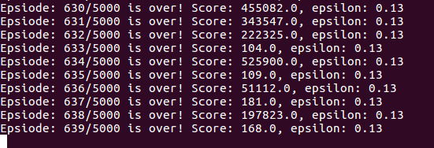

# Deep Reinforcement Learning

In a reinforcement learning setup, we have an agent and an environment. The environment gives the agent a state `s[t]` which is a function of time step. The agent will perform an action based on the given state. The environment will then give back either a reward or a punishment for the action performed. The process goes on and on until the environment gives the agent a terminal state.


## Markov Decision Process
We can mathematically formualize a reinforcement learning problem as a Markov decision process, such that current state of the agent completely characterizes the state of the *world*. 

The process is defined by a tuple of objects:
$$
\left( S, A, R, P, \gamma \right)
$$

* $$S$$ is a set of possible states.
* $$A$$ is a set of possible actions.
* $$R$$ is a distribution of reward, given the state-action pair.
* $$P$$ is a transition probability, i.e. distribution over the next state given state-action pair.
* $$\gamma$$ is a discount factor.

### Procedure
1. At time step `t=0`, environment samples an initial state $$s_{0}$$ using the initial state probability distributions.
2. For `t=0` until `t=final`:
    * Agent selects an action $$a_{t}$$.
    * Environment samples reward $$r_{t}$$ using the distribution set $$R$$.
    * Environment samples next state $s_{t+1}$ using probaility transition $$P$$.
    * Agent receives reward $$r_{t}$$ and next state $$s_{t+1}$$.

A policy $$\pi$$ is a function that maps from $$S$$ to $$A$$ that specifies what action to take in 
each state. **Objective** is to find policy $$\pi$$ that maximizes cumulative discounted reward:

$$
\Sigma_{t > 0} \; \gamma^{t}r_{t}
$$
    

### Example: Grid World
We are given a grid, and the coordinates of the grid represent the states for our agent. The 
objective is to get the terminal states (starred states) with the least number of step, starting 
from an initial state. 


A random policy is to sample random actions at any given state while an optimal policy will limit
sampling options depending on state.


### Optimal Policy
The optimal policy maximizes the sum of rewards but there are quite a few randomness involved in the
decision process. We can look at the example above, for a given optimal policy, at each state 
(i.e. coordinate) there are multiple directions to go. The policy will sample from one of these 
directions and produce an action output. In order to deal with the probablistic nature of the policy
function, we will need to maximize the **expected** sum of rewards. Formally speaking:

$$
\pi = argmax \;\mathbf{E}\left[\Sigma \; \gamma^{t}r_{t} \;\mid\; \pi \right]
$$

## Q-Learning
We know vaguely what an optimal policy is, but we don't know how to find it. Before we learn how to 
find it, we must first define couple terms. When our agent follows a policy, it produces a sample 
trajectory that is composed of states, actions, and rewards:

$$
\{s_{0}, \; a_{0}, \; r_{0}\}, \; \{s_{1}, \; a_{1}, \; r_{1}\}, \; ...
$$

### Value Function
The **value function** at state `s`, is the expected cumulative reward from following the policy 
from state `s`. This gives us an idea of how *good* is a state. 

$$
V(s) = \mathbf{E} \left[ \Sigma \; \gamma^{t}r_{t} \mid s_{0} = s, \pi \right]
$$

### Q Function
The **Q-value function** at state `s` and action `a`, is the expected cumulative reward from taking 
action `a` in state `s` and then following the policy from state `s` and action `a`. This gives us 
an idea of how *good* is a state-action pair, or an indication for how good it is for an agent to
pick action `a` while being in state `s`. It's just slightly different from the value function.

$$
Q(s, a) = \mathbf{E} \left[ \Sigma \; \gamma^{t}r_{t} \mid s_{0} = s, a_{0} = a, \pi \right]
$$

### Bellman Equation
The optimal Q-value function `Q*` is the maximum expected cumulative reward achievable from a given
state-action pair.

$$
Q^{*}(s, a)  = max \; \mathbf{E} \left[ \Sigma \gamma^{t}r_{t} \mid s_{0} = s, a_{0} = a, \pi \right]
$$

`Q*` will satisfy the following **Bellman Equation**:

$$
Q^{*}(s, a) = \mathbf{E} \left[r + \gamma \; max_{a^{\prime}} \; Q^{*}(s^{\prime}, a^{\prime}) \mid s, a\right]
$$

If the optimal state-action values for the next time-step $$Q^{*}(s^{\prime}, a^{\prime})$$ are known,
then the optimal strategy is to take the action that maximizes the expected value of
$$r + \gamma Q^{*}(s^{\prime}, a^{\prime})$$. The optimal policy $$\pi^{*}$$ corresponds to taking
the best action in any state as specified by $$Q^{*}$$.

### Solving for Optimal Policy
We can use value iteration algorithm, i.e. using Bellman equation as an iterative update. 

$$
Q_{i + 1}(s, a) = \mathbf{E} \left[r + \gamma \; max_{a^{\prime}} Q_{i}(s^{\prime}, a^{\prime}) \mid s, a\right]
$$

As `i` goes toward infinity, the `Q` function will converge to the optima. However, the problem with
this approach is that it is not computationally scalable. It must compute `Q(s,a)` for every
state-action pair. For example, if state is a current game state pixels, it would be computationally
infeasible to compute for entire state space.

We will use a function approximator to estimate Q, which leads us to the idea of **Q-learning**. If
the function approximator is a deep neural network then it is a **deep Q-learning**.

$$
Q(s, a, \theta) \approx Q^{*}(s, a)
$$

#### Forward Pass
The objective is to find a Q-function that will satisfy the Bellman equation (eq. above.) We will
define the loss function as follows: 

$$
L_{i}(\theta_{i}) = \mathbf{E}_{s, a} \left[ \left(y_{i} - Q(s, a, \theta_{i} \right)^{2} \right]
$$

where

$$
y_{i} = \mathbf{E}_{s^{\prime}} \left[ r + \gamma \; max_{a^{\prime}} \; Q(s^{\prime}, a^{\prime}, \theta_{i -1}) \mid s, a \right]
$$

#### Backward Pass
Gradient update with respect to Q-function parameters $\theta$:

$$
\nabla L_{i}(\theta_{i}) = \mathbf{E} \left[\left(r + \gamma \; max_{a^{\prime}} \; Q(s^{\prime}, a^{\prime}; \theta_{i-1}) - Q(s, a, ; \theta_{i})\right) \nabla_{\theta_{i}} Q(s, a; \theta_{i}) \right]
$$

## Q-Network Architecture
Suppose we are playing an Atari game. There are four posssible actions an agent can take in the game,
i.e. left, right, up, and down. Each state is represented by raw pixel inputs of the game. We can
think of the whole UI frame as a tensor input to the network. The reward is basically score increase
and decrease at each time step. The objective is to complete the game with the highest score.

1. Input is of shape `(84, 84, 4)`, stack of last four frames of the game.
2. First layer is convolutional layer with 16 8x8 filters and `stride=4`, which gives output of shape `(20, 20, 16)`
3. Second layer is convolutional layer with 32 4x4 filters and `stride=2`, which gives output of shape `(8, 8, 32)`
4. Fully connected layer mapping input from `(8, 8, 32)` to 256
5. Fully connected layer mapping input from 256 to 4

### Experience Replay
Learning from batches of consecutive samples is problematic.
* Samples are correlated, which leads to inefficient learning.
* Current Q-network parameters determines next training samples (e.g. if maximizing action is to move left, training sample will be dominated by samples from left-hand size) which can lead to bad feedback loops.


We can address these problems using **experience replay**.
* Continually update a replay memory table of transitions $$(s_{t}, a_{t}, r_{t}, s_{t+1})$$ as game episodes are played. 
* Train Q-network on random mini-batches of transitions from the replay memory, instead of consecutive samples.

## Deep Q Learning Example
Using Cartpole game from OpenAI gym (game simulator), we can demonstrate how to use neural network to
approximate a Q function and train an agent to play a simple game. The original source material can
be found [here](Good tutorial here: https://keon.io/deep-q-learning/).

### Q-Network
Here's a simple architecture we will use for the neural network. We give the net a state and it should
give us the expected reward for each of the actions (in this case we have 2, i.e. `action_dim=2`.)
```python
model = Sequential()
model.add(Dense(24, input_dim=state_dim, activation='relu')
model.add(Dense(24, activation='relu'))
model.add(Dense(action_dim, activation='linear'))
model.compile(loss='mse', optimizer=Adam(lr=learning_rate))
```

The loss function will be interpreted as

$$
L = \left( r + \gamma \; max_{a^{\prime}} \hat{Q}(s^{\prime}, a^{\prime}) - Q(s, a)\right)^{2}
$$

We carry out a random action in the current state and receive a reward, that is the variable `r`.
After carrying out the action, we are now in a new state. We will use the new state and feed it into
the model again and receive a policy output from the neural network. We will discount the values of
this new policy using variable gamma and pick out the maximum reward we can receive from the next
state. 

$$
target = r + \gamma \; max_{a^{\prime}} \hat{Q}\;(s^{\prime}, a^{\prime})
$$

We are actually assuming that the optimal Q function (i.e. the target) has the ability of giving us
the correct reward for a given state and action. It also has the ability to account for future optimal
reward. For a deterministic environment, we don't really have to worry about expected values.
```python
target = reward + gamma * np.amax(model.predict(next_state))
```

### Experience Replay
We will use a memory list to record a list of previous experiences and observations in the game.
```python
memory = [(state, action, reward, next_state, done), ...]
```

Also a remember function which will simply store states, actions, and resulting rewards to the memory.
```python
def remember(self, state, action, reward, next_state, done):
    self.memory.append((state, action, reward, next_state, done))
```

`done` is a boolean value that indicates whether the state is in terminal state.

### Training
We will create a mini-batch of training examples from memory. 
```python
minibatch = random.sample(memory, batch_size)
```

To make the agent perform well in long-term, we need to take into account not only the immediate
rewards but also the future rewards we are going to get. We will have a discount rate gamma for
future rewards. 
```python
# Extract information from each past experience in the mini-batch
for state, action, reward, next_state, done in minibatch:
    # If it is a terminal state, the target is the current reward
    target = reward
    
    if not done:
        # Output from model.predict() is of shape (N, action_dim), we take the first n
        target = reward + gamma * np.amax(model.predict(next_state)[0])
       
    # Make the agent approximately map the current state to future discounted reward
    target_action_values = model.predict(state)  
    target_action_values[0][action] = target
    
    # Train the model using current state and fit it to target action values
    model.fit(state, target_action_values, epochs=1, verbose=False)
```

### How Agent Acts
Our agent will randomly select its action at first by a certain percentage, called `exploration_rate`
or `epsilon`. This is because at first you want your agent to explore as many things as possible to
gain enough training experience. When the agent is not randomly selecting an action, the agent will
use the Q function and expected rewards to decide which action to take to yield the highest reward.
```python
def act(state):
    # Agent acts randomly
    if np.random.rand() <= epsilon:
        return env.action_space.sample()
    
    action_values = model.predict(state)
    
    return np.argmax(action_values[0])
```

For the cart pole game, there are four state variables, `state[0]` is cart position ranging from
-2.4 to 2.4, `state[1]` is cart velocity ranging from `-Inf` to `Inf`, `state[2]` is pole angle
ranging from -41.8 to 41.8, and `state[3]` is pole velocity at the tip ranging from `-Inf` to `Inf`.

```python
import gym
import numpy as np
from deep_q_learning import DeepQAgent

env = gym.make('CartPole-v0')
action_dim = env.action_space.n
state_dim, = env.observation_space.shape

# Initialize the agent with attributes from current game environment.
agent = DeepQAgent(state_dim=state_dim, action_dim=action_dim)

max_episodes = 500
batch_size = 32

for e in range(max_episodes):
    state = env.reset()
    state = np.reshape(state, [1, state_dim])
    
    score = 0
    game_over = False
    while not game_over:
        env.render()
        action = agent.act(state)
        
        # Reward is +1 for every action taken.
        next_state, reward, game_over, _ = env.step(action)
        
        # Penalize the action if the action leads to a game over.
        if game_over:
            reward = -10
            
        score += reward
        
        next_state = np.reshape(next_state, [1, state_dim])
        agent.remember(state, action, reward, next_state, game_over)
        state = next_state
        
        if game_over:
            print 'Episode {}/{}: score={}, eps={:.2}'.format(e+1, max_episodes, score, agent.epsilon)
    
    if len(agent.memory) > batch_size:
        agent.replay(batch_size)
```

After many episodes, the agent will eventually learn to opitmize the score.



