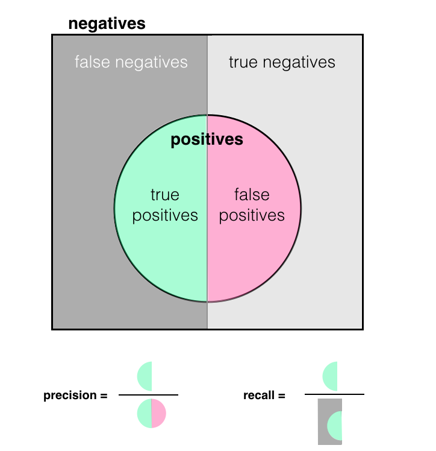

# Fraud Detection

In this notebook, we are going to write a credit card fraud detection algorithm using binary
classifier with linear regression. The algorihtm is pretty straightforward but the key idea here is
to discuss the trade off with precision and recall. Also this problem exemplifies how accuracy is a
useless metric when there is a class imbalance in the dataset, i.e. majority of the labels are 0 or
non-fraudulent.

## Background

### Labeled Data

The payment fraud data set is provided by [Kaggle](https://www.kaggle.com/mlg-ulb/creditcardfraud/data)
from Dal Pozzolo et al. 2015. It has features and labels for thousands of credit card transactions,
each of which is labeled as fraudulent or valid.

### Binary Classification

We are going to use supervised learning to produce a binary classification model. Since it's linear,
the model aims to produce a line that separates the valid and fraudulent transactions in the feature
space. Although we can aim for better model like XGBoost or simple Neural Netowrk, the objective of
this notebook is to explore what SageMaker can provide for us in terms of model improvements.

## Step 1 Loading and Preparing Data

```python
import matplotlib.pyplot as plt
%matplotlib inline

import io
import os
import numpy as np
import pandas as pd
import boto3
import sagemaker

session = sagemaker.Session(default_bucket='machine-learning-case-studies')
role = sagemaker.get_execution_role()
bucket = session.default_bucket()
```

### Download Data CSV File

```python
!wget https://s3.amazonaws.com/video.udacity-data.com/topher/2019/January/5c534768_creditcardfraud/creditcardfraud.zip
```

    --2020-04-09 05:21:20--  https://s3.amazonaws.com/video.udacity-data.com/topher/2019/January/5c534768_creditcardfraud/creditcardfraud.zip
    Resolving s3.amazonaws.com (s3.amazonaws.com)... 52.216.236.165
    Connecting to s3.amazonaws.com (s3.amazonaws.com)|52.216.236.165|:443... connected.
    HTTP request sent, awaiting response... 200 OK
    Length: 69155632 (66M) [application/zip]
    Saving to: ‘creditcardfraud.zip’

    creditcardfraud.zip 100%[===================>]  65.95M  11.2MB/s    in 6.7s    

    2020-04-09 05:21:28 (9.90 MB/s) - ‘creditcardfraud.zip’ saved [69155632/69155632]

```python
!unzip creditcardfraud
```

    Archive:  creditcardfraud.zip
    inflating: creditcard.csv          

```python
transaction_df = pd.read_csv('creditcard.csv')
print('Data shape (rows, cols): ', transaction_df.shape)
display(transaction_df.head())
```

    Data shape (rows, cols):  (284807, 31)

<div>
<table border="1" class="dataframe">
  <thead>
    <tr style="text-align: right;">
      <th></th>
      <th>Time</th>
      <th>V1</th>
      <th>V2</th>
      <th>V3</th>
      <th>V4</th>
      <th>V5</th>
      <th>V6</th>
      <th>V7</th>
      <th>V8</th>
      <th>V9</th>
      <th>...</th>
      <th>V21</th>
      <th>V22</th>
      <th>V23</th>
      <th>V24</th>
      <th>V25</th>
      <th>V26</th>
      <th>V27</th>
      <th>V28</th>
      <th>Amount</th>
      <th>Class</th>
    </tr>
  </thead>
  <tbody>
    <tr>
      <th>0</th>
      <td>0.0</td>
      <td>-1.359807</td>
      <td>-0.072781</td>
      <td>2.536347</td>
      <td>1.378155</td>
      <td>-0.338321</td>
      <td>0.462388</td>
      <td>0.239599</td>
      <td>0.098698</td>
      <td>0.363787</td>
      <td>...</td>
      <td>-0.018307</td>
      <td>0.277838</td>
      <td>-0.110474</td>
      <td>0.066928</td>
      <td>0.128539</td>
      <td>-0.189115</td>
      <td>0.133558</td>
      <td>-0.021053</td>
      <td>149.62</td>
      <td>0</td>
    </tr>
    <tr>
      <th>1</th>
      <td>0.0</td>
      <td>1.191857</td>
      <td>0.266151</td>
      <td>0.166480</td>
      <td>0.448154</td>
      <td>0.060018</td>
      <td>-0.082361</td>
      <td>-0.078803</td>
      <td>0.085102</td>
      <td>-0.255425</td>
      <td>...</td>
      <td>-0.225775</td>
      <td>-0.638672</td>
      <td>0.101288</td>
      <td>-0.339846</td>
      <td>0.167170</td>
      <td>0.125895</td>
      <td>-0.008983</td>
      <td>0.014724</td>
      <td>2.69</td>
      <td>0</td>
    </tr>
    <tr>
      <th>2</th>
      <td>1.0</td>
      <td>-1.358354</td>
      <td>-1.340163</td>
      <td>1.773209</td>
      <td>0.379780</td>
      <td>-0.503198</td>
      <td>1.800499</td>
      <td>0.791461</td>
      <td>0.247676</td>
      <td>-1.514654</td>
      <td>...</td>
      <td>0.247998</td>
      <td>0.771679</td>
      <td>0.909412</td>
      <td>-0.689281</td>
      <td>-0.327642</td>
      <td>-0.139097</td>
      <td>-0.055353</td>
      <td>-0.059752</td>
      <td>378.66</td>
      <td>0</td>
    </tr>
    <tr>
      <th>3</th>
      <td>1.0</td>
      <td>-0.966272</td>
      <td>-0.185226</td>
      <td>1.792993</td>
      <td>-0.863291</td>
      <td>-0.010309</td>
      <td>1.247203</td>
      <td>0.237609</td>
      <td>0.377436</td>
      <td>-1.387024</td>
      <td>...</td>
      <td>-0.108300</td>
      <td>0.005274</td>
      <td>-0.190321</td>
      <td>-1.175575</td>
      <td>0.647376</td>
      <td>-0.221929</td>
      <td>0.062723</td>
      <td>0.061458</td>
      <td>123.50</td>
      <td>0</td>
    </tr>
    <tr>
      <th>4</th>
      <td>2.0</td>
      <td>-1.158233</td>
      <td>0.877737</td>
      <td>1.548718</td>
      <td>0.403034</td>
      <td>-0.407193</td>
      <td>0.095921</td>
      <td>0.592941</td>
      <td>-0.270533</td>
      <td>0.817739</td>
      <td>...</td>
      <td>-0.009431</td>
      <td>0.798278</td>
      <td>-0.137458</td>
      <td>0.141267</td>
      <td>-0.206010</td>
      <td>0.502292</td>
      <td>0.219422</td>
      <td>0.215153</td>
      <td>69.99</td>
      <td>0</td>
    </tr>
  </tbody>
</table>
<p>5 rows × 31 columns</p>
</div>

> Notice the columns are hidden and normalized to protect the privacy of sources.

### Label Imbalance

```python
counts = transaction_df['Class'].value_counts()
num_valid = counts[0]
num_fraud = counts[1]

print('Number of fraudulent labels:', num_fraud)
print('Total number of data points:', num_valid + num_fraud)
```

    Number of fraudulent labels: 492
    Total number of data points: 284807

We have a severe imbalance of labels, only 0.017% of the data reports fraudulent usage of credit card.

### Split Training/Test Set

We will do a simple 70% training 30% test split.

```python
transaction_mat = transaction_df.values
np.random.seed(1)
np.random.shuffle(transaction_mat) # This is a numpy array

num_train = int(transaction_mat.shape[0] * 0.70) # 70% of the data should be training

features_train = transaction_mat[:num_train, :-1] # Get everything except last column
labels_train = transaction_mat[:num_train, -1]

features_test = transaction_mat[num_train:, :-1] # Same here
labels_test = transaction_mat[num_train:, -1]
```

```python
print('Training data length:', len(features_train))
print('Test data length:', len(features_test))

print('First item: \n', features_train[0])
print('Label: ', labels_train[0])
```

    Training data length: 199364
    Test data length: 85443
    First item: 
     [ 1.19907000e+05 -6.11711999e-01 -7.69705324e-01 -1.49759145e-01
     -2.24876503e-01  2.02857736e+00 -2.01988711e+00  2.92491387e-01
     -5.23020325e-01  3.58468461e-01  7.00499612e-02 -8.54022784e-01
      5.47347360e-01  6.16448382e-01 -1.01785018e-01 -6.08491804e-01
     -2.88559430e-01 -6.06199260e-01 -9.00745518e-01 -2.01311157e-01
     -1.96039343e-01 -7.52077614e-02  4.55360454e-02  3.80739375e-01
      2.34403159e-02 -2.22068576e+00 -2.01145578e-01  6.65013699e-02
      2.21179560e-01  1.79000000e+00]
    Label:  0.0

## Step 2 Data Modeling

We will create a linear separator that separates the fraudulent data from the valid data.


### Create the Model

We also have to tell SageMaker that it should a `binary_classifier` because the other options are
`multiclass_classifer` and `regressor`.

```python
s3_prefix = 'fraud_detection'
output_path = 's3://{}/{}/'.format(bucket, s3_prefix)
linear_learner = sagemaker.LinearLearner(role=role,
                                         train_instance_count=1,
                                         train_instance_type='ml.c4.xlarge',
                                         predictor_type='binary_classifier',
                                         output_path=output_path,
                                         sagemaker_session=session,
                                         epochs=20)
```

### Train it

```python
# Convert numpy arrays into RecordSet
training_data_recordset = linear_learner.record_set(train=features_train.astype('float32'),
                                                    labels=labels_train.astype('float32'))

linear_learner.fit(training_data_recordset)
```

    2020-04-09 05:45:28 Starting - Starting the training job...
    2020-04-09 05:45:29 Starting - Launching requested ML instances......
    2020-04-09 05:46:29 Starting - Preparing the instances for training......
    2020-04-09 05:47:50 Downloading - Downloading input data
    2020-04-09 05:47:50 Training - Downloading the training image...
    ...
    Training seconds: 170
    Billable seconds: 170

```python
linear_predictor = linear_learner.deploy(initial_instance_count=1,
                                         instance_type='ml.t2.medium')
```

## Step 3 Model Evaluation

Now let's use the predictor to make a prediction. The predictor will return a list of `Record`
protobuf messages. The prediction is stored in the `predicted_label` field.

```python
sample_input = features_test.astype('float32')
print(linear_predictor.predict(sample_input[0]))
```

    [label {
      key: "predicted_label"
      value {
        float32_tensor {
          values: 0.0
        }
      }
    }
    label {
      key: "score"
      value {
        float32_tensor {
          values: 0.0017995035741478205
        }
      }
    }
    ]

We need to write a helper so we can re-use it later for model evaluation.

```python
def evaluate(predictor, features_test, labels_test, test_batch_size=100, verbose=True):
    """
    Evaluate a model using a test set based on precision, recall and accuracy
    """
    # Split the data into 100 batches.
    input_batches = [predictor.predict(batch) for batch in np.array_split(features_test, test_batch_size)]
    predictions = np.concatenate(
                    [
                        np.array(
                            [x.label['predicted_label'].float32_tensor.values[0] for x in batch]
                        )
                        for batch in input_batches
                    ]
                  )

    true_pos = np.logical_and(labels_test, predictions).sum()
    false_pos = np.logical_and(1-labels_test, predictions).sum()
    true_neg = np.logical_and(1-labels_test, 1-predictions).sum()
    false_neg = np.logical_and(labels_test, 1-predictions).sum()

    recall = true_pos / (true_pos + false_neg)
    precision = true_pos / (true_pos + false_pos)
    accuracy = (true_pos + true_neg) / (true_pos + false_pos + true_neg + false_neg)

    # Print a table of metrics
    if verbose:
        print(pd.crosstab(labels_test, predictions, rownames=['actual (row)'], colnames=['prediction (col)']))
        print("\n{:<11} {:.3f}".format('Recall:', recall))
        print("{:<11} {:.3f}".format('Precision:', precision))
        print("{:<11} {:.3f}".format('Accuracy:', accuracy))
        print()

    return {
        'tp': true_pos,
        'tn': true_neg,
        'fp': false_pos,
        'fn': false_neg,
        'precision': precision,
        'recall': recall,
        'accuracy': accuracy
    }
```

Now we can evaluate the model

```python
print('Evaluation for basic LinearLearner model')
evaluate(linear_predictor, features_test.astype('float32'), labels_test)
```

    Evaluation for basic LinearLearner model
    prediction (col)    0.0  1.0
    actual (row)                
    0.0               85268   34
    1.0                  33  108
    
    Recall:     0.766
    Precision:  0.761
    Accuracy:   0.999
    
    {'tp': 108,
     'tn': 85268,
     'fp': 34,
     'fn': 33,
     'precision': 0.7605633802816901,
     'recall': 0.7659574468085106,
     'accuracy': 0.9992158515033414}

```python
session.delete_endpoint(linear_predictor.endpoint)
```

## Step 4 Precision vs Recall

The model has high accuracy but suffer a bit on recall and precision. If we put recall and precision
in perspective,

- Precision calculates how many predicted fraudulent cases are actually correct. If it has low
  precision, users     will complain that their transactions are incorrectly labeled as fraudulent
  even when they are not.
- Recall calculuates of all the real fraudulent cases, how many did the model catch? If it has low
  recall, banks will complain that the model fails to catch bad actors because their transactions
  went through despite they are fraudulent, aka high false negatives.
  
We can

- Obtain high precision by having low false positive
- Obtain high recall by having low false negative



In a perfect world, we want high precision, high recall and high accuracy. However, in real world,
it is not always possible. We have to give a little trade off, like making the model optimize for
high recall which is to not let any false negative to slip through the cracks.

### Optimize for Recall

Suppose the bank wants a model that catches almost all the fraudulent transactions at the expense of
annoying users, we can easily improve recall by telling SageMaker to optimize the training for
recall.

> Model selection criteria on precision at target recall means SageMaker will select the model with
> best precision at a target recall value. For example, we want 90% recall so SageMaker will pick a
> model that has the highest precision

```python
linear_learner = sagemaker.LinearLearner(role=role,
                                         train_instance_count=1,
                                         train_instance_type='ml.c4.xlarge',
                                         predictor_type='binary_classifier',
                                         output_path=output_path,
                                         sagemaker_session=session,
                                         epochs=20,
                                         binary_classifier_model_selection_criteria='precision_at_target_recall',
                                         target_recall=0.9) # Aim for 90% recall

linear_learner.fit(training_data_recordset)

linear_predictor = linear_learner.deploy(initial_instance_count=1,
                                         instance_type='ml.t2.medium')
```

    2020-04-10 06:36:41 Starting - Starting the training job...
    2020-04-10 06:36:43 Starting - Launching requested ML instances...
    2020-04-10 06:37:41 Starting - Preparing the instances for training.........
    2020-04-10 06:39:08 Downloading - Downloading input data
    2020-04-10 06:39:08 Training - Downloading the training image...
    ...
    2020-04-10 06:41:35 Uploading - Uploading generated training model
    2020-04-10 06:41:35 Completed - Training job completed
    Training seconds: 158
    Billable seconds: 158

```python
print('Evaluation for recall optimized LinearLearner model')
evaluate(linear_predictor, features_test.astype('float32'), labels_test)
```

    Evaluation for recall optimized LinearLearner model
    prediction (col)    0.0   1.0
    actual (row)                 
    0.0               82656  2646
    1.0                  10   131
    
    Recall:     0.929
    Precision:  0.047
    Accuracy:   0.969

    {'tp': 131,
     'tn': 82656,
     'fp': 2646,
     'fn': 10,
     'precision': 0.04717320849837955,
     'recall': 0.9290780141843972,
     'accuracy': 0.9689149491473849}

```python
session.delete_endpoint(linear_predictor.endpoint)
```

### Account for Class Imbalance

There is an overwhelming number of valid transactions in the data set, this will bias the model to
make false negative predictions. We can push the recall even more by telling SageMaker to increase
the ratio of positive examples.

To account for class imbalance during training of a binary classifier, LinearLearner offers the
hyperparameter, positive_example_weight_mult, which is the weight assigned to positive (1, fraudulent)
examples when training a binary classifier. The weight of negative examples (0, valid) is fixed at 1.

> The weight assigned to positive examples when training a binary classifier. The weight of negative
> examples is fixed at 1. If you want the algorithm to choose a weight so that errors in classifying
> negative vs. positive examples have equal impact on training loss, specify balanced. If you want
> the algorithm to choose the weight that optimizes performance, specify auto.

```python
linear_learner = sagemaker.LinearLearner(role=role,
                                         train_instance_count=1,
                                         train_instance_type='ml.c4.xlarge',
                                         predictor_type='binary_classifier',
                                         output_path=output_path,
                                         sagemaker_session=session,
                                         epochs=20,
                                         binary_classifier_model_selection_criteria='precision_at_target_recall',
                                         positive_example_weight_mult='balanced', # Use Balanced
                                         target_recall=0.9) # Aim for 90% recall

linear_learner.fit(training_data_recordset)

linear_predictor = linear_learner.deploy(initial_instance_count=1,
                                         instance_type='ml.t2.medium')
```

    2020-04-10 06:56:11 Starting - Starting the training job...
    2020-04-10 06:56:12 Starting - Launching requested ML instances......
    2020-04-10 06:57:40 Starting - Preparing the instances for training.........
    2020-04-10 06:59:03 Downloading - Downloading input data
    2020-04-10 06:59:03 Training - Downloading the training image...
    ...
    2020-04-10 07:01:46 Completed - Training job completed
    Training seconds: 178
    Billable seconds: 178
    -------------!

```python
print('Evaluation for recall optimized and balanced LinearLearner model')
evaluate(linear_predictor, features_test.astype('float32'), labels_test)
```

    Evaluation for recall optimized and balanced LinearLearner model
    prediction (col)    0.0   1.0
    actual (row)                 
    0.0               84163  1139
    1.0                  10   131
    
    Recall:     0.929
    Precision:  0.103
    Accuracy:   0.987

    {'tp': 131,
     'tn': 84163,
     'fp': 1139,
     'fn': 10,
     'precision': 0.1031496062992126,
     'recall': 0.9290780141843972,
     'accuracy': 0.9865524384677504}

```python
session.delete_endpoint(linear_predictor.endpoint)
```

### Optimize for Precision

On the other hand, the bank believes that customer experience is the most important. They are
willing to lose some money, e.g. if the model fails to detect fraudulent transaction, the user will
call the bank to claim the money back. Bank has to give the money back to the user and let the
fraudster to get away with the crime. We must implement a model that optimizes for precision.

```python
linear_learner = sagemaker.LinearLearner(role=role,
                                         train_instance_count=1,
                                         train_instance_type='ml.c4.xlarge',
                                         predictor_type='binary_classifier',
                                         output_path=output_path,
                                         sagemaker_session=session,
                                         epochs=20,
                                         binary_classifier_model_selection_criteria='recall_at_target_precision',
                                         positive_example_weight_mult='balanced', # Use Balanced
                                         target_precision=0.9) # Aim for 90% precision

linear_learner.fit(training_data_recordset)

linear_predictor = linear_learner.deploy(initial_instance_count=1,
                                         instance_type='ml.t2.medium')
```

    2020-04-10 20:33:48 Starting - Starting the training job...
    2020-04-10 20:33:49 Starting - Launching requested ML instances......
    2020-04-10 20:35:18 Starting - Preparing the instances for training.........
    2020-04-10 20:36:42 Downloading - Downloading input data
    2020-04-10 20:36:42 Training - Downloading the training image..
    ...
    Training seconds: 172
    Billable seconds: 172

```python
print('Evaluation for precision optimized and balanced LinearLearner model')
evaluate(linear_predictor, features_test.astype('float32'), labels_test)
```

    Evaluation for precision optimized and balanced LinearLearner model
    prediction (col)    0.0  1.0
    actual (row)                
    0.0               85276   26
    1.0                  31  110
    
    Recall:     0.780
    Precision:  0.809
    Accuracy:   0.999
    
    {'tp': 110,
     'tn': 85276,
     'fp': 26,
     'fn': 31,
     'precision': 0.8088235294117647,
     'recall': 0.7801418439716312,
     'accuracy': 0.9993328885923949}

```python
session.delete_endpoint(linear_predictor.endpoint)
```

## Final Remarks

We can take a final view on what came out from the various stages of improvement.

| Model                           | Recall | Precision | Accuracy |
|---------------------------------|--------|-----------|----------|
| Baseline                        | 0.766  | 0.761     | 0.999    |
| Optimized on Recall             | 0.929  | 0.047     | 0.969    |
| Balanced/Optimized on Recall    | 0.929  | 0.103     | 0.987    |
| Balanced/Optimized on Precision | 0.780  | 0.809     | 0.999    |

Our linear model has its limitation, if we want a higher precision we must turn to nonlinear models.
