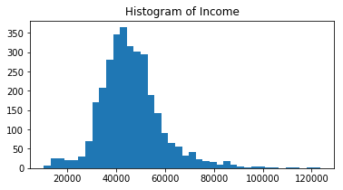
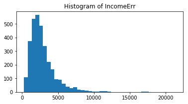
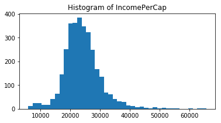
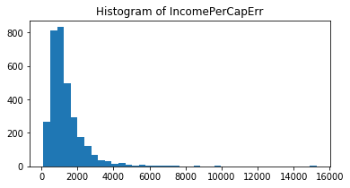
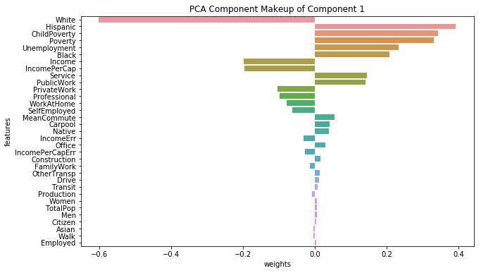
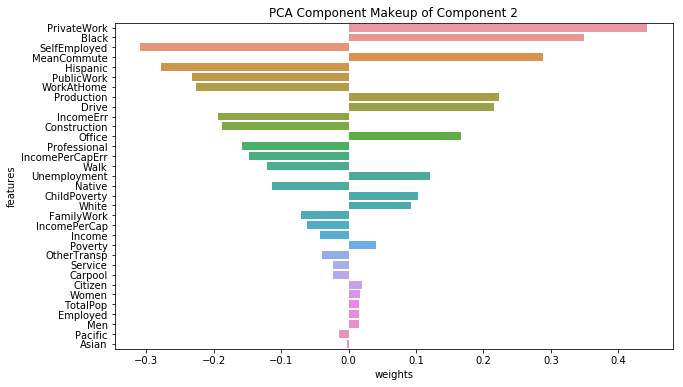
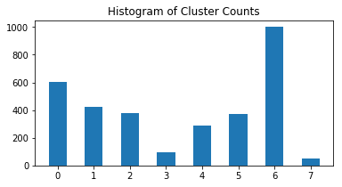
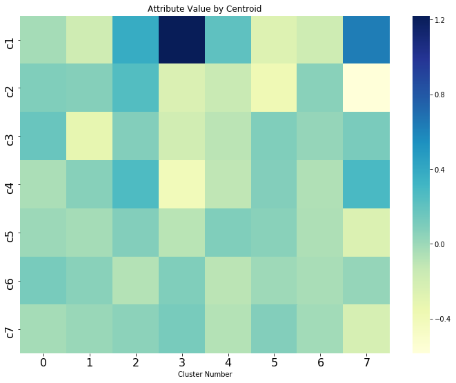

# Population Segmentation

We are deploying two unsupervised algorithms to perform population segmentation on US census data.

Using **principal component analysis** (PCA) to reduce the dimensionality of the original census
data. Then apply **k-means** clustering to assign each US county to a particular cluster based on
where a county lies in component space. This allows us to observe counties that are similiar to each
other in socialeconomic terms.

```python
import pandas as pd
import numpy as np
import os
import io

import matplotlib.pyplot as plt
import matplotlib
%matplotlib inline

import boto3
import sagemaker
```

## Step 1 Load Data from S3

```python
data_bucket = 'aws-ml-blog-sagemaker-census-segmentation'

s3_client = boto3.client('s3')
obj_list=s3_client.list_objects(Bucket=data_bucket)

keys=[]
for contents in obj_list['Contents']:
    keys.append(contents['Key'])

# We should only get one key, which is the CSV file we want.
if len(keys) != 1:
    raise RuntimeError('received unexpected number of keys from {}'.format(data_bucket))

data_object = s3_client.get_object(Bucket=data_bucket, Key=keys[0])
data_body = data_object["Body"].read() # in Bytes
data_stream = io.BytesIO(data_body)

census_df = pd.read_csv(data_stream, header=0, delimiter=",")
display(census_df.head())
```

<div>
<table border="1" class="dataframe">
  <thead>
    <tr style="text-align: right;">
      <th></th>
      <th>CensusId</th>
      <th>State</th>
      <th>County</th>
      <th>TotalPop</th>
      <th>Men</th>
      <th>Women</th>
      <th>Hispanic</th>
      <th>White</th>
      <th>Black</th>
      <th>Native</th>
      <th>...</th>
      <th>Walk</th>
      <th>OtherTransp</th>
      <th>WorkAtHome</th>
      <th>MeanCommute</th>
      <th>Employed</th>
      <th>PrivateWork</th>
      <th>PublicWork</th>
      <th>SelfEmployed</th>
      <th>FamilyWork</th>
      <th>Unemployment</th>
    </tr>
  </thead>
  <tbody>
    <tr>
      <th>0</th>
      <td>1001</td>
      <td>Alabama</td>
      <td>Autauga</td>
      <td>55221</td>
      <td>26745</td>
      <td>28476</td>
      <td>2.6</td>
      <td>75.8</td>
      <td>18.5</td>
      <td>0.4</td>
      <td>...</td>
      <td>0.5</td>
      <td>1.3</td>
      <td>1.8</td>
      <td>26.5</td>
      <td>23986</td>
      <td>73.6</td>
      <td>20.9</td>
      <td>5.5</td>
      <td>0.0</td>
      <td>7.6</td>
    </tr>
    <tr>
      <th>1</th>
      <td>1003</td>
      <td>Alabama</td>
      <td>Baldwin</td>
      <td>195121</td>
      <td>95314</td>
      <td>99807</td>
      <td>4.5</td>
      <td>83.1</td>
      <td>9.5</td>
      <td>0.6</td>
      <td>...</td>
      <td>1.0</td>
      <td>1.4</td>
      <td>3.9</td>
      <td>26.4</td>
      <td>85953</td>
      <td>81.5</td>
      <td>12.3</td>
      <td>5.8</td>
      <td>0.4</td>
      <td>7.5</td>
    </tr>
    <tr>
      <th>2</th>
      <td>1005</td>
      <td>Alabama</td>
      <td>Barbour</td>
      <td>26932</td>
      <td>14497</td>
      <td>12435</td>
      <td>4.6</td>
      <td>46.2</td>
      <td>46.7</td>
      <td>0.2</td>
      <td>...</td>
      <td>1.8</td>
      <td>1.5</td>
      <td>1.6</td>
      <td>24.1</td>
      <td>8597</td>
      <td>71.8</td>
      <td>20.8</td>
      <td>7.3</td>
      <td>0.1</td>
      <td>17.6</td>
    </tr>
    <tr>
      <th>3</th>
      <td>1007</td>
      <td>Alabama</td>
      <td>Bibb</td>
      <td>22604</td>
      <td>12073</td>
      <td>10531</td>
      <td>2.2</td>
      <td>74.5</td>
      <td>21.4</td>
      <td>0.4</td>
      <td>...</td>
      <td>0.6</td>
      <td>1.5</td>
      <td>0.7</td>
      <td>28.8</td>
      <td>8294</td>
      <td>76.8</td>
      <td>16.1</td>
      <td>6.7</td>
      <td>0.4</td>
      <td>8.3</td>
    </tr>
    <tr>
      <th>4</th>
      <td>1009</td>
      <td>Alabama</td>
      <td>Blount</td>
      <td>57710</td>
      <td>28512</td>
      <td>29198</td>
      <td>8.6</td>
      <td>87.9</td>
      <td>1.5</td>
      <td>0.3</td>
      <td>...</td>
      <td>0.9</td>
      <td>0.4</td>
      <td>2.3</td>
      <td>34.9</td>
      <td>22189</td>
      <td>82.0</td>
      <td>13.5</td>
      <td>4.2</td>
      <td>0.4</td>
      <td>7.7</td>
    </tr>
  </tbody>
</table>
<p>5 rows × 37 columns</p>
</div>

## Step 2 Explore & Clean Data

```python
# Drop rows with missing data
census_df = census_df.dropna(axis=0, how='any')
# Re-index
census_df.index = census_df['State'] + '-' + census_df['County']
# Drop useless columns
census_df = census_df.drop(columns=['CensusId', 'State', 'County'])
display(census_df.head())
```

<div>
<table border="1" class="dataframe">
  <thead>
    <tr style="text-align: right;">
      <th></th>
      <th>TotalPop</th>
      <th>Men</th>
      <th>Women</th>
      <th>Hispanic</th>
      <th>White</th>
      <th>Black</th>
      <th>Native</th>
      <th>Asian</th>
      <th>Pacific</th>
      <th>Citizen</th>
      <th>...</th>
      <th>Walk</th>
      <th>OtherTransp</th>
      <th>WorkAtHome</th>
      <th>MeanCommute</th>
      <th>Employed</th>
      <th>PrivateWork</th>
      <th>PublicWork</th>
      <th>SelfEmployed</th>
      <th>FamilyWork</th>
      <th>Unemployment</th>
    </tr>
  </thead>
  <tbody>
    <tr>
      <th>Alabama-Autauga</th>
      <td>55221</td>
      <td>26745</td>
      <td>28476</td>
      <td>2.6</td>
      <td>75.8</td>
      <td>18.5</td>
      <td>0.4</td>
      <td>1.0</td>
      <td>0.0</td>
      <td>40725</td>
      <td>...</td>
      <td>0.5</td>
      <td>1.3</td>
      <td>1.8</td>
      <td>26.5</td>
      <td>23986</td>
      <td>73.6</td>
      <td>20.9</td>
      <td>5.5</td>
      <td>0.0</td>
      <td>7.6</td>
    </tr>
    <tr>
      <th>Alabama-Baldwin</th>
      <td>195121</td>
      <td>95314</td>
      <td>99807</td>
      <td>4.5</td>
      <td>83.1</td>
      <td>9.5</td>
      <td>0.6</td>
      <td>0.7</td>
      <td>0.0</td>
      <td>147695</td>
      <td>...</td>
      <td>1.0</td>
      <td>1.4</td>
      <td>3.9</td>
      <td>26.4</td>
      <td>85953</td>
      <td>81.5</td>
      <td>12.3</td>
      <td>5.8</td>
      <td>0.4</td>
      <td>7.5</td>
    </tr>
    <tr>
      <th>Alabama-Barbour</th>
      <td>26932</td>
      <td>14497</td>
      <td>12435</td>
      <td>4.6</td>
      <td>46.2</td>
      <td>46.7</td>
      <td>0.2</td>
      <td>0.4</td>
      <td>0.0</td>
      <td>20714</td>
      <td>...</td>
      <td>1.8</td>
      <td>1.5</td>
      <td>1.6</td>
      <td>24.1</td>
      <td>8597</td>
      <td>71.8</td>
      <td>20.8</td>
      <td>7.3</td>
      <td>0.1</td>
      <td>17.6</td>
    </tr>
    <tr>
      <th>Alabama-Bibb</th>
      <td>22604</td>
      <td>12073</td>
      <td>10531</td>
      <td>2.2</td>
      <td>74.5</td>
      <td>21.4</td>
      <td>0.4</td>
      <td>0.1</td>
      <td>0.0</td>
      <td>17495</td>
      <td>...</td>
      <td>0.6</td>
      <td>1.5</td>
      <td>0.7</td>
      <td>28.8</td>
      <td>8294</td>
      <td>76.8</td>
      <td>16.1</td>
      <td>6.7</td>
      <td>0.4</td>
      <td>8.3</td>
    </tr>
    <tr>
      <th>Alabama-Blount</th>
      <td>57710</td>
      <td>28512</td>
      <td>29198</td>
      <td>8.6</td>
      <td>87.9</td>
      <td>1.5</td>
      <td>0.3</td>
      <td>0.1</td>
      <td>0.0</td>
      <td>42345</td>
      <td>...</td>
      <td>0.9</td>
      <td>0.4</td>
      <td>2.3</td>
      <td>34.9</td>
      <td>22189</td>
      <td>82.0</td>
      <td>13.5</td>
      <td>4.2</td>
      <td>0.4</td>
      <td>7.7</td>
    </tr>
  </tbody>
</table>
<p>5 rows × 34 columns</p>
</div>

```python
feature_list = census_df.columns.values
print(feature_list)
```

    ['TotalPop' 'Men' 'Women' 'Hispanic' 'White' 'Black' 'Native' 'Asian'
     'Pacific' 'Citizen' 'Income' 'IncomeErr' 'IncomePerCap' 'IncomePerCapErr'
     'Poverty' 'ChildPoverty' 'Professional' 'Service' 'Office' 'Construction'
     'Production' 'Drive' 'Carpool' 'Transit' 'Walk' 'OtherTransp'
     'WorkAtHome' 'MeanCommute' 'Employed' 'PrivateWork' 'PublicWork'
     'SelfEmployed' 'FamilyWork' 'Unemployment']

### 2.1 Visualize the Data

Use Histogram to plot the distribution of data by features.

```python
histogram_features = ['Income', 'IncomeErr', 'IncomePerCap', 'IncomePerCapErr']
for column_name in histogram_features:
    ax=plt.subplots(figsize=(6,3))
    ax = plt.hist(census_df[column_name], bins=40)
    plt.title('Histogram of {}'.format(column_name), fontsize=12)
    plt.show()
```









### 2.2 Normalize the Data

To get a fair comparison between values, we need to normalize the data to [0, 1].

```python
from sklearn.preprocessing import MinMaxScaler

scaler = MinMaxScaler()
norm_census_df = pd.DataFrame(scaler.fit_transform(census_df.astype(float)))
norm_census_df.columns = census_df.columns
norm_census_df.index = census_df.index
display(norm_census_df.head())
```

<div>
<table border="1" class="dataframe">
  <thead>
    <tr style="text-align: right;">
      <th></th>
      <th>TotalPop</th>
      <th>Men</th>
      <th>Women</th>
      <th>Hispanic</th>
      <th>White</th>
      <th>Black</th>
      <th>Native</th>
      <th>Asian</th>
      <th>Pacific</th>
      <th>Citizen</th>
      <th>...</th>
      <th>Walk</th>
      <th>OtherTransp</th>
      <th>WorkAtHome</th>
      <th>MeanCommute</th>
      <th>Employed</th>
      <th>PrivateWork</th>
      <th>PublicWork</th>
      <th>SelfEmployed</th>
      <th>FamilyWork</th>
      <th>Unemployment</th>
    </tr>
  </thead>
  <tbody>
    <tr>
      <th>Alabama-Autauga</th>
      <td>0.005475</td>
      <td>0.005381</td>
      <td>0.005566</td>
      <td>0.026026</td>
      <td>0.759519</td>
      <td>0.215367</td>
      <td>0.004343</td>
      <td>0.024038</td>
      <td>0.0</td>
      <td>0.006702</td>
      <td>...</td>
      <td>0.007022</td>
      <td>0.033248</td>
      <td>0.048387</td>
      <td>0.552430</td>
      <td>0.005139</td>
      <td>0.750000</td>
      <td>0.250000</td>
      <td>0.150273</td>
      <td>0.000000</td>
      <td>0.208219</td>
    </tr>
    <tr>
      <th>Alabama-Baldwin</th>
      <td>0.019411</td>
      <td>0.019246</td>
      <td>0.019572</td>
      <td>0.045045</td>
      <td>0.832665</td>
      <td>0.110594</td>
      <td>0.006515</td>
      <td>0.016827</td>
      <td>0.0</td>
      <td>0.024393</td>
      <td>...</td>
      <td>0.014045</td>
      <td>0.035806</td>
      <td>0.104839</td>
      <td>0.549872</td>
      <td>0.018507</td>
      <td>0.884354</td>
      <td>0.107616</td>
      <td>0.158470</td>
      <td>0.040816</td>
      <td>0.205479</td>
    </tr>
    <tr>
      <th>Alabama-Barbour</th>
      <td>0.002656</td>
      <td>0.002904</td>
      <td>0.002416</td>
      <td>0.046046</td>
      <td>0.462926</td>
      <td>0.543655</td>
      <td>0.002172</td>
      <td>0.009615</td>
      <td>0.0</td>
      <td>0.003393</td>
      <td>...</td>
      <td>0.025281</td>
      <td>0.038363</td>
      <td>0.043011</td>
      <td>0.491049</td>
      <td>0.001819</td>
      <td>0.719388</td>
      <td>0.248344</td>
      <td>0.199454</td>
      <td>0.010204</td>
      <td>0.482192</td>
    </tr>
    <tr>
      <th>Alabama-Bibb</th>
      <td>0.002225</td>
      <td>0.002414</td>
      <td>0.002042</td>
      <td>0.022022</td>
      <td>0.746493</td>
      <td>0.249127</td>
      <td>0.004343</td>
      <td>0.002404</td>
      <td>0.0</td>
      <td>0.002860</td>
      <td>...</td>
      <td>0.008427</td>
      <td>0.038363</td>
      <td>0.018817</td>
      <td>0.611253</td>
      <td>0.001754</td>
      <td>0.804422</td>
      <td>0.170530</td>
      <td>0.183060</td>
      <td>0.040816</td>
      <td>0.227397</td>
    </tr>
    <tr>
      <th>Alabama-Blount</th>
      <td>0.005722</td>
      <td>0.005738</td>
      <td>0.005707</td>
      <td>0.086086</td>
      <td>0.880762</td>
      <td>0.017462</td>
      <td>0.003257</td>
      <td>0.002404</td>
      <td>0.0</td>
      <td>0.006970</td>
      <td>...</td>
      <td>0.012640</td>
      <td>0.010230</td>
      <td>0.061828</td>
      <td>0.767263</td>
      <td>0.004751</td>
      <td>0.892857</td>
      <td>0.127483</td>
      <td>0.114754</td>
      <td>0.040816</td>
      <td>0.210959</td>
    </tr>
  </tbody>
</table>
<p>5 rows × 34 columns</p>
</div>

## Step 3 Train PCA with SageMaker

Now we can apply PCA to perform dimensionality reduction. We will use SageMaker's builtin PCA
algorithm.

### 3.1 Prepare the Model

```python
from sagemaker import get_execution_role

session = sagemaker.Session(default_bucket='machine-learning-case-studies')
role = get_execution_role()
session_bucket = session.default_bucket()

print('Execution role: {} \nSession Bucket: {}'.format(role, session_bucket))
```

    Execution role: arn:aws:iam::171758673694:role/service-role/AmazonSageMaker-ExecutionRole-20200315T122350 
    Session Bucket: machine-learning-case-studies

```python
prefix = 'population-segmentation'
model_output_path='s3://{}/{}/'.format(session_bucket, prefix)
print('Training artifcats will be uploaded to {}'.format(model_output_path))
```

    Training artifcats will be uploaded to s3://machine-learning-case-studies/population-segmentation/

### 3.2 Train the Model

```python
%%time
from sagemaker import PCA

NUM_COMPONENTS = len(feature_list) - 1

# Define the model
pca = PCA(role=role,
          train_instance_count=1,
          train_instance_type='ml.c4.xlarge',
          output_path=model_output_path,
          num_components=NUM_COMPONENTS,
          sagemaker_session=session)

# Prepare data by converting into RecordSet, this will be done by the
# model.
train_data_np = norm_census_df.values.astype('float32')
train_data_record_set = pca.record_set(train_data_np)

# Train the model
from time import localtime, strftime
job_name = strftime("population-segmentation-pca-%Y-%m-%d-%H-%M-%S", localtime())
pca.fit(train_data_record_set, job_name=job_name)
```

    2020-04-06 21:56:07 Starting - Starting the training job...
    2020-04-06 21:56:08 Starting - Launching requested ML instances...
    2020-04-06 21:57:06 Starting - Preparing the instances for training......
    2020-04-06 21:58:01 Downloading - Downloading input data...
    2020-04-06 21:58:28 Training - Downloading the training image..
    ...
    Training seconds: 58
    Billable seconds: 58
    CPU times: user 498 ms, sys: 37.3 ms, total: 535 ms
    Wall time: 3min 12s

### 3.3 Load Model Artifacts (w/o using Predict)

```python
model_key = os.path.join(prefix, job_name, 'output/model.tar.gz')
print('Loading artifacts from {}'.format(model_key))

boto3.resource('s3').Bucket(session_bucket).download_file(model_key, 'model.tar.gz')
os.system('tar -zxvf model.tar.gz')
os.system('unzip model_algo-1')
```

    Loading artifacts from population-segmentation/population-segmentation-pca-2020-04-06-21-56-07/output/model.tar.gz

    2304

Many of the Amazon SageMaker algorithms use MXNet for computational speed, including PCA, and so the
model artifacts are stored as an array. After the model is unzipped and decompressed, we can load
the array using MXNet.

```python
import mxnet as mx
import pprint

pca_model_params = mx.ndarray.load('model_algo-1')
pprint.pprint(pca_model_params)
```

    {'mean': 
    [[0.00988273 0.00986636 0.00989863 0.11017046 0.7560245  0.10094159
      0.0186819  0.02940491 0.0064698  0.01154038 0.31539047 0.1222766
      0.3030056  0.08220861 0.256217   0.2964254  0.28914267 0.40191284
      0.57868284 0.2854676  0.28294644 0.82774544 0.34378946 0.01576072
      0.04649627 0.04115358 0.12442778 0.47014    0.00980645 0.7608103
      0.19442631 0.21674445 0.0294168  0.22177474]]
    <NDArray 1x34 @cpu(0)>,
     's': 
    [1.7896362e-02 3.0864021e-02 3.2130770e-02 3.5486195e-02 9.4831578e-02
     1.2699370e-01 4.0288666e-01 1.4084760e+00 1.5100485e+00 1.5957943e+00
     1.7783760e+00 2.1662524e+00 2.2966361e+00 2.3856051e+00 2.6954880e+00
     2.8067985e+00 3.0175958e+00 3.3952675e+00 3.5731301e+00 3.6966958e+00
     4.1890211e+00 4.3457499e+00 4.5410376e+00 5.0189657e+00 5.5786467e+00
     5.9809699e+00 6.3925138e+00 7.6952214e+00 7.9913125e+00 1.0180052e+01
     1.1718245e+01 1.3035975e+01 1.9592180e+01]
    <NDArray 33 @cpu(0)>,
     'v': 
    [[ 2.46869749e-03  2.56468095e-02  2.50773830e-03 ... -7.63925165e-02
       1.59879066e-02  5.04589686e-03]
     [-2.80601848e-02 -6.86634064e-01 -1.96283013e-02 ... -7.59587288e-02
       1.57304872e-02  4.95312130e-03]
     [ 3.25766727e-02  7.17300594e-01  2.40726061e-02 ... -7.68136829e-02
       1.62378680e-02  5.13597298e-03]
     ...
     [ 1.12151138e-01 -1.17030945e-02 -2.88011521e-01 ...  1.39890045e-01
      -3.09406728e-01 -6.34506866e-02]
     [ 2.99992133e-02 -3.13433539e-03 -7.63589665e-02 ...  4.17341813e-02
      -7.06735924e-02 -1.42857227e-02]
     [ 7.33537527e-05  3.01008171e-04 -8.00925500e-06 ...  6.97060227e-02
       1.20169498e-01  2.33626723e-01]]
    <NDArray 34x33 @cpu(0)>}

### 3.4 PCA Model Attributes

Three types of model attributes are contained within the PCA model.

- mean: The mean that was subtracted from a component in order to center it.
- v: The makeup of the principal components; (same as ‘components_’ in an sklearn PCA model).
- s: The singular values of the components for the PCA transformation.
  
The singular values do not exactly give the % variance from the original feature space, but can give
the % variance from the projected feature space.

#### Explained Variance

From s, we can get an approximation of the data variance that is covered in the first `n` principal
components. The approximate explained variance is given by the formula: the sum of squared s values
for all top n components over the sum over squared s values for _all_ components:

\begin{equation*}
\frac{\sum_{n}^{ } s_n^2}{\sum s^2}
\end{equation*}

From v, we can learn more about the combinations of original features that make up each principal
component.

```python
# Get selected params
s=pd.DataFrame(pca_model_params['s'].asnumpy())
v=pd.DataFrame(pca_model_params['v'].asnumpy())

# The top principal components are actually at the end of the data frame.
# Ordered by least significance to most sigificance.

# Let's look at top 5
display(s.iloc[NUM_COMPONENTS-5:, :])
```

<div>
<table border="1" class="dataframe">
  <thead>
    <tr style="text-align: right;">
      <th></th>
      <th>0</th>
    </tr>
  </thead>
  <tbody>
    <tr>
      <th>28</th>
      <td>7.991313</td>
    </tr>
    <tr>
      <th>29</th>
      <td>10.180052</td>
    </tr>
    <tr>
      <th>30</th>
      <td>11.718245</td>
    </tr>
    <tr>
      <th>31</th>
      <td>13.035975</td>
    </tr>
    <tr>
      <th>32</th>
      <td>19.592180</td>
    </tr>
  </tbody>
</table>
</div>

```python
def explained_variance(s, n_top_components):
    '''

    :param s: A dataframe of singular values for top components; 
              the top value is in the last row.
    :param n_top_components: An integer, the number of top components to use.
    :return: The expected data variance covered by the n_top_components.
    '''
    start_idx = len(s) - n_top_components
    denom = np.square(s).sum()[0]
    numer = np.square(s.iloc[start_idx:, :]).sum()[0]
    return numer/denom


for n in range(1, 10):
    print('Explained variance with {} top components: {}'.format(n, explained_variance(s, n)))
```

    Explained variance with 1 top components: 0.32098713517189026
    Explained variance with 2 top components: 0.46309205889701843
    Explained variance with 3 top components: 0.5779199004173279
    Explained variance with 4 top components: 0.6645806431770325
    Explained variance with 5 top components: 0.7179827094078064
    Explained variance with 6 top components: 0.7675008773803711
    Explained variance with 7 top components: 0.8016724586486816
    Explained variance with 8 top components: 0.8315857648849487
    Explained variance with 9 top components: 0.8576101660728455

### 3.5 Examine Component Makeup

We can now examine the makeup of each PCA component based on the weights of the original features
that are included in the component.

```python
import seaborn


def display_component_makeup(v, feature_list, component_idx, num_weights=10):
    component = v.iloc[:, NUM_COMPONENTS-component_idx] # Reversed
    component_values = np.squeeze(component.values) # Remove redundant arrays
    component_df = pd.DataFrame(data=list(zip(component_values, feature_list)),
                                columns=['weights', 'features'])

    # Create a new column for absolute weight, so we can sort it
    component_df['abs_weights'] = component_df['weights'].apply(lambda x: np.abs(x))

    sorted_weight_data = component_df.sort_values('abs_weights', ascending=False).head(num_weights)
    ax = plt.subplots(figsize=(10, 6))
    ax = seaborn.barplot(data=sorted_weight_data,
                         x='weights',
                         y='features')
    ax.set_title('PCA Component Makeup of Component {}'.format(component_idx))
    plt.show()
```

Each component is a linearly independent vector. The component represents a new basis in a projected
component space. When we compare the feature weights, we are effectively asking,
_for this new basis vector, what is its corrrelation to the original feature space?_ For example,
component 1 is negatively correlated with `White` percentage in the census data. Component 2 is
positvely correlated with `PrivateWork` percentage in census data.

```python
for idx in range(1, 3):
    display_component_makeup(v, feature_list=norm_census_df.columns.values,
                                component_idx=idx,
                                num_weights=33)
```





## Step 4 Deploy PCA with SageMaker

Now we can deploy the PCA model and use it as an endpoint without having to dig into the model
params to transform an input.

```python
%%time
pca_predictor = pca.deploy(initial_instance_count=1,
                           instance_type='ml.t2.medium')
```

    -------------!CPU times: user 238 ms, sys: 15.3 ms, total: 254 ms
    Wall time: 6min 33s

We don't need to use `RecordSet` anymore once the model is deployed. It will simply accept a `numpy`
array to yield principal components.

```python
pca_result = pca_predictor.predict(train_data_np)
```

SageMaker PCA returns a list of protobuf `Record` message, same length as the training data which is
3218 in this case. The protobuf `Record` message has the following format.

```protobuf
message Record {
    // Map from the name of the feature to the value.
    //
    // For vectors and libsvm-like datasets,
    // a single feature with the name `values`
    // should be specified.
    map<string, Value> features = 1;

    // An optional set of labels for this record.
    // Similar to the features field above, the key used for
    // generic scalar / vector labels should be 'values'.
    map<string, Value> label = 2;

    // A unique identifier for this record in the dataset.
    //
    // Whilst not necessary, this allows better
    // debugging where there are data issues.
    //
    // This is not used by the algorithm directly.
    optional string uid = 3;

    // Textual metadata describing the record.
    //
    // This may include JSON-serialized information
    // about the source of the record.
    //
    // This is not used by the algorithm directly.
    optional string metadata = 4;

    // An optional serialized JSON object that allows per-record
    // hyper-parameters/configuration/other information to be set.
    //
    // The meaning/interpretation of this field is defined by
    // the algorithm author and may not be supported.
    //
    // This is used to pass additional inference configuration
    // when batch inference is used (e.g. types of scores to return).
    optional string configuration = 5;
}
```

Essentially each data point is now projected onto a new component space. We can retrieve the
projection by using the following syntax.

```python
pca_result[0].label['projection'].float32_tensor.values
```

    [0.0002009272575378418, 0.0002455431967973709, -0.0005782842636108398, -0.0007815659046173096, -0.00041911262087523937, -0.0005133943632245064, -0.0011316537857055664, 0.0017268601804971695, -0.005361668765544891, -0.009066537022590637, -0.008141040802001953, -0.004735097289085388, -0.00716288760304451, 0.0003725700080394745, -0.01208949089050293, 0.02134685218334198, 0.0009293854236602783, 0.002417147159576416, -0.0034637749195098877, 0.01794189214706421, -0.01639425754547119, 0.06260128319263458, 0.06637358665466309, 0.002479255199432373, 0.10011336207389832, -0.1136140376329422, 0.02589476853609085, 0.04045158624649048, -0.01082391943782568, 0.1204797774553299, -0.0883558839559555, 0.16052711009979248, -0.06027412414550781]

Now we can transform the PCA result into a DataFrame that we can work with.

```python
def create_pca_transformed_df(original_data, pca_transformed_data, num_top_components):
    """
    Return a DataFrame of data points with component features. The DF should be indexed by State-County and
    contain component values.
    """
    df = pd.DataFrame()
    for record in pca_transformed_data:
        projection_values = record.label['projection'].float32_tensor.values
        df = df.append([projection_values])

    df.index = original_data.index
    df = df.iloc[:, NUM_COMPONENTS-num_top_components:]
    return df.iloc[:, ::-1] # Reverse the ordering, such that most important component is shown first.
```

```python
# Manually pick top 7 components.
pca_transformed_census_df = create_pca_transformed_df(norm_census_df, pca_result, 7) 
pca_transformed_census_df.columns = ['c1', 'c2', 'c3', 'c4', 'c5', 'c6', 'c7']
pca_transformed_census_df.head()
```

<div>
<table border="1" class="dataframe">
  <thead>
    <tr style="text-align: right;">
      <th></th>
      <th>c1</th>
      <th>c2</th>
      <th>c3</th>
      <th>c4</th>
      <th>c5</th>
      <th>c6</th>
      <th>c7</th>
    </tr>
  </thead>
  <tbody>
    <tr>
      <th>Alabama-Autauga</th>
      <td>-0.060274</td>
      <td>0.160527</td>
      <td>-0.088356</td>
      <td>0.120480</td>
      <td>-0.010824</td>
      <td>0.040452</td>
      <td>0.025895</td>
    </tr>
    <tr>
      <th>Alabama-Baldwin</th>
      <td>-0.149684</td>
      <td>0.185969</td>
      <td>-0.145743</td>
      <td>-0.023092</td>
      <td>-0.068677</td>
      <td>0.051573</td>
      <td>0.048137</td>
    </tr>
    <tr>
      <th>Alabama-Barbour</th>
      <td>0.506202</td>
      <td>0.296662</td>
      <td>0.146258</td>
      <td>0.297829</td>
      <td>0.093111</td>
      <td>-0.065244</td>
      <td>0.107730</td>
    </tr>
    <tr>
      <th>Alabama-Bibb</th>
      <td>0.069224</td>
      <td>0.190861</td>
      <td>0.224402</td>
      <td>0.011757</td>
      <td>0.283526</td>
      <td>0.017874</td>
      <td>-0.092053</td>
    </tr>
    <tr>
      <th>Alabama-Blount</th>
      <td>-0.091030</td>
      <td>0.254403</td>
      <td>0.022714</td>
      <td>-0.193824</td>
      <td>0.100738</td>
      <td>0.209945</td>
      <td>-0.005099</td>
    </tr>
  </tbody>
</table>
</div>

## Step 5 Train KMeans with SageMaker

We will arbitrarily pick 8 clusters for KMeans. To train the model, we need to pass in `RecordSet`
again.

```python
from sagemaker import KMeans

NUM_CLUSTERS = 8

kmeans = KMeans(role=role,
                train_instance_count=1,
                train_instance_type='ml.c4.xlarge',
                output_path=model_output_path,
                k=NUM_CLUSTERS)

train_data_np = pca_transformed_census_df.values.astype('float32')
train_data_record_set = kmeans.record_set(train_data_np)

job_name = strftime("population-segmentation-kmeans-%Y-%m-%d-%H-%M-%S", localtime())
kmeans.fit(train_data_record_set, job_name=job_name)
```

    2020-04-06 23:43:44 Starting - Starting the training job...
    2020-04-06 23:43:45 Starting - Launching requested ML instances......
    2020-04-06 23:44:45 Starting - Preparing the instances for training......
    2020-04-06 23:46:05 Downloading - Downloading input data...
    2020-04-06 23:46:40 Training - Training image download completed. Training in progress..
    ...
    2020-04-06 23:46:52 Uploading - Uploading generated training model
    2020-04-06 23:46:52 Completed - Training job completed
    Training seconds: 47
    Billable seconds: 47

```python
%%time
# Also deploy it
kmeans_predictor = kmeans.deploy(initial_instance_count=1,
                                 instance_type='ml.t2.medium')
```

    -----------------------------!CPU times: user 459 ms, sys: 20.4 ms, total: 479 ms
    Wall time: 14min 36s

## Step 6 Clustering

Now we can perform clustering and explore the result of clustering.

```python
cluster_info = kmeans_predictor.predict(train_data_np)
```

### 6.1 Explore the Resultant Clusters

Let's see which cluster is each data point assigned to. We can simply randomly select few data
points by indices and check their cluster information using the same indices.

```python
import random
for i in range(3):
    data_index = random.randint(0,len(train_data_np))
    print('County: {}\n'.format(pca_transformed_census_df.index[data_index]))
    print(cluster_info[data_index])
```

    County: Colorado-Garfield
    
    label {
      key: "closest_cluster"
      value {
        float32_tensor {
          values: 4.0
        }
      }
    }
    label {
      key: "distance_to_cluster"
      value {
        float32_tensor {
          values: 0.3327351212501526
        }
      }
    }
    
    County: Texas-Shelby
    
    label {
      key: "closest_cluster"
      value {
        float32_tensor {
          values: 4.0
        }
      }
    }
    label {
      key: "distance_to_cluster"
      value {
        float32_tensor {
          values: 0.3395182192325592
        }
      }
    }
    
    County: Louisiana-Evangeline
    
    label {
      key: "closest_cluster"
      value {
        float32_tensor {
          values: 2.0
        }
      }
    }
    label {
      key: "distance_to_cluster"
      value {
        float32_tensor {
          values: 0.3210434317588806
        }
      }
    }

Let's take a look at the data point distribution across clusters.

```python
cluster_labels = [c.label['closest_cluster'].float32_tensor.values[0] for c in cluster_info]
cluster_df = pd.DataFrame(cluster_labels)[0].value_counts()
display(cluster_df)

ax = plt.subplots(figsize=(6,3))
ax = plt.hist(cluster_labels, bins=8, range=(-0.5, 7.5), rwidth=0.5)
plt.title('Histogram of Cluster Counts', fontsize=12)
plt.show()
```

    6.0    999
    0.0    606
    1.0    425
    2.0    379
    5.0    369
    4.0    291
    3.0     98
    7.0     51
    Name: 0, dtype: int64



### 6.2 Load Model Artifacts (instead of using Predict)

We want to dig a little deeper to understand where are the centroids and what do they look like in
the 7-dimensional space.

```python
model_key = os.path.join(prefix, job_name, 'output/model.tar.gz')
print('Loading artifacts from {}'.format(model_key))

boto3.resource('s3').Bucket(session_bucket).download_file(model_key, 'model.tar.gz')
os.system('tar -zxvf model.tar.gz')
os.system('unzip model_algo-1')
```

    Loading artifacts from population-segmentation/population-segmentation-kmeans-2020-04-06-23-43-44/output/model.tar.gz

    2304

```python
kmeans_model_params = mx.ndarray.load('model_algo-1')
pprint.pprint(kmeans_model_params)
```

    [
    [[-0.02251747  0.08905876  0.17157373 -0.04806723  0.00632851  0.11663745
      -0.02355854]
     [-0.17932147  0.07183108 -0.3180788   0.070527   -0.0244734   0.05766358
       0.0124713 ]
     [ 0.3787895   0.24803953  0.07842267  0.27025062  0.07873817 -0.0716323
       0.05168937]
     [ 1.2215096  -0.23992902 -0.19631913 -0.40215966 -0.08697513  0.09118532
       0.11438478]
     [ 0.20756531 -0.14692396 -0.09451014 -0.10918342  0.09122091 -0.09337081
      -0.07659711]
     [-0.2621782  -0.37752372  0.08524974  0.08468443  0.05860636 -0.00327792
       0.08481469]
     [-0.17384098  0.06186541  0.02547553 -0.06141954 -0.0519999  -0.03896767
      -0.01417946]
     [ 0.6351353  -0.5854497   0.10829799  0.28468394 -0.25043395  0.02687342
      -0.22321643]]
    <NDArray 8x7 @cpu(0)>]

There is only 1 set of model parameters contained within the K-means model; the cluster centroid
locations in PCA-transformed, component space.

```python
centroid_df = pd.DataFrame(kmeans_model_params[0].asnumpy())
centroid_df.columns = pca_transformed_census_df.columns
display(centroid_df)
```

<div>
<table border="1" class="dataframe">
  <thead>
    <tr style="text-align: right;">
      <th></th>
      <th>c1</th>
      <th>c2</th>
      <th>c3</th>
      <th>c4</th>
      <th>c5</th>
      <th>c6</th>
      <th>c7</th>
    </tr>
  </thead>
  <tbody>
    <tr>
      <th>0</th>
      <td>-0.022517</td>
      <td>0.089059</td>
      <td>0.171574</td>
      <td>-0.048067</td>
      <td>0.006329</td>
      <td>0.116637</td>
      <td>-0.023559</td>
    </tr>
    <tr>
      <th>1</th>
      <td>-0.179321</td>
      <td>0.071831</td>
      <td>-0.318079</td>
      <td>0.070527</td>
      <td>-0.024473</td>
      <td>0.057664</td>
      <td>0.012471</td>
    </tr>
    <tr>
      <th>2</th>
      <td>0.378790</td>
      <td>0.248040</td>
      <td>0.078423</td>
      <td>0.270251</td>
      <td>0.078738</td>
      <td>-0.071632</td>
      <td>0.051689</td>
    </tr>
    <tr>
      <th>3</th>
      <td>1.221510</td>
      <td>-0.239929</td>
      <td>-0.196319</td>
      <td>-0.402160</td>
      <td>-0.086975</td>
      <td>0.091185</td>
      <td>0.114385</td>
    </tr>
    <tr>
      <th>4</th>
      <td>0.207565</td>
      <td>-0.146924</td>
      <td>-0.094510</td>
      <td>-0.109183</td>
      <td>0.091221</td>
      <td>-0.093371</td>
      <td>-0.076597</td>
    </tr>
    <tr>
      <th>5</th>
      <td>-0.262178</td>
      <td>-0.377524</td>
      <td>0.085250</td>
      <td>0.084684</td>
      <td>0.058606</td>
      <td>-0.003278</td>
      <td>0.084815</td>
    </tr>
    <tr>
      <th>6</th>
      <td>-0.173841</td>
      <td>0.061865</td>
      <td>0.025476</td>
      <td>-0.061420</td>
      <td>-0.052000</td>
      <td>-0.038968</td>
      <td>-0.014179</td>
    </tr>
    <tr>
      <th>7</th>
      <td>0.635135</td>
      <td>-0.585450</td>
      <td>0.108298</td>
      <td>0.284684</td>
      <td>-0.250434</td>
      <td>0.026873</td>
      <td>-0.223216</td>
    </tr>
  </tbody>
</table>
</div>

### 6.3 Visualize Centroids in Component Space

We can't visualize a 7-dimensional centroid in Cartesian space, but we can plot a heatmap of the
centroids and their location in transformed feature space.

```python
plt.figure(figsize=(12,9))
ax = seaborn.heatmap(centroid_df.T, cmap='YlGnBu')
ax.set_xlabel('Cluster Number')
ax.set_title('Attribute Value by Centroid')
plt.yticks(fontsize=16)
plt.xticks(fontsize=16)
plt.show()
```



### 6.4 Examine the Grouping

Finally we should map the labels back to the census transformed `DataFrame` to understand the
grouping of different counties.

```python
pca_transformed_census_df['labels'] = list(map(int, cluster_labels))
pca_transformed_census_df.sort_values('labels', ascending=True).head(20)
```

<div>
<table border="1" class="dataframe">
  <thead>
    <tr style="text-align: right;">
      <th></th>
      <th>c1</th>
      <th>c2</th>
      <th>c3</th>
      <th>c4</th>
      <th>c5</th>
      <th>c6</th>
      <th>c7</th>
      <th>labels</th>
    </tr>
  </thead>
  <tbody>
    <tr>
      <th>Tennessee-Wayne</th>
      <td>0.063113</td>
      <td>0.104933</td>
      <td>0.285298</td>
      <td>-0.041470</td>
      <td>-0.083603</td>
      <td>0.179846</td>
      <td>-0.040195</td>
      <td>0</td>
    </tr>
    <tr>
      <th>Georgia-Morgan</th>
      <td>-0.024062</td>
      <td>0.063064</td>
      <td>-0.021719</td>
      <td>0.181931</td>
      <td>0.091352</td>
      <td>0.053852</td>
      <td>0.089129</td>
      <td>0</td>
    </tr>
    <tr>
      <th>Georgia-Murray</th>
      <td>0.002309</td>
      <td>0.277421</td>
      <td>0.149035</td>
      <td>-0.284987</td>
      <td>0.033298</td>
      <td>-0.058308</td>
      <td>-0.006328</td>
      <td>0</td>
    </tr>
    <tr>
      <th>Kentucky-Garrard</th>
      <td>-0.077484</td>
      <td>0.158746</td>
      <td>0.149348</td>
      <td>-0.117317</td>
      <td>0.036888</td>
      <td>0.273137</td>
      <td>0.018827</td>
      <td>0</td>
    </tr>
    <tr>
      <th>North Carolina-Stanly</th>
      <td>0.004421</td>
      <td>0.140494</td>
      <td>0.077001</td>
      <td>-0.009013</td>
      <td>-0.050588</td>
      <td>0.053955</td>
      <td>-0.044574</td>
      <td>0</td>
    </tr>
    <tr>
      <th>Kentucky-Floyd</th>
      <td>0.050515</td>
      <td>0.081900</td>
      <td>0.294386</td>
      <td>-0.073164</td>
      <td>-0.201384</td>
      <td>0.176484</td>
      <td>0.052943</td>
      <td>0</td>
    </tr>
    <tr>
      <th>Georgia-Oglethorpe</th>
      <td>-0.023825</td>
      <td>0.027835</td>
      <td>0.080744</td>
      <td>0.103825</td>
      <td>0.138597</td>
      <td>0.102568</td>
      <td>0.076467</td>
      <td>0</td>
    </tr>
    <tr>
      <th>Kentucky-Fleming</th>
      <td>-0.142175</td>
      <td>0.087977</td>
      <td>0.215186</td>
      <td>-0.122501</td>
      <td>0.099160</td>
      <td>0.152931</td>
      <td>0.051317</td>
      <td>0</td>
    </tr>
    <tr>
      <th>Virginia-Wise</th>
      <td>-0.036725</td>
      <td>0.082495</td>
      <td>0.166730</td>
      <td>-0.020731</td>
      <td>-0.054882</td>
      <td>0.072931</td>
      <td>-0.018200</td>
      <td>0</td>
    </tr>
    <tr>
      <th>Kentucky-Grant</th>
      <td>-0.124348</td>
      <td>0.271452</td>
      <td>0.145990</td>
      <td>-0.192828</td>
      <td>0.035439</td>
      <td>0.095130</td>
      <td>-0.112029</td>
      <td>0</td>
    </tr>
    <tr>
      <th>Georgia-Pierce</th>
      <td>-0.001628</td>
      <td>0.073671</td>
      <td>0.147948</td>
      <td>-0.035196</td>
      <td>0.075766</td>
      <td>0.101444</td>
      <td>0.078241</td>
      <td>0</td>
    </tr>
    <tr>
      <th>Georgia-Polk</th>
      <td>0.128671</td>
      <td>0.222121</td>
      <td>0.093260</td>
      <td>-0.101383</td>
      <td>0.059719</td>
      <td>-0.031002</td>
      <td>0.054587</td>
      <td>0</td>
    </tr>
    <tr>
      <th>Kentucky-Estill</th>
      <td>0.030883</td>
      <td>0.267407</td>
      <td>0.415052</td>
      <td>-0.190667</td>
      <td>0.073437</td>
      <td>0.229371</td>
      <td>-0.137457</td>
      <td>0</td>
    </tr>
    <tr>
      <th>Georgia-Putnam</th>
      <td>0.079529</td>
      <td>0.146343</td>
      <td>-0.065017</td>
      <td>0.147295</td>
      <td>0.071503</td>
      <td>-0.023137</td>
      <td>-0.019267</td>
      <td>0</td>
    </tr>
    <tr>
      <th>Kentucky-Elliott</th>
      <td>0.076525</td>
      <td>-0.027717</td>
      <td>0.516782</td>
      <td>-0.074577</td>
      <td>0.152140</td>
      <td>0.329290</td>
      <td>-0.080332</td>
      <td>0</td>
    </tr>
    <tr>
      <th>Georgia-Rabun</th>
      <td>-0.020311</td>
      <td>-0.128632</td>
      <td>0.188155</td>
      <td>-0.050324</td>
      <td>-0.024796</td>
      <td>0.042600</td>
      <td>0.012712</td>
      <td>0</td>
    </tr>
    <tr>
      <th>Kentucky-Edmonson</th>
      <td>-0.128306</td>
      <td>0.062065</td>
      <td>0.189488</td>
      <td>-0.078180</td>
      <td>0.051537</td>
      <td>0.201547</td>
      <td>-0.129917</td>
      <td>0</td>
    </tr>
    <tr>
      <th>North Carolina-Stokes</th>
      <td>-0.131478</td>
      <td>0.169661</td>
      <td>0.124303</td>
      <td>-0.096798</td>
      <td>-0.011888</td>
      <td>0.079122</td>
      <td>0.032037</td>
      <td>0</td>
    </tr>
    <tr>
      <th>Kentucky-Cumberland</th>
      <td>-0.059693</td>
      <td>0.071140</td>
      <td>0.271004</td>
      <td>-0.054590</td>
      <td>-0.116546</td>
      <td>-0.000517</td>
      <td>0.087996</td>
      <td>0</td>
    </tr>
    <tr>
      <th>Georgia-Pike</th>
      <td>-0.145351</td>
      <td>0.186637</td>
      <td>-0.025261</td>
      <td>0.015897</td>
      <td>0.128544</td>
      <td>0.251605</td>
      <td>-0.028959</td>
      <td>0</td>
    </tr>
  </tbody>
</table>
</div>

## Step 7 Cleanup

Delete all the endpoints.

```python
session.delete_endpoint(pca_predictor.endpoint)
session.delete_endpoint(kmeans_predictor.endpoint)
```
