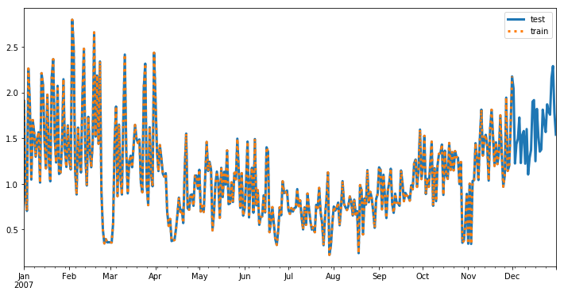

# Time Serie Forecast

In this notebook we will use **SageMaker DeepAR** to perform time series prediction. The data we
will be using is provided by [Kaggle](https://www.kaggle.com/uciml/electric-power-consumption-data-set);
a global household eletric power consumption data set collected over years from 2006 to 2010. A
large dataset like this allows us to make time series prediction over long periods of time, like
weeks or months.

## Data Exploration

Let's get started by exploring the data and see what's contained within the data set.

```python
! wget https://s3.amazonaws.com/video.udacity-data.com/topher/2019/March/5c88a3f1_household-electric-power-consumption/household-electric-power-consumption.zip
```

    --2020-04-22 01:54:44--  https://s3.amazonaws.com/video.udacity-data.com/topher/2019/March/5c88a3f1_household-electric-power-consumption/household-electric-power-consumption.zip
    Resolving s3.amazonaws.com (s3.amazonaws.com)... 52.216.142.102
    Connecting to s3.amazonaws.com (s3.amazonaws.com)|52.216.142.102|:443... connected.
    HTTP request sent, awaiting response... 200 OK
    Length: 20805339 (20M) [application/zip]
    Saving to: ‘household-electric-power-consumption.zip’
    
    household-electric- 100%[===================>]  19.84M  8.19MB/s    in 2.4s    
    
    2020-04-22 01:54:47 (8.19 MB/s) - ‘household-electric-power-consumption.zip’ saved [20805339/20805339]

```python
! unzip household-electric-power-consumption
```

    Archive:  household-electric-power-consumption.zip
    inflating: household_power_consumption.txt  

```python
with open('household_power_consumption.txt') as file:
    for line in range(10):
        print(next(file))
```

    Date;Time;Global_active_power;Global_reactive_power;Voltage;Global_intensity;Sub_metering_1;Sub_metering_2;Sub_metering_3
    
    16/12/2006;17:24:00;4.216;0.418;234.840;18.400;0.000;1.000;17.000
    
    16/12/2006;17:25:00;5.360;0.436;233.630;23.000;0.000;1.000;16.000
    
    16/12/2006;17:26:00;5.374;0.498;233.290;23.000;0.000;2.000;17.000
    
    16/12/2006;17:27:00;5.388;0.502;233.740;23.000;0.000;1.000;17.000
    
    16/12/2006;17:28:00;3.666;0.528;235.680;15.800;0.000;1.000;17.000
    
    16/12/2006;17:29:00;3.520;0.522;235.020;15.000;0.000;2.000;17.000
    
    16/12/2006;17:30:00;3.702;0.520;235.090;15.800;0.000;1.000;17.000
    
    16/12/2006;17:31:00;3.700;0.520;235.220;15.800;0.000;1.000;17.000
    
    16/12/2006;17:32:00;3.668;0.510;233.990;15.800;0.000;1.000;17.000

We've downloaded a text file which has a similar format to that of CSV except it is separated by `;`.

## Data Preprocessing

The text file has the following attributes,

- Each data point has date and time of recording
- Each feature is separated by ;
- Some values are either NaN or ?, we'll treat them as `NaN` in DataFrame

For `NaN` values, instead of dropping them, we want to fill them with the mean value of that column.
This is to ensure our time series is nice and smooth. It's not a terrible assumption to make that if
a record is missing, it's likely that the record has a mean value of energy consumption, given that
we don't have that many missing values.

### Load Text Data into Data Frame

```python
import pandas as pd


df = pd.read_csv('household_power_consumption.txt', sep=';',
                                                    parse_dates={'Date-Time': ['Date', 'Time']},
                                                    infer_datetime_format=True,
                                                    low_memory=False,
                                                    na_values=['nan', '?'],
                                                    index_col='Date-Time')
```

```python
print('Number of missing values per column')
df.isnull().sum()
```

    Number of missing values per column

    Global_active_power      25979
    Global_reactive_power    25979
    Voltage                  25979
    Global_intensity         25979
    Sub_metering_1           25979
    Sub_metering_2           25979
    Sub_metering_3           25979
    dtype: int64

```python
print('Numer of values per column')
df.count()
```

    Numer of values per column

    Global_active_power      2049280
    Global_reactive_power    2049280
    Voltage                  2049280
    Global_intensity         2049280
    Sub_metering_1           2049280
    Sub_metering_2           2049280
    Sub_metering_3           2049280
    dtype: int64

### Replace NaN with Mean

```python
num_cols = len(list(df.columns.values))
for col in range(num_cols):
    df.iloc[:,col]=df.iloc[:,col].fillna(df.iloc[:,col].mean())


print('Number of missing values per column')
df.isnull().sum()
```

    Number of missing values per column

    Global_active_power      0
    Global_reactive_power    0
    Voltage                  0
    Global_intensity         0
    Sub_metering_1           0
    Sub_metering_2           0
    Sub_metering_3           0
    dtype: int64

```python
df.head()
```

<div>
<table border="1" class="dataframe">
  <thead>
    <tr style="text-align: right;">
      <th></th>
      <th>Global_active_power</th>
      <th>Global_reactive_power</th>
      <th>Voltage</th>
      <th>Global_intensity</th>
      <th>Sub_metering_1</th>
      <th>Sub_metering_2</th>
      <th>Sub_metering_3</th>
    </tr>
    <tr>
      <th>Date-Time</th>
      <th></th>
      <th></th>
      <th></th>
      <th></th>
      <th></th>
      <th></th>
      <th></th>
    </tr>
  </thead>
  <tbody>
    <tr>
      <th>2006-12-16 17:24:00</th>
      <td>4.216</td>
      <td>0.418</td>
      <td>234.84</td>
      <td>18.4</td>
      <td>0.0</td>
      <td>1.0</td>
      <td>17.0</td>
    </tr>
    <tr>
      <th>2006-12-16 17:25:00</th>
      <td>5.360</td>
      <td>0.436</td>
      <td>233.63</td>
      <td>23.0</td>
      <td>0.0</td>
      <td>1.0</td>
      <td>16.0</td>
    </tr>
    <tr>
      <th>2006-12-16 17:26:00</th>
      <td>5.374</td>
      <td>0.498</td>
      <td>233.29</td>
      <td>23.0</td>
      <td>0.0</td>
      <td>2.0</td>
      <td>17.0</td>
    </tr>
    <tr>
      <th>2006-12-16 17:27:00</th>
      <td>5.388</td>
      <td>0.502</td>
      <td>233.74</td>
      <td>23.0</td>
      <td>0.0</td>
      <td>1.0</td>
      <td>17.0</td>
    </tr>
    <tr>
      <th>2006-12-16 17:28:00</th>
      <td>3.666</td>
      <td>0.528</td>
      <td>235.68</td>
      <td>15.8</td>
      <td>0.0</td>
      <td>1.0</td>
      <td>17.0</td>
    </tr>
  </tbody>
</table>
</div>

### Display Global Active Power

For this demonstration, we will predict global active power. We can ignore the other columns.

```python
active_power_df = df['Global_active_power'].copy()
```

```python
import matplotlib.pyplot as plt
%matplotlib inline


plt.figure(figsize=(12,6))
active_power_df.plot(title='Global Active Power', color='green')
plt.show()
```


The data are recorded each minute, we want to zoom into one day worth of data and see what it looks
like.

```python
# There are 1440 minutes in a day
plt.figure(figsize=(12,6))
active_power_df[0:1440].plot(title='Global Active Power Over 1 Day', color='green')
plt.show()
```


### Hourly vs Daily

With this amount of data, there are many interesting approaches to this problem.

1. Create many short time series, predict the energy consumption over hours or days.
2. Create fewer but longer time series, predict the energy consumption over seasons.

For the purpose of demonstrating `pandas` resampling, we will go with the latter. We need to convert
the minute data points into hour or day data points. Pandas'
[time series tools](https://pandas.pydata.org/pandas-docs/stable/user_guide/timeseries.html) allow
us to easily resample time series data by frequency, e.g. hourly `H` or daily `D`

```python
# Set frequency to be daily
freq = 'D'
mean_active_power_df = active_power_df.resample(freq).mean()

plt.figure(figsize=(12,6))
mean_active_power_df.plot(title='Global Active Power Mean per Day', color='green')
plt.show()
```


### Create Time Series Training Data

The objective is to train a model on a 3 years of data and use the 4th year as the test set to
predict what will be the power usage in first few months of 2010. There wil be 3 year-long time
series from the years 2007, 2008, and 2009.

```python
def create_time_series_list_by_years(df, years, freq='D', start_idx=0):
    """Creates time series for each supplied year in the years list.
    """
    leap = '2008' # We should account for all leap years but for the purpose of this demo, 2008 is enough
    time_series_list = []
    for i in range(len(years)):
        if years[i] == leap:
            end_idx = start_idx + 366
        else:
            end_idx = start_idx + 365

        index = pd.date_range(start=years[i] + '-01-01', end=years[i] + '-12-31', freq=freq)
        time_series_list.append(pd.Series(data=df[start_idx:end_idx], index=index))
        start_idx = end_idx

    return time_series_list
```

Now we can plot the time series and see that there are 3 series, each has length either 365 or 366,
depending on whether it is a leap year or not.

```python
time_series_list = create_time_series_list_by_years(mean_active_power_df, ['2007', '2008', '2009'], start_idx=16)

plt.figure(figsize=(12,6))
for ts in time_series_list:
    ts.plot()

plt.show()
```


### Training Feature/Label Split in Time

This is supervised learning, we need to provide our training set with some labels or targets. One
simple way to think about it is to split the year-long time series into two chunks. The first chunk
is the training, while the second chunk is the label. We are training a model to accept an input
time series and return a prediction time series. Let's call the length of the prediction time
series `prediction_length`.

For example, I have 365 days of data. I want my prediction length to be a month or 30 days. The
input time series would have 335 data points while the label or target time series would have 30
data points. This split must occur in time though. We cannot randomly choose 30 days out of 365
days.

```python
prediction_length = 30 # Days

training_list = []
for ts in time_series_list:
    training_list.append(ts[:-prediction_length])


for ts in training_list:
    print('Training set has shape {} after truncating {} days'.format(ts.shape, prediction_length))
```

    Training set has shape (335,) after truncating 30 days
    Training set has shape (336,) after truncating 30 days
    Training set has shape (335,) after truncating 30 days

Now let's visualize the split.

```python
plt.figure(figsize=(12,6))
time_series_list[0].plot(label='test', lw=3)
training_list[0].plot(label='train', ls=':', lw=3)
plt.legend()
plt.show()
```



## DeepAR

### Save as JSON

Before we run DeepAR on SageMaker, we need to do one final data preparation, i.e. converting the
data frames into JSON format that is accepted by DeepAR.

DeepAR expects to see input training data in the following JSON fields.

- `start`: a string that defines the starting date of the time series YYYY-MM-DD HH:MM:SS
- `target`: a list of numerical values that represent the time series
- `cat`: optional, a numerical array of categorical features that can be used to encode the groups
  that the record belongs to. This is useful for finding models per class of item.

For example,

```json
{
  "start": "2007-01-01 00:00:00"
  "target": [1.1, 2.2, 3.3],
  "cat": [1]
}
```

```python
import json
import os


def write_json_dataset(time_series_list, data_dir, filename):
    if not os.path.exists(data_dir):
       os.makedirs(data_dir)

    with open(os.path.join(data_dir, filename), 'wb') as f:
        for ts in time_series_list:
            json_line = json.dumps({
                'start': str(ts.index[0]),
                'target': list(ts)
            }) + '\n'
            f.write(json_line.encode('utf-8'))
```

```python
local_data_dir = 'energy_json_data'

write_json_dataset(training_list, local_data_dir, 'train.json')
write_json_dataset(time_series_list, local_data_dir, 'test.json')
```

### Upload to S3

Just as any other built-in models, SageMaker expects the JSON data to be in a S3 bucket during
training and inference job.

```python
import boto3
import sagemaker


session = sagemaker.Session(default_bucket='machine-learning-case-studies')
role = sagemaker.get_execution_role()

s3_bucket = session.default_bucket()
s3_prefix = 'deepar-energy-consumption'

print('Instantiated session with default bucket {}'.format(s3_bucket))

train_path = session.upload_data(os.path.join(local_data_dir, 'train.json'), bucket=s3_bucket, key_prefix=s3_prefix)
test_path = session.upload_data(os.path.join(local_data_dir, 'test.json'), bucket=s3_bucket, key_prefix=s3_prefix)

print('Training data are stored in {}'.format(train_path))
print('Test data are stored in {}'.format(test_path))
```

    Instantiated session with default bucket machine-learning-case-studies
    Training data are stored in s3://machine-learning-case-studies/deepar-energy-consumption/train.json
    Test data are stored in s3://machine-learning-case-studies/deepar-energy-consumption/test.json

### DeepAR Estimator

Instantiate an estimator

```python
from sagemaker.amazon.amazon_estimator import get_image_uri
from sagemaker.estimator import Estimator


s3_output_path = 's3://{}/{}'.format(s3_bucket, s3_prefix)
image_name = get_image_uri(boto3.Session().region_name, 'forecasting-deepar')
estimator = Estimator(sagemaker_session=session,
                      image_name=image_name,
                      role=role,
                      train_instance_count=1,
                      train_instance_type='ml.c4.xlarge',
                      output_path=s3_output_path)
```

There are couple hyperparameters we need to set.

- `epochs`: The maximum number of times to pass over the data when training.
- `time_freq`: The granularity of time series in the dataset, e.g. `D` for daily.
- `prediction_length`: The number of time steps that the model is trained to predict.
- `context_length`: The number of data points that the model gets to see before making a prediction.

More information can be found on [Deep AR Documentation](https://docs.aws.amazon.com/sagemaker/latest/dg/deepar_hyperparameters.html)

```python
hyperparameters = {
    'epochs': '50',
    'time_freq': 'D', # Day
    'prediction_length': '30',
    'context_length': '30',
    'num_layers': '2',
    'num_cells': '50',
    'mini_batch_size': '128',
    'learning_rate': '0.001',
    'early_stopping_patience': '10'
}

estimator.set_hyperparameters(**hyperparameters)
```

When we provide inputs toe the `fit` function, if we provide a test dataset, DeepAR will calculate
the accuracy metrics for the trained model. This is done by predicting the last `prediction_length`
points of each time series in the test set and comparing it to the actual value of the time series.
The computed error metrics will be included as part of the log output.

```python
estimator.fit(inputs={
    'train': train_path,
    'test': test_path
})
```

    2020-04-22 01:55:18 Starting - Starting the training job...
    2020-04-22 01:55:20 Starting - Launching requested ML instances...............
    2020-04-22 01:57:54 Starting - Preparing the instances for training......
    2020-04-22 01:58:56 Downloading - Downloading input data...
    2020-04-22 01:59:35 Training - Training image download completed.
    ...
    Training seconds: 168
    Billable seconds: 168

Deploy it and make it ready for inference.

```python
predictor = estimator.deploy(initial_instance_count=1,
                             instance_type='ml.t2.medium',
                             content_type='application/json')
```

## Model Evaluation

### Generate Predictions

DeepAR predictor expects JSON for inputs, the input should have the following keys.

- `instances`: A list of JSON formatted time series
- `configuration` optional: A dictionary of configuration information for the response
  - `num_samples`
  - `output_types`
  - `quantiles`
  
More information on [DeepAR Inference Formats](https://docs.aws.amazon.com/sagemaker/latest/dg/deepar-in-formats.html)

```python
def to_json_predictor_input(ts_list, num_samples=50, quantiles=['0.1', '0.5', '0.9']):
    instances = []
    for i in range(len(ts_list)):
        instances.append({
            'start': str(ts_list[i].index[0]),
            'target': list(ts_list[i])
        })

    configuration = {
        'output_types': ['quantiles'],
        'num_samples': num_samples,
        'quantiles': quantiles
    }

    json_request = json.dumps({
        'instances': instances,
        'configuration': configuration
    }).encode('utf-8')

    return json_request


prediction = predictor.predict(to_json_predictor_input(training_list))
```

The prediction JSON would look something like the following. We need to decode string into JSON
object and then load the data into a DataFrame.

```json
{
   "predictions":[
      {
         "quantiles":{
            "0.1":[numbers...],
            "0.9":[numbers...],
            "0.5":[numbers...]
         }
      },
      {
         "quantiles":{
            "0.1":[numbers...],
            "0.9":[numbers...],
            "0.5":[numbers...]
         }
      },
      {
         "quantiles":{
            "0.1":[numbers...],
            "0.9":[numbers...],
            "0.5":[numbers...]
         }
      }
   ]
}
```

```python
def decode_prediction(prediction_json, encoding='utf-8'):
    json_data = json.loads(prediction_json.decode(encoding))
    pd_list = []
    for i in range(len(json_data['predictions'])):
        pd_list.append(pd.DataFrame(data=json_data['predictions'][i]['quantiles']))

    return pd_list


results = decode_prediction(prediction)

print(results[0])
```

             0.1       0.9       0.5
    0   1.088849  1.828646  1.502092
    1   1.022624  1.551457  1.282422
    2   1.305507  1.900849  1.538800
    3   1.033439  1.458136  1.265341
    4   0.873974  1.416162  1.145868
    5   1.183307  1.786330  1.489765
    6   1.358921  1.893588  1.658125
    7   1.023880  1.776468  1.353857
    8   0.816724  1.451042  1.169706
    9   0.989871  1.643647  1.341426
    10  0.954561  1.471301  1.141534
    11  0.882861  1.549521  1.137189
    12  1.066164  1.888121  1.350396
    13  1.008170  1.875113  1.396235
    14  1.088461  2.301020  1.586839
    15  1.058260  1.541146  1.302700
    16  1.191627  1.804835  1.495359
    17  1.081382  1.848557  1.330365
    18  0.916280  1.782442  1.443959
    19  1.096332  1.851947  1.503171
    20  1.189601  2.429537  1.660283
    21  0.864012  2.223838  1.407799
    22  0.906846  1.819857  1.251403
    23  1.061913  1.900574  1.439155
    24  0.908473  1.759717  1.377292
    25  0.656686  1.697152  1.085249
    26  0.702556  2.054829  1.307726
    27  0.484136  1.871403  1.430208
    28  0.824297  1.891673  1.406972
    29  0.671941  1.601008  1.103163

### Visualize the Results

- Quantiles 0.1 and 0.9 represent higher and lower bounds for the predicted values.
- Quantile 0.5 represents the median of all sample predictions.

```python
def display_quantiles(prediction_list, target=None, prediction_length=30):
    for i in range(len(prediction_list)):
        plt.figure(figsize=(12, 6))
        if target is not None:
            target_ts = target[i][-prediction_length:]
            plt.plot(range(len(target_ts)), target_ts, label='target')

        p10 = prediction_list[i]['0.1']
        p90 = prediction_list[i]['0.9']
        plt.fill_between(p10.index, p10, p90, color='y', alpha=0.5, label='80% confidence interval')
        prediction_list[i]['0.5'].plot(label='prediction median')
        plt.legend()
        plt.show()


display_quantiles(results, target=time_series_list)
```


### Predicting the Future

Now we have verified that the predictor works and it can capture patterns fairly well, we can use it
to predict the future, i.e. the months in 2010. We will leave `target` empty and reserve the 2010
data for testing. In fact we could provide the historical data as target and let the model to
predict the future.

```python
start_date = '2010-01-01' # We want to predict first 30 days in 2010
timestamp = '00:00:00'
request_data = {
    'instances': [
        { 'start': '{} {}'.format(start_date, timestamp), 'target': [] }
    ],
    'configuration': {
        'num_samples': 50,
        'output_types': ['quantiles'],
        'quantiles': ['0.1', '0.5', '0.9']
    }
}

predictions_2010 = decode_prediction(predictor.predict(json.dumps(request_data).encode('utf-8')))
```

```python
pd_series_2010 = pd.Series(data=mean_active_power_df.values[1112:],
                           index=pd.date_range(start=start_date,
                                               periods=len(mean_active_power_df.values[1112:]),
                                               freq=freq)
                          )

display_quantiles(predictions_2010, [pd_series_2010[0:prediction_length]])
```


The result came out to be not too bad! Now it's time to clean up.

```python
predictor.delete_endpoint()
```
